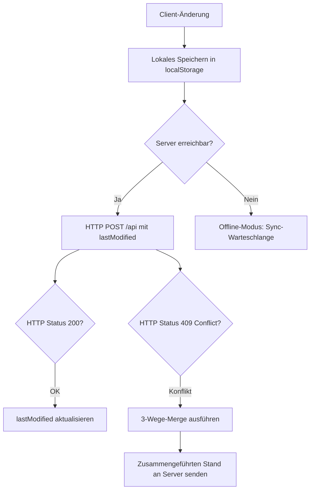

# RadPlan — Digitaler Dienstplan für die Klinik für Radiologie & Nuklearmedizin

> **RadPlan** ist eine vollständig im Browser laufende, hochspezialisierte Dienstplan-Anwendung für die **Klinik für Radiologie & Nuklearmedizin am Klinikum St. Georg Leipzig**. Sie verbindet ein dichtes, tabellarisches Monatsraster mit einem regelbasierten, mehrzyklischen Optimierungsalgorithmus (dem *RadPlan Neural Scheduler*), tiefen Mitarbeiter- und Jahresauswertungen, einem isolierten Planungsmodus und einer servergestützten Echtzeit-Synchronisation — verpackt in eine bis ins letzte Detail durchgestaltete, barrierearme und touch-taugliche Oberfläche mit einem eigenständigen, durchgängigen **Premium-Design-System** (Glasmorphismus, Elevation-Stufen, Feder-Bewegungssprache, Gradient-Akzente), Hell-/Dunkelmodus und iPhone-genauer PWA-Optimierung.
>
> Diese Dokumentation beschreibt den **vollständigen aktuellen Funktions-, Design- und Code-Stand** der Anwendung bis in jedes Detail: jede Ansicht, jedes Bedienelement, jedes Design-Token, jede Regel, jeden Datenpfad, jede CSS-Datei, jede JS-Datei und jede Tastenkombination — verifiziert gegen den tatsächlichen Quellcode.

---

## Inhaltsverzeichnis

1. [Was RadPlan löst — die fachliche Domäne](#1-was-radplan-löst--die-fachliche-domäne)
2. [Technologie-Stack & Architekturprinzipien](#2-technologie-stack--architekturprinzipien)
3. [Das Design-System: visuelle Sprache & Gestaltungsphilosophie](#3-das-design-system-visuelle-sprache--gestaltungsphilosophie)
4. [Fachliches Datenmodell & globaler Zustand](#4-fachliches-datenmodell--globaler-zustand)
5. [Stammdaten, Rollen, Qualifikationen & Sonderregeln](#5-stammdaten-rollen-qualifikationen--sonderregeln)
6. [Persistenz, LocalStorage & Server-Synchronisation](#6-persistenz-localstorage--server-synchronisation)
7. [Gesamtaufbau der Oberfläche](#7-gesamtaufbau-der-oberfläche)
8. [Das Dienstplan-Raster im Detail](#8-das-dienstplan-raster-im-detail)
9. [Zell-Interaktion: Editor, Schnellaktionen, Gestik & Tastatur](#9-zell-interaktion-editor-schnellaktionen-gestik--tastatur)
10. [Kontextmenü & Zell-Detail-Tooltip](#10-kontextmenü--zell-detail-tooltip)
11. [Das Undo/Redo-System](#11-das-undoredo-system)
12. [Der Planungsmodus (Entwurfs-Sandbox)](#12-der-planungsmodus-entwurfs-sandbox)
13. [Der RadPlan Neural Scheduler (Auto-Plan)](#13-der-radplan-neural-scheduler-auto-plan)
14. [Mitarbeitendenbereich (Team- & Personen-Dashboard)](#14-mitarbeitendenbereich-team--personen-dashboard)
15. [Der Auswertungs-Hub (Auswertungen)](#15-der-auswertungs-hub-auswertungen)
16. [Abteilungsübersicht](#16-abteilungsübersicht)
17. [Befehlspalette](#17-befehlspalette)
18. [Benachrichtigungszentrum](#18-benachrichtigungszentrum)
19. [Drucken & PDF-Export](#19-drucken--pdf-export)
20. [Import & Export von Daten](#20-import--export-von-daten)
21. [Theming, Animationen & Barrierefreiheit](#21-theming-animationen--barrierefreiheit)
22. [Mobile-, Touch- & PWA-Erfahrung](#22-mobile--touch--pwa-erfahrung)
23. [Kalender- & Feiertagslogik](#23-kalender-&--feiertagslogik)
24. [Vollständige Tastaturkürzel-Referenz](#24-vollständige-tastaturkürzel-referenz)
25. [Vollständige Projektstruktur & Dateibeschreibungen](#25-vollständige-projektstruktur--dateibeschreibungen)
26. [Entwicklung & Deployment](#26-entwicklung--deployment)
27. [Glossar & Codetabellen](#27-glossar--codetabellen)

---

## 1. Was RadPlan löst — die fachliche Domäne

In einer klinischen radiologischen Abteilung müssen an jedem Tag des Jahres zwei kritische Dienste lückenlos und qualifiziert besetzt sein:

1. **Bereitschaftsdienst (BD / Code „D")** — Der Arzt vor Ort, der die Akutversorgung trägt, Notfall-CTs und -MRTs befundet, Kontrastmittelüberwachungen durchführt und klinische Anfragen steuert.
2. **Hintergrunddienst (HG)** — Die fachärztliche Rückfallebene im Hintergrund (Rufbereitschaft), die telefonisch beratend zur Seite steht, komplexe Befunde freigibt, Interventionsentscheidungen trifft und bei personellen Engpässen oder Katastrophenfällen einspringt.

Daneben werden die Ärztinnen und Ärzte der Abteilung an Werktagen auf verschiedene **Arbeitsplätze** (Modalitäten) verteilt: Großgeräte (MRT, CT, Sonographie – US, Angiographie – AN), Spezialbereiche (Mammographie – MA, Kinder-Ultraschall – KUS), der Außenstandort Wermsdorf (W) und die Teleradiologie (T).

Die Dienstplanung steht vor der Herausforderung, diese Dienste und Modalitäten unter Beachtung strenger Restriktionen zu verteilen:

* **Gesetzliche Vorgaben:** Einhaltung von Ruhezeiten (nach einem Bereitschaftsdienst am Folgetag zwingend dienstfrei).
* **Fachliche Qualifikation:** Wochenend-Bereitschaftsdienste und alle Hintergrunddienste dürfen ausschließlich von vollapprobierten Fachärztinnen und Fachärzten geleistet werden.
* **Soziale Kriterien & Fairness:** Gleichmäßige Verteilung der Dienste über das Jahr, Berücksichtigung von Wünschen und Urlauben, Vermeidung von aufeinanderfolgenden Dienstwochenenden sowie Einhaltung individueller vertraglicher Sondervereinbarungen (Dienstreduktion, Befreiungen, personenbezogene Konfliktregeln).

RadPlan digitalisiert diesen Prozess vollständig: von der präzisen **manuellen Erfassung** über tiefgehende **Auswertungen und Fairness-Kennzahlen** bis zur **vollautomatischen Berechnung** eines optimierten Dienstplans durch einen regelbasierten, mehrzyklischen Scheduling-Algorithmus — verpackt in eine Oberfläche, die trotz extremer Informationsdichte ruhig, klar und angenehm zu bedienen bleibt.

---

## 2. Technologie-Stack & Architekturprinzipien

RadPlan ist konsequent als **Single-Page-Application (SPA) ohne Build-Schritt** konzipiert. Es gibt keinen Bundler, keinen Transpiler, kein `node_modules`-Verzeichnis mit Laufzeitabhängigkeiten — die Anwendung läuft exakt so im Browser, wie sie im Repository vorliegt.

### 2.1 Frontend-Laufzeit & Sprachen

* **HTML5 (`index.html`):** Das statische Anwendungsgerüst. Enthält alle Skelette der Modal-Dialoge (Editor, Mitarbeitende, Auswertungen, Abteilung, Jahresplan, Import, Autoplan, Befehlspalette …), die feste Kopfzeile, die Planungsleiste, die Statistikleiste, den Tabellen-Container sowie die mobile Navigationsleiste. 
* **Flicker-Schutz (FOUC-Prävention):** Ein Inline-`<script>` im `<head>` liest — noch *vor* dem Rendering des restlichen Dokuments — das gespeicherte Theme aus `localStorage` aus (Fallback auf System-Präferenzen) und setzt `data-theme` sofort synchron. Zusätzlich wird `document.documentElement.style.backgroundColor` sofort auf die exakte Hintergrundfarbe des jeweiligen Themes gesetzt (`#0B131F` für Dark Mode, `#F4F1EA` für Light Mode). Dies unterbindet jegliches weiße Flackern (Flash of Unstyled Content) beim Laden oder Neuladen der Anwendung unter langsamen Netzwerkverbindungen vollständig.
* **ECMAScript-Module (ESM):** Der gesamte JavaScript-Code (`<script type="module" src="js/app.js">`) ist in klar getrennte, über `import`/`export` verbundene Module aufgeteilt. Es gibt keine globalen Variablen außerhalb dieser Modulgrenzen.
* **CSS3 als eigenständiges Design-System:** Das Styling ist auf 23 thematisch getrennte Dateien aufgeteilt (Kern-Tokens, Layout, Komponenten, Chips, drei Modal-Dateien nach Dialog getrennt, Views, Kontextmenü, Mobile-Optimierung, Print, Enhancements, Agenda-Ansicht sowie ein Basis- plus neun Modul-Stylesheets für den Auswertungs-Hub). Durchgehender Einsatz von CSS Custom Properties (zweistufiges Primitive-/Semantic-Token-System, siehe [Kapitel 3](#3-das-design-system-visuelle-sprache-&--gestaltungsphilosophie)), von Flexbox/Grid für Layouts, von Container-Queries für adaptive Schriftgrößen in Tabellenzellen und von `@media (display-mode: standalone)` für PWA-spezifische Anpassungen.

### 2.2 Externe Bibliotheken (per CDN eingebunden)

Alle externen Bibliotheken werden über `<script>`-Tags am Ende von `index.html` von öffentlichen CDNs geladen — es gibt keine lokal gebündelten Kopien. Die Kernfunktionen der App (Planung, Editor, Speichern) hängen nicht von ihnen ab; ist ein CDN nicht erreichbar, bleiben nur die jeweils abhängigen Zusatzfunktionen (Diagramme, Animationen, PDF) eingeschränkt:

* **Chart.js (v4.4.4):** Rendert alle Diagramme — Arbeitsplatzverteilungen und Aktivitätsverläufe im Mitarbeiterprofil, den kumulierten Fairness-Verlauf im Auswertungs-Hub, Balkendiagramme in der Prognose und den Kapazitäts-/Engpass-Verlauf bei Abwesenheiten.
* **GSAP (GreenSock Animation Platform, v3.12.2):** Sorgt für weiche Animationsübergänge in ausgewählten Choreografien (u. a. Neural-Constellation-Visualisierung).
* **jsPDF (v2.5.1) & jspdf-autotable (v3.8.2):** Erzeugen mehrseitige PDF-Dokumente im A4-Format direkt im Browser, ohne Server-Roundtrip. Falls das CDN blockiert ist, schützt eine Try-Catch-Prüfung vor Abstürzen, deaktiviert den PDF-Export und verweist auf die native Systemdruck-Funktion.
* **IBM Plex Sans & IBM Plex Mono (Google Fonts):** Webfonts für optimale Lesbarkeit. Die Festbreitenschrift (Mono) wird gezielt für numerische Daten und Dienst-Codes genutzt, damit Zahlen beim Ändern nicht visuell „springen".

### 2.3 Edge-Backend & Persistenz

* **Cloudflare Pages Functions (`functions/api.js`):** Eine einzelne, serverlose Handler-Funktion `onRequest(context)`, die alle Anfragen an `/api` beantwortet.
* **Cloudflare KV (Key-Value-Namespace):** Der persistente Datenspeicher auf Cloudflare-Edge-Servern, gebunden unter dem Namen `RADPLAN_KV`. Der Datenbestand ist **nach Kalenderjahr partitioniert** statt in einem einzigen, unbegrenzt wachsenden JSON-Blob abgelegt: `RADPLAN_META` (`{ years, lastModified }`) verzeichnet die vorhandenen Jahre, jedes Jahr liegt separat unter `RADPLAN_YEAR_<jahr>` (`{ months, lastModified }`), Planungsentwürfe liegen gesammelt unter `RADPLAN_PLANS`. Der Wire-Vertrag gegenüber dem Client bleibt dabei unverändert (`{ main, plans, lastModified }`) — `functions/api.js` setzt die Jahres-Fragmente serverseitig transparent zum flachen `main`-Objekt zusammen bzw. zerlegt es beim Schreiben wieder. 
* **HTTP-Verhalten:** `GET` liefert den gespeicherten Stand zurück (oder ein leeres Grundgerüst `{main:{}, plans:{}, lastModified:0}`, falls noch nichts gespeichert wurde). `POST` schreibt neue Daten unter einer optimistischen Nebenläufigkeitskontrolle, die dank der Jahres-Partitionierung **pro Jahr** statt für den gesamten Bestand ausgelesen wird: bearbeiten zwei Personen gleichzeitig unterschiedliche Jahre, entsteht serverseitig gar kein Konflikt mehr; alle anderen HTTP-Methoden werden mit `405` abgelehnt. CORS ist mit `*` vollständig offen, alle Antworten tragen `no-cache`-Header.

---

## 3. Das Design-System: visuelle Sprache & Gestaltungsphilosophie

RadPlan besitzt ein eigenständiges, durchgängiges Design-System — eine bewusst geschichtete Token-Architektur, die jede Komponente der Anwendung mit derselben visuellen Grammatik versorgt. Dieses Kapitel beschreibt die Gestaltungsphilosophie so, wie sie tatsächlich im Code (`css/core.css` und darauf aufbauend alle 22 weiteren CSS-Dateien) umgesetzt ist.

### 3.1 Gestaltungsphilosophie in einem Satz

**Ruhige Tiefe statt lauter Farbigkeit.** RadPlan verzichtet bewusst auf grelle Verläufe, überzogene Animationen oder dekorative Spielereien — die Informationsdichte einer klinischen Dienstplanung verlangt zuerst Lesbarkeit und Präzision. Die Eleganz entsteht stattdessen aus **fein gestufter materieller Tiefe** (Glas, Schatten, Licht), **einer einzigen, konsequent wiederverwendeten Bewegungssprache** und **gezielten, sparsam eingesetzten Akzenten** (Sky-Blue-zu-Indigo-Gradient), die immer dort auftauchen, wo echte Interaktion oder ein besonders relevanter Zustand angezeigt werden soll — nie als reines Dekor.

### 3.2 Zweistufige Token-Architektur

Die gesamte visuelle Sprache ist in `css/core.css` als CSS-Custom-Property-Baum organisiert und folgt konsequent zwei Ebenen:

* **Primitive Tokens** — rohe, themenunabhängige Werte: die Navy-/Cream-Farbskala (`--navy-900`…`--navy-400`), die Graustufen-Skala (`--gray-50`…`--gray-900`), Status-Grundfarben (`--red`, `--green`, `--orange`, `--blue-d`), Radien (`--radius-xs` … `--radius-xl`), die Bewegungs-Timings (`--dur-1` … `--dur-4`) und Easing-Kurven (`--ease-out`, `--ease-in-out`, `--ease-spring`, `--ease-spring-soft`).
* **Semantische Tokens** — bedeutungstragend und **themenbewusst**: `--text-1/2/3/faint` (Textgewichtung), `--elev-0…3-bg` (Elevation-Füllungen), `--elev-border-*`, `--elev-shadow-1/2/3`, `--accent-soft/-strong/-ring`, `--c-success/-warning/-danger/-info`. Komponenten referenzieren **ausschließlich** semantische Tokens — ein Theme-Wechsel (`data-theme="dark"` ↔ `"light"`) geschieht dadurch an exakt einer Stelle im Code.

Alle theme-abhängigen Farben werden zusätzlich als **RGB-Tripel** geführt (`--ink-rgb`, `--accent-rgb`, `--accent-2-rgb` …), damit jede Komponente sie in beliebiger Deckkraft per `rgba(var(--x-rgb), .NN)` weiterverwenden kann, ohne eine eigene Hex-Kopie zu pflegen.

### 3.3 Elevation-System: eine durchgehende Höhenleiter

Statt einzelner, unzusammenhängender Box-Shadow-Werte definiert RadPlan eine **Materialtiefen-Leiter** von Surface 0 bis 3 (`--elev-0-bg` … `--elev-3-bg`). Jede Stufe hebt sich auf drei Arten von der darunterliegenden ab:

1. **Hellere Glasfüllung** — höhere Stufen erhalten eine dichtere, hellere `rgba(ink)`-Füllung (Dark Mode) bzw. eine dichtere weiße Füllung (Light Mode).
2. **Festere Umrandung** — `--elev-border` bis `--elev-border-3` steigern die Kantenschärfe stufenweise.
3. **Plastischer Innenglanz/-schatten** — `--elev-hi` (oberer 1px-Glanzsaum) und `--elev-lo` (unterer Schlagschatten) erzeugen zusammen mit `--elev-shadow-1/2/3` eine echte, spürbare Kante, keinen reinen Flat-Look.

Zusätzlich verwendet RadPlan folgende Tiefen-Tokens:

* **`--shadow-float`** — der Standard-Schwebeschatten für schwebende Chrome-Elemente (Kopfzeile, geöffnete Overflow-Menüs, Bottom-Sheets im Hochgleiten, Modal-Öffnung) — deutlich weicher gestreut als ein hartes `box-shadow`, mit eingebautem oberen Glanzsaum.
* **`--shadow-lift-hover`** — der verstärkte Hover-Zustand für interaktive Karten (KPI-Kacheln, Mitarbeiter-Karten, Fairness-Kacheln, Analytics-Kacheln): beim Überfahren hebt sich die Karte spürbar sichtbar von der Fläche ab.
* **`--ring-focus-glow`** — ein weicher, vierfach gestreuter Fokus-Halo, der zusätzlich zum klassischen `outline` bei `:focus-visible` erscheint (siehe [3.6](#36-fokus-hover--aktivzustände)).
* **`--grad-hairline`** — ein 1px hoher, links/rechts ausblendender Verlaufsstrich (transparent → Akzent → transparent), der als aktive Tab-/Modul-Unterstreichung, Trennlinie im Kontextmenü oder Top-Akzent auf hervorgehobenen Karten dient.
* **`--grad-sheen`** — ein sehr dezenter, diagonal verlaufender Lichtstreifen (`rgba(ink) 0 → .06 → 0`), der als `::after`-Overlay einen Hauch von Glasglanz auf geöffnete Panels/Menüs legt.
* **`--grad-accent-soft`** — ein weicher, zweifarbiger Sky-Blue-zu-Indigo-Verlauf in niedriger Deckkraft, verwendet für Primär-Button-Hintergründe, aktive Zustände und Formel-/Info-Boxen.

### 3.4 Bewegungssystem (Motion System)

Jede Transition und Animation in RadPlan bezieht ihre Dauer und Kurve aus genau vier Timing- und vier Easing-Tokens — nirgends stehen „freihändige" Millisekundenwerte in einzelnen Komponenten:

| Token | Wert | Einsatzzweck |
| :--- | :--- | :--- |
| `--dur-1` | 120 ms | Mikro-Feedback (Tap, Icon-Wechsel) |
| `--dur-2` | 200 ms | Standard-Zustandswechsel (Farbe, Hintergrund, Transform) |
| `--dur-3` | 320 ms | Panel-Enthüllungen, Modal-Öffnungen |
| `--dur-4` | 500 ms | Große, choreografierte Übergänge |
| `--ease-out` | `cubic-bezier(.22,.61,.36,1)` | Ruhiges Ausklingen, Standard für Farbwechsel |
| `--ease-in-out` | `cubic-bezier(.4,0,.2,1)` | Symmetrische Bewegungen (View Transitions) |
| `--ease-spring` | `cubic-bezier(.34,1.32,.64,1)` | Federndes Überschwingen für Buttons, Chips, Karten-Hover |
| `--ease-spring-soft` | `cubic-bezier(.34,1.12,.64,1)` | Dezenteres Federn für großflächige Karten |

Die gesamte Bewegungssprache zieht sich konsequent durch alle Ecken der Anwendung: Buttons, Chips, Kontextmenü-Einträge, Kachel-Hover-Zustände, Tab-Wechsel im Auswertungs-Hub und Bottom-Sheet-Drag-Handles verwenden ausnahmslos `--ease-spring`/`--ease-spring-soft` statt einzelner Ad-hoc-Kurven — das Ergebnis ist eine spürbar einheitliche, „handgefertigt" wirkende Reaktionsfreudigkeit der gesamten Oberfläche.

### 3.5 Farbwelt: Navy/Cream als Leinwand, Sky-Blue/Indigo als Akzent

* **Dunkelmodus (Standard):** Eine tiefe, leicht ins Blaue gehende Navy-Skala (`--navy-900: #0B131F` bis `--navy-400: #345484`) bildet die Leinwand. Ein subtiler, radialer Mehrfarb-Verlauf im `body::before` (zwei sehr blasse Farbkleckse in Sky-Blue und Indigo, überlagert von einem Navy-Verlauf) sorgt für räumliche Tiefe.
* **Hellmodus:** Statt eines reinen Weiß/Grau-Umschwungs verwendet RadPlan eine **warme Creme-/Sand-Skala** (`--navy-900: #F4F1EA` bis `--navy-400: #B3A37C`) — das erzeugt ein papierartiges, „warmes Klinik-Whiteboard"-Gefühl.
* **Akzent:** Ein einziger, konsequent wiederverwendeter Zweifarb-Akzent aus Sky-Blue (`--accent: #0EA5E9`) und Indigo (`--accent-2-rgb: 99,102,241`), kombiniert im `--accent-grad`-135°-Verlauf. Dieser Akzent erscheint ausschließlich an Stellen mit echter Bedeutung.
* **Status-Ampel:** Erfolg/Warnung/Gefahr/Information sind als eigene Hue-Werte (`--hue-success`, `--hue-warning`, `--hue-danger`, `--hue-info`) UND als fertige Farben (`--c-success`, `--c-warning`, `--c-danger`, `--c-info`) hinterlegt — beide Zugriffsformen existieren, damit Module wahlweise fertige Farben oder HSL-basierte Abstufungen (z. B. für Heatmaps im Jahresgitter) bilden können.

### 3.6 Fokus-, Hover- & Aktivzustände

Jedes interaktive Element folgt derselben Zustandslogik:

* **Hover (Maus):** dezente Aufhellung der Glasfüllung (`--elev-1-bg-hover`/`--elev-2-bg-hover`) plus ggf. `--shadow-lift-hover` bei Karten.
* **Active/Pressed:** Ein leichter `scale(0.96)`-Squeeze via `--ease-spring`, global auf `button:active` definiert — ein einziges, konsistentes „Tap"-Gefühl über die gesamte App.
* **Fokus (Tastatur):** `:focus-visible` kombiniert einen 2px-Outline in Akzentfarbe **mit** dem weichen `--ring-focus-glow`-Halo — sichtbar genug für Tastaturnutzer, aber unaufdringlich bei Maus-Interaktion (`:focus` selbst bleibt outline-los).
* **Disabled:** reduzierte Deckkraft, `cursor: not-allowed`, keine Hover-/Active-Reaktion.

Chips, Buttons, Kontextmenü-Einträge und Command-Palette-Zeilen haben durchgängig `:focus-visible`-Zustände, sodass Tastaturnutzer an **jedem** interaktiven Element im Chrome-Bereich eindeutig sehen, wo der Fokus steht.

### 3.7 Glasmorphismus mit Augenmaß

RadPlan nutzt „Glas"-Flächen (`--glass-bg`, `--glass-border`, `backdrop-filter: blur(...)`) für schwebende Chrome-Elemente (Kopfzeile, Overflow-Menüs, Kontextmenü, Quick-Popover), **aber nicht überall**: Modal-Dialoge sind laut expliziter, im Code dokumentierter Designentscheidung **immer hell**, unabhängig vom aktiven Theme — ein Editor- oder Auto-Plan-Dialog soll sich wie ein physisches, auf den Tisch gelegtes Formular anfühlen, nicht wie ein weiteres, theme-verschmelzendes Glaspanel. Die Blur-Radien sind bewusst gedeckelt (`--glass-blur: 16px`, `--glass-blur-lg: 24px`, das immer sichtbare `#app-header` sogar auf 12px reduziert), um die Rendering-Kosten auf schwächerer Mobile-Hardware gering zu halten.

### 3.8 Feinschliff-Details des Premium-Redesigns

* **Schlanke, themenbewusste Scrollbars:** Ein globales `scrollbar-width: thin` plus gestaltete WebKit-Scrollbar-Thumbs (`rgba(ink, .18–.3)`, abgerundet) ersetzen die groben Browser-Standard-Balken auf allen scrollbaren Flächen (Raster, Modals, Auswertungs-Hub) — dezent, aber immer im Einklang mit der jeweiligen Theme-Tinte.
* **Double-Tap-Zoom-Unterdrückung:** Auf coarse-Touchscreens (Mobiles & Tablets) wird für alle Buttons, Schnelltasten-Chips und Gitterzellen (`.td-cell`, `.td-name`) CSS-seitig `touch-action: manipulation;` deklariert. Dies unterbindet den systemeigenen Double-Tap-Zoom von WebKit vollständig und stellt verzögerungsfreie Taps sicher.
* **NFI-Score-Radialglanz:** Die Score-Anzeige im Auto-Plan-Dialog erhält über `color-mix()` einen score-abhängigen Radialglanz hinter dem Fortschrittsring — ein hoher Neural Fitness Index „leuchtet" sichtbar stärker.
* **Gradient-Füllungen statt Flat-Bars:** Fortschritts- und Abweichungsbalken (Team-Fairness, Abdeckungsquote, Profil-KPIs) tragen einen feinen `--grad-sheen`-Glanzstreifen im `mix-blend-mode: overlay` über der datengetriebenen Füllfarbe.
* **NFI-/Konflikt-/Score-Karten mit `--card-radius`:** Ein gemeinsamer Radius-Token vereinheitlicht die Eckenrundung aller Karten-artigen Oberflächen app-weit.
* **Bottom-Sheet-Feinschliff:** Der Drag-Handle mobiler Sheets is schlanker und trägt einen feinen vertikalen Verlauf mit Lichtkante statt einer flachen Füllung; Sheets heben sich beim Hochgleiten mit `--shadow-float` sichtbar von der App darunter ab.
* **Druckoptimierung:** Grid-Zellrahmen und Rollenband-Trenner im Browser-Druck (`print.css`) wurden kontrastreicher gestaltet, damit die Struktur auch auf Graustufen- und Laserdruckern ohne Farbwiedergabe klar lesbar bleibt.

---

## 4. Fachliches Datenmodell & globaler Zustand

### 4.1 Globale Datenstruktur `DATA`

Der gesamte Zustand aller Pläne ist in einem einzigen, hierarchischen JSON-Objekt namens `DATA` abgelegt (verwaltet in `state.js`). Seine Hauptschlüssel sind die Monate im Format `YYYY-M` (der Monat ist **0-basiert**, z. B. `"2026-5"` für Juni 2026).

```jsonc
{
  "2026-5": {
    "employees": ["Prof. Schäfer", "Dr. Lurz", "Dr. Becker", "Dr. Martin"],
    "assignments": {
      "Dr. Martin": {
        "3":  { "assignment": "CT",    "duty": "HG" },  // Tag 3: Arbeitsplatz CT, Hintergrunddienst
        "12": { "assignment": "MR/US", "duty": "D"  },  // Tag 12: Split-Arbeitsplatz, Bereitschaftsdienst
        "13": { "assignment": "F" }                      // Tag 13: Dienstfrei
      }
    },
    "rbn": {
      "3":  "Dr. Maybaum (NRAD)",
      "12": "Dr. Bailis (NRAD)"
    },
    "comments": {
      "Dr. Martin": { "12": "Vertretung für MRT" }
    }
  }
}
```

`model.js` bietet `normalizeMonthDataShape(md)`, das sicherstellt, dass jedes Monatsobjekt garantiert die vier Schlüssel `employees` (Array), `assignments`, `rbn` und `comments` (jeweils Objekte) besitzt — auch bei frisch angelegten Monaten oder nach einem Import.

### 4.2 Zellspezifische Datenbereinigung & Leckvermeidung

Um Speicherplatz zu sparen und JSON-Strukturvergleiche (für Undo/Redo und den 3-Wege-Merge) sauber zu halten, werden Zellen bei jeder Änderung automatisch bereinigt (`cleanupAssignmentCell`):

* Enthält eine Zelle weder eine Zuweisung (`assignment`), einen Dienst (`duty`), Wünsche, Pins noch Kommentare, wird das entsprechende Tagesobjekt vollständig gelöscht.
* Hat ein Mitarbeiter an einem bestimmten Tag gar keine Einträge mehr, wird sein Tageseintrag aus `assignments` entfernt.
* **Mitarbeiterlöschung (Datenbereinigung):** Wenn ein Mitarbeiter über `removeEmployee()` in `model.js` gelöscht wird, bereinigt das System den Zustand vollständig: Sämtliche zugehörigen Mitarbeiterkommentare in `md.comments[name]` des Monats werden per `delete` entfernt, um verwaiste Datenrückstände (Datenlecks) in der JSON-Struktur der KV-Datenbank dauerhaft zu verhindern.

### 4.3 RBN-Zeile (Rufdienst Neuroradiologie)

Zusätzlich zur personenbezogenen Matrix existiert eine globale Planungszeile **„RD Neurorad"**, die in `md.rbn[day]` gespeichert wird und einen eigenen, achtköpfigen Personenpool nutzt:

* **Sichtbarkeit:** Die Zeile erscheint erst ab Juni 2025 (`RBN_ROW_START = { year: 2025, month: 5 }`, 0-basiert = Juni).
* **Auswahlpool (`RBN_OPTIONS`):** Prof. Schob (NRAD), Dr. Maybaum (NRAD), Dr. Bailis (NRAD), Dr. Schüngel (NRAD), Fr. Dalitz (RAD), Fr. Thaler (RAD), Dr. Martin (RAD), Hr. El Houba (RAD).
* **Dynamische Gültigkeit:** *Fr. Thaler (RAD)* steht nur bis einschließlich März 2026 zur Auswahl (`RBN_THALER_LAST_MONTH = { year: 2026, month: 2 }`, 0-basiert = März) und wird ab April automatisch aus der Dropdown-Liste ausgeblendet (`getRbnOptionsForDate`).

### 4.4 Personalabgänge (`EMPLOYEE_DEPARTURES`)

Um historische Pläne unverändert zu lassen, aber zukünftige Pläne von ausgeschiedenen Personen freizuhalten, wird befristetes Personal als strukturiertes Austrittsdatum modelliert:

```js
export const EMPLOYEE_DEPARTURES = {
  // month ist 0-basiert und markiert den ERSTEN Monat OHNE die Person.
  "Fr. Thaler": { year: 2026, month: 3, reason: "ausgeschieden" }, // aktiv bis inkl. März 2026
  "Hr. Torki":  { year: 2026, month: 6, reason: "gekündigt"    }, // aktiv bis inkl. Juni 2026
};
```

Die Hilfsfunktion `isEmployeeActiveInMonth(name, y, m)` prüft diese Bedingung live gegen jeden angefragten Monat. Beim Initialisieren oder Speichern eines Monats führt `reconcileEmployeesForMonth(md, y, m)` automatische Bereinigungen durch: ausgeschiedene Personen werden aus der `employees`-Liste eines Monats entfernt, sobald dieser Monat in ihrer Abwesenheitszeit liegt — vergangene Monate bleiben davon unberührt.

---

## 5. Stammdaten, Rollen, Qualifikationen & Sonderregeln

### 5.1 Mitarbeiter-Stammdaten (`EMP_META`)

In `constants.js` ist das Register `EMP_META` hinterlegt. Jede Person wird dort als strukturiertes Objekt geführt mit den Feldern `fullName` (vollständiger Titel-/Namensstring), `position` (Kürzel, siehe unten), `posLabel` (ausgeschriebene Positionsbezeichnung), `type` (Facharztrichtung, z. B. „FA für Radiologie"), `area` (Schwerpunktbereich) und `deputy` (Standard-Vertretung).

Fehlt eine Person im Register, liefert `getEmpMeta(name)` einen sicheren Fallback (`position: "—"`, leere Felder) statt eines Fehlers.

### 5.2 Positions-Kürzel

| Kürzel | Bedeutung |
| :--- | :--- |
| `CA` | Chefarzt |
| `LOA` | Leitender Oberarzt |
| `OA` / `OÄ` | Oberarzt / Oberärztin |
| `FA` / `FÄ` | Facharzt / Fachärztin |
| `AA` / `AÄ` | Assistenzarzt / Assistenzärztin |

Jedes Kürzel besitzt in `posColor()` eine eigene Badge-Farbe (z. B. CA = Violett, LOA = Blau, OA/OÄ = Türkis, FA = Grün), die im Raster, in Mitarbeiterkarten und in den Auswertungen konsistent wiederverwendet wird.

### 5.3 Rollenklassifikation für die Engine

Der Scheduler und das Dienstgitter leiten Berechtigungen dynamisch aus der Position ab:

* **`isFacharzt`:** `true` für alle Rollen außer AA/AÄ. Ermächtigt zur Übernahme von Hintergrunddiensten und Samstags-Bereitschaftsdiensten.
* **`isAssistenzarzt`:** `true` ausschließlich für AA/AÄ.
* **Fallback (`hasKnownRole`):** Personen ohne Profil im Register werden sicherheitshalber wie Assistenzärzte behandelt (die engeren Beschränkungen), um Fehlplanungen bei Berechtigungen zu vermeiden — begleitet von einer UI-Aufforderung zur Datenpflege.

### 5.4 Datengetriebene Sonderregeln (`SPECIAL_RULES`)

Sämtliche Ausnahmen und Spezialkombinationen sind zentral in einem einzigen Objekt `SPECIAL_RULES` in `constants.js` hinterlegt, das sowohl vom Scheduler als auch von der Konformitätsprüfung im Auswertungs-Hub konsumiert wird:

* **`dutyExempt: ["Prof. Schäfer"]`** — Komplette Befreiung von allen Bereitschafts- und Hintergrunddiensten. Das monatliche Dienstziel beträgt hart 0.
* **`reducedBdTarget: { "Dr. Polednia": 3, "Dr. Becker": 3, "Hr. Sebastian": 3 }`** — Reduziertes monatliches Dienstziel für den Bereitschaftsdienst (Standardziel ist ansonsten **4**).
* **`noBdWeekdays: { "Dr. Polednia": [0, 2, 4] }`** — Absolutes Verbot für Bereitschaftsdienste an Sonntagen (0), Dienstagen (2) und Donnerstagen (4).
* **`noHgFromAaWeekdays: { "Dr. Polednia": [0, 2, 4] }`** — Verbot zur Übernahme des Hintergrunddienstes an diesen Tagen, wenn der Bereitschaftsdienst-Halter desselben Tages ein Assistenzarzt ist.
* **`surplusBdPreference: ["Dr. Lurz"]`** — Priorität bei unvermeidbaren Überhangdiensten.
* **`saturdayUltimaRatio: ["Dr. Becker"]`** — Samstags-Bereitschaftsdienst soll für diese Person nur im äußersten Ausnahmefall vergeben werden.
* **`saturdayFzaCompensation: ["Dr. Becker"]`** — Nach der Vergabe eines Samstags-Bereitschaftsdienstes muss am darauffolgenden regulären Werktag zwingend ein Freizeitausgleich (`FZA`) eingetragen werden.
* **`ctLeadershipPairs: [["Dr. Becker", "Dr. Martin"]]`** — Bilden das CT-Leitungsteam. Beide dürfen an Werktagen niemals gleichzeitig abwesend oder dienstfrei sein.
* **`hgConflictRules`** — Strukturierte Konfliktkopplung für den Hintergrunddienst.

Jede Regel ist über eine dedizierte, reine Prüf-Funktion verfügbar (`getReducedBdTarget`, `isNoBdWeekday`, `isNoHgFromAaWeekday`, `isSaturdayUltimaRatio`, `getSurplusBdPreferenceRank`, `needsSaturdayFza`, `getCtLeadershipPartner`, `getHgConflictBd`) — sowohl der Scheduler als auch die Live-Konflikterkennung im Gitter und der Auswertungs-Hub greifen ausschließlich über diese Funktionen zu, nie direkt auf das Rohobjekt.

---

## 6. Persistenz, LocalStorage & Server-Synchronisation

RadPlan arbeitet nach einer **Offline-First-Strategie**: Daten werden lokal sofort gespeichert und asynchron mit der Cloud synchronisiert.



### 6.1 Lokale Speicherstrukturen (`localStorage`)

| Schlüssel | Inhalt |
| :--- | :--- |
| `radplan_v3` | Der Hauptdatenstamm (`DATA` als JSON-String, `STORAGE_KEY`) |
| `radplan_v3_plan_YYYY-M` | Temporärer Planungsentwurf für den jeweiligen Monat (Planungsmodus) |
| `radplan_v3_theme` | Gespeichertes Theme (`light` oder `dark`) |
| `radplan_v3_colorblind` | Umschalter für Barrierefreiheit (`"1"` = aktiv) |

### 6.2 Server-Interaktion & 3-Wege-Merge (`mergeThreeWay`)

Die Synchronisation arbeitet optimistisch. Bei jedem Speichervorgang sendet der Client den Zeitstempel seines letzten erfolgreichen Server-Abgleichs mit. Hat eine andere Planerin in der Zwischenzeit Daten gespeichert, meldet der Server ein **HTTP 409 (Conflict)** und liefert seinen neueren Datenstand aus (`latestData`). Da der Datenbestand serverseitig nach Kalenderjahr partitioniert ist, prüft `functions/api.js` diese Bedingung **pro Jahr**: Ändert die andere Planerin nur ein anderes Jahr als der speichernde Client, entsteht serverseitig gar kein Konflikt und beide Speichervorgänge gelingen ohne Merge.

Der Client löst einen echten Konflikt feldgenau auf, ausgehend von drei Ständen:
1. **Base-Stand:** Der Zustand beim letzten gemeinsamen Abgleich.
2. **Local-Stand:** Die ungespeicherten Änderungen des aktuellen Clients.
3. **Server-Stand:** Die Änderungen der anderen Planer auf dem Server.

Der Algorithmus wandert rekursiv durch das JSON: Wurde ein Feld nur lokal geändert → lokale Änderung gewinnt. Wurde es nur auf dem Server geändert → Server-Änderung gewinnt. Wurde dasselbe Feld beidseitig unterschiedlich modifiziert → **Konflikt**, die lokale manuelle Änderung überschreibt den Server-Wert. Der Merge-Vorgang feuert das Event `radplan-sync-update`, das UI-Statusleiste, Undo-Verlauf (Reset) und ein sichtbares Toast (im hell gestalteten Konflikt-Modal, siehe [3.7](#37-glasmorphismus-mit-augenmaß)) informiert.

---

## 7. Gesamtaufbau der Oberfläche

Die Benutzeroberfläche gliedert sich in fünf Hauptbereiche:

```
+-------------------------------------------------------------------+
|  [Logo] RadPlan       ‹ Juni 2026 ▾ ›      [Undo] [Redo] [Mond]   | <-- Kopfzeile (Header)
+-------------------------------------------------------------------+
|  [PLANUNGSAKTIV]  Mitteilungen        [Auto-Plan] [Übernehmen]    | <-- Planungsleiste (nur aktiv)
+-------------------------------------------------------------------+
|  Stats: MR [12]  CT [8]  US [10]  D [4/30]  HG [5/30]  U [14]     | <-- Statistikleiste
+-------------------------------------------------------------------+
|  Mitarbeiter | 1 | 2 | 3 | 4 | 5 | 6 | 7 | 8 | 9 | 10 | ...        | <-- Hauptbereich (Tabelle/Raster)
|  ------------+---+---+---+---+---+---+---+---+---+----+----------|
|  Dr. Becker  |MR |CT | D | F |US |MR |   |   |   |    |           |
|  Dr. Martin  |CT |US |   |   | D | F |   |   |   |    |           |
+-------------------------------------------------------------------+
```

1. **Kopfzeile (`#app-header`):** Enthält das interaktive Markenlogo (animiertes SVG), die Monatsnavigation mit Schnellsprüngen, Undo-/Redo-Buttons für den Hauptmodus, Schnellwerkzeuge (Theme-Umschalter, Kontrastmodus, Suche/Befehlspalette, Dichte-Umschalter) und das Navigationsmenü für die Kernmodule (Planung, Mitarbeitende, Jahresplan, Auswertungen). Die Kopfzeile ist eine schwebende Glasfläche mit `--shadow-float`-Tiefe.
2. **Planungsleiste (`#plan-bar`):** Erscheint nur bei aktivem Planungsmodus. Bietet visuelle Rückmeldung und Steuerelemente zum Ausführen des Auto-Planers sowie zum Verwerfen oder Übernehmen des Entwurfs.
3. **Statistikleiste (`#stats-bar`):** Eine scrollbare Leiste mit farbigen Datenchips, die die Summe aller im Monat eingetragenen Arbeitsplätze, Dienste und Status in Echtzeit anzeigt.
4. **Hauptbereich (Tabelle):** Die interaktive Planungsmatrix. Zeigt Zeilen für Mitarbeitende und Spalten für Kalendertage.
5. **Mobile-Bedienleiste:** Unterhalb der `MOBILE_BREAKPOINT`-Schwelle (600px) wird die Tabelle durch eine Tagesliste ersetzt und eine untere Navigationsleiste für den schnellen Zugriff auf Mitarbeitende, Planung und Menü eingeblendet.

---

## 8. Das Dienstplan-Raster im Detail

Das Monatsraster (`#plan-table`, gerendert in `render-grid.js`) stellt alle Informationen extrem verdichtet dar.

**Gezielte DOM-Updates statt Full-Rerender:** Eine einzelne Zellbearbeitung (Editor speichern, Schnellaktionen, Drag&Drop von Dienst-Badges) baut nicht die komplette Tabelle neu auf. `updateGridCell(emp, day)` ersetzt gezielt nur das betroffene `<td>`; `updateGridStatsAndHeader(touchedDays)` aktualisiert im Tabellenkopf und im Statistik-Fuß ebenfalls nur die Spalte(n) der tatsächlich geänderten Tage, statt Kopf- und Fußzeile über alle Tage hinweg neu zu erzeugen.

### 8.1 Intelligenter Tabellenkopf (`renderThead`)

Die Spaltenköpfe zeigen gestapelte Informationen:

* **Kalenderwochen-Band (`KW`):** Wird am Wochenanfang gezeichnet und fasst die zugehörigen Wochentage visuell zusammen (ISO-Wochennummer über `isoWeekNumber`).
* **Tagesbezeichner:** Datum und Wochentag (Mo–So). Samstage, Sonntage und Feiertage sind farblich abgesetzt.
* **Feiertags-Indikator:** Fährt man über einen Feiertag, wird der offizielle Name eingeblendet.
* **Abdeckungs-Indikator:** Ein schmaler, dreistufiger Farbstreifen unter dem Wochentag — Grün: BD und HG besetzt; Gelb: nur einer von beiden; Rot (an Wochenenden/Feiertagen auffällig Orange-Rot): beide unbesetzt.

Der Kopfbereich der Tabelle ist bewusst als eigenständige, kräftig eingefärbte Navy-Zone gestaltet — unabhängig vom aktiven App-Theme — damit die Spaltenstruktur (Tag, Wochentag, KW-Band) auf einen Blick als „Lineal" der Tabelle erkennbar bleibt.

### 8.2 Tabellenkörper (`renderTbody`)

* **Rollenbänder (Zonierung):** Das Gitter trennt die Mitarbeitergruppen (Chefärzte, Oberärzte, Fachärzte, Assistenzärzte) durch horizontale Trennlinien und dezente Farbbänder, ohne die alphabetische Sortierung innerhalb der Gruppen aufzubrechen.
* **Namensspalte:** Enthält den Namen, ein farbiges Positions-Badge und ein Avatar-Symbol. Ein Klick öffnet das Mitarbeiterprofil, ein Rechtsklick das Kontextmenü.
* **Tageszellen:** Sind vollflächig in der Farbe der zugewiesenen Modalität eingefärbt (`cellColor`). Dienste (`D`, `HG`) und Abwesenheiten (`U`, `K`, `FZA` …) werden als Textbadges überlagert. Ein kleiner grauer Eckpunkt indiziert das Vorhandensein einer Tagesnotiz.

### 8.3 Live-Konflikterkennung im Raster

Wird eine Zelle bearbeitet, prüft die Funktion `computeGridConflicts` im Hintergrund sofort die Einhaltung aller K.-o.-Kriterien (Ruhezeiten, Dienst-Exklusivität, Qualifikationssperren, personenbezogene Sonderregeln aus `SPECIAL_RULES`). Bei Konflikten wird die Zelle im Gitter mit einem roten Rahmen (`cell-conflict`) markiert. Beim Überfahren mit der Maus zeigt der Detail-Tooltip den Regelverstoß im Klartext an. Nach jedem erfolgreichen Speichern werden Regelkonflikte des aktuell geöffneten Monats zusätzlich als persistente Benachrichtigung im Benachrichtigungszentrum gemeldet.

### 8.4 Container-Query Schriftgrößen-Skalierung

Die Tageszellen verhalten sich als Style-Container, und die Schriftgröße der Zuweisungen passt sich stufenlos der tatsächlichen Breite und Höhe der Zelle an — unabhängig vom aktuell gewählten Dichte-Modus (Standard/Kompakt, `body.grid-density-compact`).

---

## 9. Zell-Interaktion: Editor, Schnellaktionen, Gestik & Tastatur

RadPlan bietet vier verschiedene Interaktionsmodelle, um den unterschiedlichen Eingabegewohnheiten der Anwender gerecht zu werden.

### 9.1 Der vierstufige Zuweisungs-Editor

Ein modales Fenster (`#modal-editor`) für detaillierte Zuweisungen:

1. **Einsatz:** Auswahl eines exklusiven Status (z. B. Urlaub) oder freie Kombination mehrerer Arbeitsplätze (z. B. „MR/CT") durch Anklicken der farbigen Chips.
2. **Dienst:** Zuweisung von Bereitschafts- (D) oder Hintergrunddienst (HG). Besetzte Dienste anderer Personen an diesem Tag werden als belegt markiert.
3. **Planung (nur im Planungsmodus):** Setzen von Dienstwünschen (`NO_DUTY`, `BD_WISH`, `HG_WISH`) und Fixieren der Zelle (Pin).
4. **Tagesnotiz:** Ein Textfeld für Kommentare (maximal 200 Zeichen).

### 9.2 Desktop Schnell-Popover (`showCellQuickPopover`) & Lifecycle-Bereinigung

Ein leichtgewichtiges Popover (`.cqp-*`-Klassen), das sich direkt an die fokussierte Zelle anheftet. Es ermöglicht das Setzen der gängigsten Modalitäten und Dienste mit einem einzigen Klick.
* **Synchroner Popover-Cleanup:** Sowohl beim Öffnen (`showCellQuickPopover`) als auch beim Schließen (`closeCellQuickPopover`) sucht das System im DOM synchron nach allen existierenden Popover-Knoten (`.cell-quick-popover`), bricht deren Verzögerungs-Timeouts ab (`clearTimeout(popoverEl._removeTimerId)`) und entfernt die DOM-Knoten augenblicklich. Dies verhindert Darstellungsfehler, flackernde Überlappungen und Speicherlecks bei schnellen, aufeinanderfolgenden Klicks vollständig.

### 9.3 Mobile-Radialmenü (`openRadialQuickMenu`)

Für Touch-Geräte optimiert: Ein **längeres Gedrückthalten** (Longpress) auf eine Tageszelle öffnet ein kreisförmiges Radialmenü. Durch Wischen in die Richtung eines Menüpunktes (z. B. nach oben für Urlaub, nach rechts für Bereitschaftsdienst) und anschließendes Loslassen wird die Zuweisung sofort eingetragen.

```
       [Urlaub]
          |
[Dienst]--+--[Frei]
          |
       [Editor]
```

### 9.4 Mehrfachauswahl, Drag-Selection & Touch-Gesten-Kollisionsschutz

* **Bereichs-Auswahl (Shift):** Zelle anklicken, Shift halten und Zielzelle anklicken wählt alle dazwischenliegenden Tage aus.
* **Einzel-Auswahl (Alt/Option):** Alt+Klick auf eine Zelle nimmt sie gezielt in eine Mehrfachauswahl auf bzw. aus ihr heraus.
* **Drag-Selection (Maus):** Klicken und Ziehen der Maus über mehrere Zellen spannt ein Auswahlfeld auf.
* **Tastatur-Verhalten:** Jede Zuweisung über den Editor oder die Tastenkürzel wird auf **alle** markierten Zellen gleichzeitig angewendet.
* **Touch-Gesten-Kollisionsschutz:** Um zu verhindern, dass das Wischen zum horizontalen Scrollen auf Touch-Geräten (wie iPads) fälschlicherweise als Drag-Selection interpretiert wird, ist ein zeitgesteuerter Schutz deklariert: Ein mousedown auf Gitterzellen, das über Berührung (`touchstart` registriert innerhalb der letzten 500 ms) erfolgt, verzögert den Start der Drag-Selection um 350 ms. Bewegt der Anwender den Finger in dieser Zeit um mehr als 8 Pixel (Scroll-Geste), wird der Auswahlmodus sofort abgebrochen, damit das Gitter flüssig scrollt. Hebt der Nutzer den Finger vor Ablauf der 350 ms ab (kurzer Tap), wird die Auswahl sofort und ohne Verzögerung aktiviert, und das Schnell-Popover öffnet sich.

### 9.5 Tastatur-Navigation im Raster

Bei fokussierter Zelle navigieren die Pfeiltasten zur jeweiligen Nachbarzelle (`focusAdjacentCell`), `D`/`H` togglen die jeweiligen Dienste direkt (`quickToggleDuty`), `Entf`/`Rückschritt` leert die Zelle und `Enter` öffnet den Editor.

---

## 10. Kontextmenü & Zell-Detail-Tooltip

### 10.1 Rechtsklick-Kontextmenü (`contextmenu.js`)

Eine generische, wiederverwendbare `ContextMenu`-Klasse (als Singleton `contextMenu` exportiert) mit Glassmorphism-Optik: Blur-/Sättigungs-Hintergrund, feste Positionierung an der Klickstelle, Unterstützung für Trennlinien (als feine `--grad-hairline`-Verlaufslinie), „gefährliche" (rot hervorgehobene) Einträge sowie Icon-, Label-, Untertitel- und Tastenkürzel-Slots pro Eintrag. Öffnet sich per Rechtsklick auf eine Namenszelle im Gitter und schließt automatisch bei Klick außerhalb, beim Scrollen oder bei Fenster-Resize.

### 10.2 Zell-Detail-Tooltip (`celltooltip.js`)

Ein Hover-Tooltip speziell für Desktop-/Maus-Nutzung (auf Touch-Geräten deaktiviert): Nach einer Verzögerung von 420 ms öffnet sich beim Überfahren einer Tageszelle ein Detailfenster mit Name/Position/Zuweisung, den letzten vier D-/HG-Diensteinträgen dieser Person, der Erklärung eines eventuellen Regelkonflikts und dem zuletzt protokollierten Änderungsverlauf dieser Zelle samt Zeitstempel.

---

## 11. Das Undo/Redo-System

RadPlan verwaltet **zwei vollständig getrennte** Verlaufs-Systeme, damit Änderungen im Hauptmodus niemals mit Entwürfen aus dem Planungsmodus kollidieren.

### 11.1 Hauptmodus-Verlauf (`history.js`)

`history.js` protokolliert vollständige `DATA`-Snapshots: Jeder Aufruf von `saveToStorage()` feuert das Event `radplan-save-queued`; der Listener debounct diese Events um 260 ms und legt den Zustand *vor* der Änderung auf einem Undo-Stapel ab. Der Stapel ist auf `MAX_HISTORY = 80` Einträge begrenzt.
* **Speicherbereinigung:** Beim Aufruf von `resetNormalHistory()` (ausgelöst nach erfolgreicher Server-Synchronisation oder Datenimporten) wird die interne Map `changeLog` vollständig über `changeLog.clear()` geleert. Dies verhindert das kontinuierliche Anwachsen historischer Änderungsdaten im RAM bei stundenlangen Planungs-Sessions.

### 11.2 ChangeLog für den Zell-Detail-Tooltip

Zusätzlich zum Undo-Stapel führt `history.js` eine separate `changeLog`-Map (Schlüssel `monthKey|emp|day` → `{ ts, from, to }`), die jede vorgenommene Zelländerung mit Vorher-/Nachher-Wert und Zeitstempel referenzierbar hält.

### 11.3 Separater Planungsmodus-Verlauf

Der Planungsmodus verfügt über einen eigenen Undo/Redo-Verlauf (`recordPlanHistory`/`undoPlan`/`redoPlan` in `planmode.js`), der komplett unabhängig vom Hauptverlauf agiert. `Strg/Cmd+Z` bzw. `Strg/Cmd+Shift+Z`/`Strg/Cmd+Y` routen automatisch zum jeweils aktiven Verlauf.

---

## 12. Der Planungsmodus (Entwurfs-Sandbox)

Der Planungsmodus bietet eine vollständig isolierte Arbeitsumgebung (Sandbox) für den Entwurf neuer Pläne.

### 12.1 Isolierte Session-Kopien

Beim Aktivieren des Planungsmodus wird eine tiefe Kopie des aktuellen Monatsplans im Speicher angelegt (`createPlanSession` in `model.js`). Alle manuellen Änderungen, Eintragungen von Dienstwünschen, Fixierungen (Pins) und Testläufe des Auto-Planers betreffen ausschließlich diesen Entwurf:

* Der Entwurf wird permanent im `localStorage` unter `radplan_v3_plan_YYYY-M` zwischengespeichert, sodass ein versehentlich geschlossener Tab den Fortschritt nicht verliert.
* Erst durch Klicken auf **„Übernehmen"** wird der Entwurf in den echten Hauptplan überführt und synchronisiert.
* Ein Klick auf **„Abbrechen"** verwirft den gesamten Entwurfsstand rückstandslos.

Die Planungsleiste signalisiert den aktiven Zustand visuell unmissverständlich: ein warmer Akzentrahmen um das gesamte Raster (`box-shadow: inset 0 0 0 3px rgba(245,158,11,.35)`) und eine eigens eingefärbte Tabellenecke.

### 12.2 Separater Undo/Redo-Verlauf

Siehe [11.3](#113-separater-planungsmodus-verlauf).

---

## 13. Der RadPlan Neural Scheduler (Auto-Plan)

Der automatische Planer (`autoplan.js`) is eine hochspezialisierte Optimierungs-Engine. Sie arbeitet mit einer Kombination aus deterministischen Restriktionen, probabilistischem Scoring und einer mehrzyklischen Metaheuristik, um die optimale Verteilung der Dienste zu berechnen.

### 13.1 Gewichtungs-Profile

Vor dem Berechnungsstart kann der Planer den Fokus der Optimierung festlegen:

* `standard` (Ausgewogen): Gleiche Balance zwischen Wunscherfüllung und mathematisch gerechter Verteilung.
* `fairness` (Fairness-optimiert): Priorisiert eine exakt gleichmäßige Verteilung aller Dienste und Wochenenden.
* `wish` (Wunsch-optimiert): Versucht, so viele persönliche Dienstwünsche wie möglich zu erfüllen.

### 13.2 Die mathematische Fitness-Funktion (NFI)

Die Qualität eines erzeugten Plans wird über den **Neural Fitness Index (NFI)** auf einer Skala von 0 bis 100 ausgedrückt:

\[\text{NFI} = 0.36 \cdot F_{\text{BD-Abdeckung}} + 0.24 \cdot F_{\text{HG-Abdeckung}} + 0.16 \cdot F_{\text{BD-Gerechtigkeit}} + 0.10 \cdot F_{\text{HG-Gerechtigkeit}} + 0.08 \cdot F_{\text{WE-Fairness}} + 0.06 \cdot F_{\text{Wünsche}}\]

* **BD-Abdeckung (36 %):** Bestraft jeden Tag, an dem der Bereitschaftsdienst unbesetzt bleibt. Unbesetzte Wochenenden wiegen doppelt schwer.
* **HG-Abdeckung (24 %):** Bestraft jeden Tag mit unbesetztem Hintergrunddienst.
* **BD-Gerechtigkeit (16 %):** Bewertet die Abweichung der verplanten Bereitschaftsdienste zwischen den Fachärzten.
* **HG-Gerechtigkeit (10 %):** Bewertet die Abweichung der Hintergrunddienste von der idealen Lastverteilung.
* **Wochenend-Fairness (8 %):** Bewertet die Streuung der Wochenenddienste um den Kollegiums-Durchschnitt.
* **Wunscherfüllung (6 %):** Belohnt vergebene Dienste an Wunschtagen und bestraft Vergaben an Tagen mit einem eingetragenen „Kein Dienst".

Ein winziger Feinabzug (Deep-Move-Korrelation) verhindert zusätzlich eine künstliche Score-Inflation durch erzwungene Extrem-Swaps. Die NFI-Anzeige im Auto-Plan-Dialog wird durch einen score-abhängigen Radialglanz visuell verstärkt — je höher der Score, desto sichtbarer der Glanz hinter dem Fortschrittsring.

### 13.3 Detaillierter Ablauf der Optimierungs-Pipeline

```
[Start Auto-Plan]
       |
       v
[Historien-Analyse] (Soll/Ist seit 1. Januar sammeln)
       |
       v
[Greedy-Konstruktion] (Wochenend-BDs verteilen -> Werktags-BDs verteilen)
       |
       v
[HG-Kopplung (Bundling)] (Freitags-Support, WE-Kette, Feiertags-Vortag)
       |
       v
[HG-Rhythmisierung] (HG-Lücken füllen unter Anti-Clustering-Logik)
       |
       v
[Multi-Zyklus-Optimierung (max. 8 Zyklen, Abbruch bei Konvergenz)]
  |-- 1. BD-Swap-Pass (max. 20 Durchläufe, Gerechtigkeit glätten)
  |-- 2. HG-Wochenend-Kopplung & HG-Lücken auffüllen
  |-- 3. HG-Swap-Pass (max. 30 Durchläufe, Abstände optimieren)
  |-- 4. Deep-Optimize-Pass (max. 40 Durchläufe, rollenübergreifende Swaps)
  |-- 5. Coverage-Repair (Lücken zwangsbesetzen) — läuft am Ende jedes Zyklus
       |
       v
[Validierungs-Prüfung] (Dienst-Exklusivität, harte Constraints)
       |
       v
[Success-Visualisierung] (Lichtschein-Kontur-Tracing)
```

1. **Historien-Analyse:** Liest alle Dienste seit dem 1. Januar des aktuellen Kalenderjahres aus, um die kumulierte Belastung der Mitarbeiter als Grundlage der Fairnessbewertung zu erfassen.
2. **Greedy-Konstruktion:** Zuweisung aller Bereitschaftsdienste. Wochenenden und Feiertage werden zuerst besetzt. Manuell gesetzte Fix-Dienste haben absolute Priorität.
3. **Hintergrund-Bundling (deterministische Kopplungen):** Freitags-Support, Wochenend-Kette (HG-D-HG-Kette), Feiertags-Vortag-Unterstützung.
4. **Hintergrund-Rhythmisierung:** Verteilung der verbleibenden Hintergrunddienste unter strengen Abstandsanforderungen (Anti-Clustering): Abstands-Malus, Direkt-Folge-Malus, Dichte-Prüfung im rollierenden 7-Tage-Fenster.
5. **Multi-Zyklus-Optimierung (max. 8 Zyklen):** BD-Swaps, HG-Wochenend-Kopplung, HG-Lückenfüllung, HG-Swaps und eine rollenübergreifende Deep-Optimize-Metaheuristik, jeweils gegen die Gesamt-Fitness (`computeGlobalObjective`) geprüft. Verbessert sich die globale Fitness um weniger als 0,01, gilt der Lauf als konvergiert und bricht vorzeitig ab.
6. **Validierung:** Abschlussprüfung auf Dienst-Exklusivität und Einhaltung aller K.-o.-Kriterien.

### 13.4 Mathematische Kostenfaktoren (Objective Penalties)

| Metrik / Verstoß | Straffaktor |
| :--- | :--- |
| Ungedeckter BD-Tag | + 25.000 |
| Ungedeckter HG-Tag | + 18.000 |
| Abweichung vom BD-Monatsziel | (Diff² × 25.000) + (\|Diff\| × 10.000) |
| HG-Fairness (Abweichung vom Ideal) | (Diff_zu_Ideal)² × 25.000 |
| HG-Typ-Balance (AA-HG vs. FA-HG) | (Diff_zu_Avg)² × 15.000 |
| Fr. Dalitz vs. Torki/Sebastian (So/Mo) | + 100.000 (K.-o.-Kriterium im Swap) |
| Illegale BD-Folge (D-D) | + 100.000 |
| HG vor eigenem BD (außer erlaubter Kopplung) | + 60.000 |
| Nicht gekoppelter Adjacent-HG | + 45.000 |
| Dichte-Verstoß (HG-Block im 7-Tage-Fenster) | + 12.000 |
| BD-Mindestabstand < 3 Tage | (3 − Distanz) × 15.000 |
| Zweiter Samstags-BD im Monat | + 80.000 |
| Becker-Samstag (Notlösung) | + 40.000 |
| D-F-D-F-Muster | + 1.200 |

### 13.5 Workload-Fairness-Kalkül (HG-Berechnung)

\[\text{Ideal\_HG\_Anzahl} = \text{Monats\_Durchschnitt\_HG} + (\text{Durchschnitt\_BD\_der\_FAs} - \text{Individuelle\_BD\_Anzahl}) \cdot 1.0\]

Ein Facharzt, der einen Bereitschaftsdienst weniger als der Durchschnitt leistet, muss exakt einen Hintergrunddienst mehr als der Durchschnitt übernehmen — und umgekehrt. Die **Überhang-Präferenz** (`SPECIAL_RULES.surplusBdPreference`) lässt Dr. Lurz bevorzugt den ersten unvermeidbaren Überhangdienst übernehmen; die **Wochenend-Fairness** wird zusätzlich zum festen Ziel von 1.0 Äquivalenten gegen die Streuung um den tatsächlichen Gruppendurchschnitt bestraft.

### 13.6 Mutex-Sperre & Visualisierungs-Schutz während der Autoplanung

* **Berechnungs-Mutex (`isAutoplanRunning`):** Sobald der Anwender den Rechenlauf startet, wird die globale Variable `state.isAutoplanRunning` auf `true` gesetzt. Dies bewirkt:
  * Alle Tastaturkurzfehleingaben und Shortcuts im Haupt- und Planungsmodus (`app.js` und `render-grid.js`) werden sofort abgefangen (`preventDefault`/`stopPropagation`) und blockiert.
  * Sämtliche Klicks auf das Dienstgitter und Menübuttons werden ignoriert.
  * Undo- und Redo-Aktionen (`history.js` und `planmode.js`) brechen sofort ergebnislos ab.
  * Das Schließen des Fortschritts-Modals (`hideOverlay("modal-autoplan")`) wird unterbunden — der Anwender ist sicher im animierten Fortschrittsfenster gefangen, bis der Lauf beendet ist (oder fehlschlägt), woraufhin der Mutex wieder auf `false` gesetzt wird.
* **„Neural Constellation"-Visualisierung (`neuralgraph.js`):** Um die Rechenschritte des Schedulers grafisch erlebbar zu machen, rendert die Klasse `NeuralGraph` eine Canvas-Inszenierung während der Berechnung: Die Tage des Monats kreisen als glänzende Netzknoten um einen zentralen, pulsierenden Energiekern; jede Zuweisung eines Dienstes schießt als farbcodiertes Energiepaket (D rot, HG blau) entlang der Synapsen in den Kern. Die Hintergrund-Aurora färbt sich je nach aktiver Phase ein (`init`/`greedy`/`hg`/`deep`/`success`/`error`). Sobald die Optimierung erfolgreich abgeschlossen ist, wird die Kontur jeder final feststehenden Tageskarte durch eine leuchtend grüne Konturlinie nachgezeichnet — zeitlich versetzt ab Tag 1, wellenartig bis zum Monatsende.

### 13.7 Jahresplanung als segmentierte Monatskette (`computeAutoPlanRange`)

`computeAutoPlan()` ist bewusst auf Monatsgröße ausgelegt. `computeAutoPlanRange(startYear, startMonth, endYear, endMonth, options)` löst eine mehrmonatige Planung stattdessen als **segmentierte Kette**: `computeAutoPlan()` wird einmal pro Monat aufgerufen, die jahresweite Soll/Ist-Fairness trägt sich automatisch fort, weil das Ergebnis jedes Monats vor der Planung des nächsten Monats in `DATA` geschrieben wird.

* **Vorschau-Modus (Standard):** vollständig seiteneffektfrei (`structuredClone()`-Sicherung/Wiederherstellung).
* **`options.apply = true`:** Die geplanten Monate bleiben dauerhaft in `DATA` stehen.
* **Zugriff über die Befehlspalette:** „Jahresplanung (restliche Monate automatisch)" plant über `runYearAutoPlan()` alle verbleibenden Monate des aktuell angezeigten Kalenderjahres durch.
* **Obergrenze:** maximal 24 Monate pro Aufruf.

---

## 14. Mitarbeitendenbereich (Team- & Personen-Dashboard)

Der Mitarbeitendenbereich (`#modal-emps`, gerendert in `render-employee-dashboard.js`) bietet Werkzeuge zur Analyse und Pflege des Personals.

### 14.1 Der Team-Screen

* **KPI-Zusammenfassung:** Zeigt die Anzahl der aktiven Mitarbeiter, die Verteilung der Dienstrollen (LOA, OA, FA, AA) und die Gesamtzahl der Bereitschafts- und Hintergrunddienste im laufenden Jahr.
* **Rollenfilter (`renderRoleFilters`):** Schnellsortier-Pillen zum Filtern nach Position.
* **Team-Analytics:** Auswertung der Arbeitszeiten und Dienste über dynamische Zeiträume: Aktueller Monat, Aktuelles Quartal, Laufendes Jahr, Letzte 12 Monate oder ein frei wählbarer Datumsbereich.
* **Dienst-Fairness (Team):** Equity-Karten + Abweichungsbalken-Tabelle, gespeist von `computeDutyFairness()`. Zeigt einen **Equity-Index** (Gini-basiert, 0–100), den **Variationskoeffizienten** und die **Spannweite**. Eine Fairness-Rangliste stellt je Mitarbeiter BD/HG, Gesamt-/Wochenendlast, das FTE-skalierte Soll/Ist (BD) und die Abweichung vom fairen Anteil dar — inklusive eines um die Null-Achse zentrierten Abweichungsbalkens mit feinem Glanzstreifen-Overlay.
* **Mitgliederliste:** Filterbar nach Name, Qualifikation und Position, mit Live-Suche. Zeigt für jeden Mitarbeiter eine Karte mit Avatar-Initialen (mit dezentem Glow-Ring), „Heute"-Badge, Abdeckungs-Fortschrittsleiste, den zwei häufigsten Arbeitsplätzen als Chips und der Anzahl der aktiven Monate.

### 14.2 Der Personen-Screen (Detaillierte Einzelstatistik)

Über fünf Tabs wird das Profil eines einzelnen Mitarbeiters aufgeschlüsselt (`renderEmployeeDetailDashboard`):

1. **Übersicht:** Monatliche Einsatzstatistik mit direktem Trendvergleich zum Vormonat. Enthält ein Donut-Diagramm der Verteilung auf die Modalitäten.
2. **Dienste & Feiertage:** Ein Block **Dienst-Fairness im Jahr** ordnet die Belastung der Person teamrelativ ein: Kacheln für Gesamtdienste, Wochenend-/Feiertagsdienste und reine Feiertagsdienste mit Team-Rang, ein Soll/Ist-Balken für den Bereitschaftsdienst, zentrierte Abweichungsbalken sowie eine Team-Positionsleiste (min · Ø · max) inklusive Equity-Index.
3. **Kalender:** Ein interaktiver Monatskalender zur manuellen Zuweisung von Diensten sowie ein kompakter Jahreskalender (12-Monats-Übersicht).
4. **Analyse:** KPI-Kacheln plus zwei Chart.js-Diagramme, deren Instanzen in einem `_detailCharts`-Cache gehalten und bei jedem Rerender sauber zerstört werden.
5. **Verwaltung:** Ermöglicht das Hinzufügen oder Entfernen der Person zum aktuellen Planungsmonat.

---

## 15. Der Auswertungs-Hub (Auswertungen)

Der **Auswertungs-Hub** (`#modal-analytics`) ist die zentrale, frage- und domänenorientierte Analyseumgebung. Er konsolidiert sämtliche Kennzahlen in einem einzigen Modal mit drei Zonen:

```
+--------------------------------------------------------------+
|  Auswertungen        [Monat][Quartal][YTD][Jahr][12M][Frei]  | <-- Kopf + Zeitraum-Leiste
+-------------+------------------------------------------------+
| Übersicht   |                                                |
| Abdeckung   |        Aktives Modul rendert hier              |
| Fairness    |        (Kennzahlen, Tabellen, Charts)          |
| Jahresgitter|                                                |
| Kurven      |                                                |
| Abwesenheit |                                                |
| Regelkonf.  |                                                |
| Prognose    |                                                |
| Berichte    |                                                |
+-------------+------------------------------------------------+
```

### 15.1 Architektur: Engine, Shell & autarke Module

* **Engine (`js/analytics/engine.js`):** Die gemeinsame Berechnungs- und Zeitraum-Schicht. Stellt den einheitlichen Zeitraum-Selektor sowie alle wiederverwendbaren Kennzahl-Berechnungen bereit. Alleinige Quelle des **Tooltip-Glossars `TT`** und der **Wert-Interpretationsbibliothek `TTI`**.
* **Shell/Hub (`js/analytics/hub.js`):** Verwaltet die linke Navigation, die Zeitraum-Leiste und das Routing.
* **Zeitraum-Selektor:** Monat, Quartal, Jahr bis heute (YTD), Gesamtjahr, Rollierend 12 Monate oder Frei (Start-/Endmonat).

### 15.2 Modul „Übersicht" (Dashboard-Einstieg)

Verdichtet alle Domänen zu sechs Kennzahl-Kacheln mit Ampel-Logik (Abdeckung, Risiko-Index, Fairness-Equity, Regelkonformität, Abwesenheiten, Wunscherfüllung) und führt per Klick direkt in das jeweilige Fachmodul.

### 15.3 Modul „Abdeckung & Risiko"

Tagesgenaue Besetzung von BD/HG. Liefert Abdeckungsquoten, klassifizierte Tage, separat ausgewiesene Wochenend-/Feiertagslücken und einen Risiko-Index (0–100, höher = sicherer). Ein Risiko-Kalender visualisiert jeden Tag farblich.

### 15.4 Modul „Fairness"

Die FTE-gewichtete Verteilungsgerechtigkeit der Dienstlast. Equity-Index, Variationskoeffizient, Spannweite sowie eine Rangliste je Person mit Soll/Ist (BD), Abweichung vom fairen Anteil und Status-Pille.

### 15.5 Modul „Jahresgitter" (Heatmap)

Matrix aus Mitarbeitenden × Monaten mit der Anzahl geleisteter Dienste je Zelle. Die Hintergrundfarbe codiert in fünf Stufen die Abweichung vom monatlichen Kollegiums-Durchschnitt.

### 15.6 Modul „Kurven" (Fairness-Verlauf)

Liniendiagramm der kumulierten Abweichung jeder Person vom monatlichen Kollegiumsdurchschnitt über den Jahresverlauf, umschaltbar zwischen BD und HG.

### 15.7 Modul „Abwesenheiten"

Erfasste Fehltage je Person und der Kapazitäts-/Engpass-Verlauf: pro Werktag die Zahl gleichzeitig abwesender Personen samt Abwesenheitsquote, Spitzentag und Engpass-/Kollisionswarnungen.

### 15.8 Modul „Regelkonformität"

Prüft den Zeitraum über alle Monatsgrenzen hinweg auf Ruhezeit-Verstöße, Dienst-Häufungen, Qualifikations-Verstöße und personenbezogene Sonderregeln.

### 15.9 Modul „Prognose" & saisonale Risiko-Monatsanalyse

Lineare Hochrechnung der Dienste auf das Jahresende (Ist-Dienste, Prognose-Gesamt, das FTE-gewichtete Jahresziel und die erwartete Jahresabweichung). 
* **Saisonale Ausfall-Prognose:** Die Funktion `computeSeasonalAbsenceIndex` berechnet anhand historischer Krankheitstage (`K`, `KK`) pro Kalendermonat rezenzgewichtet (Ausreißer vor 20 Jahren wirken schwächer als das Vorjahr) eine monatliche Ausfallquote. Weicht diese signifikant vom Durchschnitt ab, markiert das System den Monat proaktiv als saisonalen Risikomonat.

### 15.10 Modul „Berichte"

Generiert kompakte, druck-/exportfähige Auswertungen — u. a. einen Eigenbeleg je Person sowie domänenübergreifende Zusammenfassungen.

### 15.11 Mobile Darstellung des Auswertungs-Hubs

Der Auswertungs-Hub besitzt auf kleinen Touch-Bildschirmen einen echten Vollbild-Modus: randloses Overlay, kollisionsfreie Kopfzeile, horizontal scrollende Modul-Navigation mit Rand-Fade und automatischem Scroll-in-View des aktiven Reiters.

---

## 16. Abteilungsübersicht

Die Abteilungsübersicht (`#modal-dept`, gerendert in `render-dept.js`) fasst die Gesamtleistung der Klinik zusammen:

* **Tab Aktueller Monat:** Kennzahlen zur Abdeckungsquote, dem prozentualen Anteil besetzter Dienste an Wochenenden und Feiertagen, der Summe der geleisteten Stunden der gesamten Abteilung sowie eine Personentabelle mit Team-Summenzeile.
* **Tab Jahresübersicht:** Aggregiert diese Werte für das gesamte Kalenderjahr und vergleicht sie mit den Werten des Vorjahres. Ein Abschnitt **Dienst-Fairness** fasst den Equity-Index sowie die Spannweite der Wochenend-/Feiertagslast zusammen.

---

## 17. Befehlspalette

Über **Strg+K**/**Cmd+K** oder das Lupensymbol im Header lässt sich die Befehlspalette (`#modal-command-palette`, `commandpalette.js`) öffnen: Fuzzy-Suche für Funktionen, Monate und Mitarbeitende; Pfeiltasten navigieren durch die Filterergebnisse, `Enter` führt den Befehl aus, `Esc` schließt die Palette.

---

## 18. Benachrichtigungszentrum

Die Glocke in der Kopfzeile (`js/notifications.js`) öffnet ein Panel mit persistenten Meldungen: neu erkannte Regelkonflikte nach dem Speichern, proaktive Compliance-Hinweise sowie System-/Sync-Meldungen. Ungelesene Einträge werden über ein Zähler-Badge signalisiert.

---

## 19. Drucken & PDF-Export

RadPlan unterstützt zwei getrennte Ausgabeformate für den physischen Druck oder den digitalen Versand, beide über die Druckvorschau (`printpreview.js`, `#modal-print-preview`) gesteuert.

### 19.1 Gemeinsame Datenextraktion

Die aktuell im DOM angezeigte Tabelle `#plan-table` wird über `extractGrid()` in ein headless Grid-Modell überführt. Der Anwender wählt vorab Seitenausrichtung und ob die RBN-Zeile mit ausgegeben werden soll.

### 19.2 Optimierter Browser-Druck

Über ein spezielles Druck-Stylesheet (`print.css`, nur `@media print` aktiv) wird das Layout beim Aufrufen des Browser-Druckdialogs neu strukturiert: Alle UI-Elemente werden ausgeblendet, ein fester `@page`-Rahmen plus eine `--print-scale`-Custom-Property sorgt dafür, dass der komplette Monat auf eine Druckseite passt.

### 19.3 Nativer PDF-Export (jsPDF)

Die Anwendung erzeugt über jsPDF + jspdf-autotable direkt im Browser hochauflösende, mehrseitige PDF-Dokumente (`doPdfExport`).

---

## 20. Import & Export von Daten

* **Export:** Der gesamte Datenbestand der Anwendung kann jederzeit als strukturierte JSON-Datei exportiert werden.
* **Import:** Über einen Importdialog können JSON-Dateien per Drag & Drop hineingezogen oder als Text eingefügt werden.
* **Poka-Yoke-Schema- & Integritätsvalidierung:** Vor dem eigentlichen Laden neuer Importdaten führt `validateImportSchema` eine strenge Vorabprüfung durch:
  * Jeder Schlüssel muss dem regulären Monats-Muster YYYY-M entsprechen.
  * Das Feld `employees` muss zwingend ein Array aus Strings sein.
  * Die Felder `assignments`, `rbn` und `comments` müssen valide JSON-Objekte sein.
  Dies verhindert jegliche Zustandsbeschädigung durch korruptierte Datenstrukturen.
* **Import-Cleanup:** Der Import verwendet die Funktion `replaceAllData` in `state.js`, um den Zustand komplett zu leeren, bevor die neuen Fragmente eingelesen werden.
* **Microsoft Excel Kompatibilität (Umlaute):** Alle CSV-Exporte (Mitarbeiterdaten-Tabelle, Fairness-Report, Prognosen) schreiben beim Export ein explizites Unicode-BOM-Zeichen (`\uFEFF`) als Escape-Sequenz direkt an den Anfang der Textblobs. Dies stellt sicher, dass Microsoft Excel unter Windows Umlaute (ä, ö, ü, ß) und Sonderzeichen fehlerfrei als UTF-8 liest statt unleserlichen Zeichensalat anzuzeigen.

---

## 21. Theming, Animationen & Barrierefreiheit

### 21.1 Dynamische Themes (Hell-/Dunkelmodus)

* Die Steuerung erfolgt über das Attribut `data-theme="dark"` bzw. `"light"` am `<html>`-Element.
* **Flicker-Schutz (FOUC):** Siehe [2.1](#21-frontend-laufzeit-&--sprachen).
* **Theme-Wechsel mit kreisförmiger Enthüllung:** Der Theme-Umschalter nutzt die native View Transitions API (`viewtransition.js`): eine kreisförmige Aufdeckung ausgehend von der Klickposition.

### 21.2 Farbenblind-Modus (Barrierefreiheit)

Aktiviert einen optimierten CSS-Farbsatz über das Attribut `data-cb="1"`. Die Standardfarben für Arbeitsplätze werden durch kontrastreiche Farbpaletten ersetzt, die auch bei Rot-Grün-Schwäche oder anderen Sehbehinderungen eine fehlerfreie Unterscheidung der Modalitäten garantieren.

### 21.3 ARIA-Spezifikation

Alle modalen Dialoge nutzen `role="dialog"`, `aria-modal="true"` und leiten den Tastaturfokus beim Öffnen automatisch in das Modal (Focus Trapping). Tabellen und Listen sind mit den korrekten Rollen (`role="grid"`, `role="row"`, `role="gridcell"`) versehen.

### 21.4 Kontext-Hilfe & Mouse-Over-Tooltips

Sämtliche Fachbegriffe, Kennzahlen, Spaltenköpfe, KPI-Kacheln, Legenden und Bedienelemente im Auswertungs-Hub und im Mitarbeitendenbereich sind mit erklärenden Mouse-Over-Tooltips hinterlegt (`js/tooltip.js`, jedes Element mit `data-tooltip`). Jedes Tooltip wird an `<body>` gehängt und intelligent positioniert und dadurch selbst in scrollbaren Modal-Containern **niemals abgeschnitten**. 

### 21.5 Das animierte Markenlogo

`icons.js` exportiert neben einem zentralen Icon-Register auch `ANIMATED_BRAND_ICON_SVG`: eine große, animierte Logo-SVG mit umkreisenden Ringen und pulsierendem Kern, eigenen CSS-`@keyframes`, Hell-/Dunkel-Varianten und einem `prefers-reduced-motion`-Kill-Switch.

### 21.6 High-Contrast-Unterstützung

Für Nutzer, die über das Betriebssystem einen höheren Kontrast anfordern (`prefers-contrast: more`), werden Trennlinien und der Tastatur-Fokusring in `core.css` gezielt verstärkt — Farbcodierte Zellen tragen ohnehin bereits ein Text-Label, sodass Bedeutung nie ausschließlich über Farbe transportiert wird.

---

## 22. Mobile-, Touch- & PWA-Erfahrung

RadPlan passt sein Bedienkonzept in mehreren, kaskadierenden Stufen an die Bildschirmgröße an und ist zusätzlich als **installierbare Progressive Web App (PWA)** konzipiert.

### 22.1 Der Responsive-Breakpoint-Kaskade

Die Anwendung nutzt eine gestaffelte Kette von CSS-`max-width`-Breakpoints (1200px, 768px, 720/560/380px im Auswertungs-Hub, 700px im Jahresplaner, **600px** als JavaScript-Schwelle `MOBILE_BREAKPOINT`, 480px + `pointer: coarse`), die schrittweise Dichte und Layout reduzieren.

### 22.2 Mobile Kartenliste & Navigation

Anstelle der breiten Gittertabelle zeigt die mobile Ansicht eine vertikale Liste von Tageskarten. Editor, Hauptmenü und weitere Dialoge öffnen sich als Bottom-Sheets. Die untere Navigationsleiste (`.mobile-nav`) trägt eine feine Gradient-Hairline als oberen Rand sowie einen weichen Glow auf dem aktiven Tab-Icon.

### 22.3 Safe-Area-Sicherheitszonen

Vier CSS-Variablen (`--safe-top`, `--safe-left`, `--safe-right`, `--safe-bottom`) spiegeln `env(safe-area-inset-*)`. Header, Grid-Wrapper, Overlays, mobile Navigation und alle Bottom-Sheets berücksichtigen diese Werte.

### 22.4 iOS-Standalone-PWA: Präzise Viewport-Erkennung

Wird RadPlan im Standalone-Modus geöffnet, gelten eigene, sorgfältig gehärtete Regeln gegen bekannte WebKit-Eigenheiten bei der `dvh`-Berechnung, der Verwechslung von Home-Indicator und Bildschirmtastatur (`KEYBOARD_MIN_INSET = 100`) sowie verzögerten Viewport-Korrekturen nach Bildschirmdrehung.

### 22.5 Modal-Höhen: `fit-content` vs. `fit-viewport`

`updateModalLayout()` berechnet für jedes geöffnete Modal die verfügbare Höhe und misst, ob der tatsächliche Inhalt hineinpasst: Passt er hinein, erhält das Modal `modal-fit-content` (kompakte schwebende Karte); passt er nicht hinein, erhält es `modal-fit-viewport` (volle verfügbare Höhe mit internem Scrollen).

### 22.6 Tastatur-Resistenz

Das Layout überwacht Änderungen des `visualViewport`, um das Verschieben von Eingabefeldern oder das Verdecken aktiver Bereiche durch die eingeblendete Bildschirmtastatur zu verhindern.

---

## 23. Kalender- & Feiertagslogik

Die Anwendung ermittelt alle arbeitsfreien Tage dynamisch ohne externe API-Abfragen (`constants.js`):

* **Bewegliche Feiertage (Gaußsche Osterformel, `easterDate`):** Berechnet das Datum des Ostersonntags. Davon ausgehend werden Karfreitag, Ostermontag, Christi Himmelfahrt und Pfingstmontag ermittelt.
* **Sächsische Besonderheiten (`getSaxonyHolidays`, mit `getSaxonyHolidaysCached` gecacht):** Reformationstag (31. Oktober) und Buß- und Bettag (Mittwoch vor dem 23. November).
* **Ruhetags-Automatik & Folgetags-Überschreibschutz:** 
  * **Automatischer Pflicht-Ruhetag:** Bereitschaftsdienst (`D`) am letzten Tag eines Monats erzwingt automatisch einen Pflicht-Ruhetag (`F`) am 1. Tag des Folgemonats, um gesetzliche Ruhezeiten einzuhalten.
  * **Überschreibschutz bei Drag-and-Drop:** Verschiebt der Anwender per Drag-and-Drop einen Bereitschaftsdienst auf eine Zelle, deren Folgetag bereits mit einer Modalität/Dienst belegt ist (ungleich leer und ungleich `F`), warnt ein Bestätigungs-Dialog (`confirm`) vor dem Überschreiben. Bricht der Nutzer ab, wird die Verschiebung unterbunden. Bei Annahme verschiebt sich der Dienst, und der F-Tag wird auf dem neuen Folgetag platziert, während der alte F-Tag über `clearCascadedFreeDay` automatisch entfernt wird.

---

## 24. Vollständige Tastaturkürzel-Referenz

### 24.1 Globale Steuerung

| Tastenkombination | Aktion |
| :--- | :--- |
| `Alt` + `←` | Zum vorherigen Monat wechseln |
| `Alt` + `→` | Zum nächsten Monat wechseln |
| `Strg` + `K` / `Cmd` + `K` | Befehlspalette öffnen |
| `Strg` + `S` / `Cmd` + `S` | Daten exportieren (im Planungsmodus: Entwurf zwischenspeichern) |
| `Strg` + `P` / `Cmd` + `P` | Druckvorschau und PDF-Export-Dialog öffnen |
| `Strg` + `Z` / `Cmd` + `Z` | Letzte Aktion rückgängig machen (routet automatisch in Planungs- oder Hauptmodus-Verlauf, blockiert während Autoplan) |
| `Strg` + `Y` / `Cmd` + `Y` | Letzte Aktion wiederholen (Redo, blockiert während Autoplan) |
| `Strg` + `Shift` + `Z` | Letzte Aktion wiederholen (Alternative für macOS, blockiert während Autoplan) |
| `Esc` | Aktives Modal, Popover oder Flyout schließen, oder Mehrfachauswahl aufheben (blockiert Schließen des Autoplanners während Lauf) |

Alle Undo/Redo- und Speichern-Kürzel werden unterdrückt, solange sich der Tastaturfokus in einem Eingabefeld befindet.

### 24.2 Gitter-Navigation (bei fokussierter Zelle, nur Desktop)

| Taste | Aktion |
| :--- | :--- |
| `←` `↑` `→` `↓` | Zur Nachbarzelle navigieren |
| `1`–`8` | Arbeitsplatz MR/CT/US/AN/MA/KUS/W/T zuweisen |
| `D` | Bereitschaftsdienst (`D`) umschalten |
| `H` | Hintergrunddienst (`HG`) umschalten |
| `Entf` / `Rückschritt` | Inhalt der Zelle löschen |
| `Enter` | Zuweisungs-Editor für die fokussierte Zelle öffnen |

### 24.3 Steuerung im Editor-Modal

| Taste | Aktion |
| :--- | :--- |
| `1`–`8` | Entsprechenden Arbeitsplatz aktivieren/deaktivieren |
| `D` / `H` | Bereitschafts-/Hintergrunddienst aktivieren/deaktivieren |
| `S` / `Enter` | Änderungen speichern und Editor schließen |
| `Esc` | Editor ohne Speichern schließen |

### 24.4 Befehlspalette

| Taste | Aktion |
| :--- | :--- |
| `↓` / `↑` | Auswahl in den Suchergebnissen bewegen |
| `Enter` | Ausgewählten Befehl ausführen |
| `Esc` | Befehlspalette schließen |

---

## 25. Vollständige Projektstruktur & Dateibeschreibungen

```
radplan/
├── index.html                       # SPA-Einstiegsseite; DOM-Grundgerüst aller Bereiche + Theme-Flicker-Schutz
├── manifest.json                    # PWA-Konfiguration (Name, Icons, Start-URL, Anzeigemodus, Farben)
├── package.json                     # Projektspezifikation (ESM-Modultyp, Test-/Lint-/Format-Skripte)
├── Algorithmusregeln.txt            # Fachliche Dienstplanregeln (Klinikvorgaben) in Prosaform
├── algorithm_rules.md               # Kanonische technische Spezifikation des Scheduler-Algorithmus
├── radplan.json                     # Beispiel-/Testdatenstand für Entwicklungszwecke
├── functions/
│   └── api.js                      # Cloudflare Pages Function: GET/POST auf Cloudflare-KV, optimistische Nebenläufigkeit
├── img/
│   ├── icon.svg                    # Statisches App-Icon im SVG-Format
│   └── icon_animated.svg           # Animiertes RadPlan-Markenlogo (Lade- und Header-Animation)
├── js/
│   ├── app.js                      # Orchestriert Anwendungs-Lifecycle, globale Event-Listener und Tastatursteuerung
│   ├── theme.js                    # Hell-/Dunkelmodus, Spaltendichte, Kopfzeilen-Overflow-Menü, Farbenblind-Modus
│   ├── period.js                   # Perioden-Navigation: Monats-/Jahreswechsel, Perioden-Flyout, „Heute"-Sprung
│   ├── planmode.js                 # Planungsmodus-Lebenszyklus, Undo/Redo der Entwurfs-Historie, Wünsche & Pins
│   ├── editor.js                   # Der Zellen-Editor (#modal-editor)
│   ├── autoplan-ui.js              # Auto-Plan-Konfigurationsdialog, Fortschrittsanzeige, „Warum X?"-Bericht, Jahresplanung
│   ├── mobile.js                   # Mobile Tages-Detailkarte mit Swipe-Navigation und Radial-Schnellmenü
│   ├── import-export.js            # JSON-Export/-Import inkl. Drag & Drop und Preflight Schema-Validierung
│   ├── quick-actions.js            # Schnellaktionen für (mehrfach ausgewählte) Zellen
│   ├── constants.js                # Stammdaten, SPECIAL_RULES, Codes/Farben, Kalender-/Feiertagsmathematik
│   ├── state.js                    # Verwaltet DATA, LocalStorage-Zugriffe und Server-Synchronisation
│   ├── model.js                    # Datenabfragen, Fairness-Berechnung, Planungs-Session-Lebenszyklus
│   ├── history.js                  # Snapshot-basiertes Undo/Redo + ChangeLog für den Zell-Tooltip
│   ├── autoplan.js                 # Der Neural Scheduler (Constraint-Engine, Swaps, Kostenfunktionen, NFI)
│   ├── neuralgraph.js              # "Neural Constellation"-Canvas-Visualisierung
│   ├── render-grid.js              # Haupt-Monatsraster, Viewport-/Modal-Höhenlogik, Quick-Popover, Radialmenü
│   ├── render-modals.js            # Steuert alle modalen Dialoge
│   ├── render-employee-dashboard.js # Team- und Personen-Screens des Mitarbeitendenbereichs
│   ├── render-dept.js              # Abteilungsstatistiken für Monats- und Jahresansicht
│   ├── printpreview.js             # Druckvorschau, Browser-Druck und nativer PDF-Export
│   ├── commandpalette.js           # Befehlspalette (Fuzzy-Suche, Tastaturbedienung)
│   ├── contextmenu.js              # Generische, wiederverwendbare Rechtsklick-Kontextmenü-Klasse
│   ├── celltooltip.js              # Detail-Tooltip beim Überfahren einer Rasterzelle
│   ├── tooltip.js                  # Globales, schwebendes Hilfe-Tooltip-System
│   ├── viewtransition.js           # View-Transitions-Wrapper: Monatswechsel-Richtung, kreisförmiger Theme-Wechsel
│   ├── icons.js                    # Zentrales SVG-Icon-Register + animiertes Markenlogo
│   ├── notifications.js            # Benachrichtigungszentrum, Compliance-Checks nach dem Speichern
│   ├── conflict-modal.js           # Anzeige/Auflösung von Server-Sync-Konflikten
│   ├── agenda-view.js              # Agenda-/Listenansicht
│   ├── utils.js                    # HTML-Escaping-Hilfsfunktion (`esc`)
│   ├── types.js                    # Zentrale JSDoc-Typdefinitionen für `tsc --noEmit`
│   └── analytics/                  # Der Auswertungs-Hub
│       ├── engine.js               # Gemeinsame Berechnungs-/Zeitraum-Schicht + Tooltip-Glossar (TT) + Interpreter (TTI)
│       ├── hub.js                  # Shell: Navigation, Zeitraum-Leiste, Modul-Routing
│       ├── dashboard.js            # Modul „Übersicht"
│       ├── mod-coverage.js         # Modul „Abdeckung & Risiko"
│       ├── mod-fairness.js         # Modul „Fairness"
│       ├── mod-yeargrid.js         # Modul „Jahresgitter"
│       ├── mod-curves.js           # Modul „Kurven"
│       ├── mod-absence.js          # Modul „Abwesenheiten"
│       ├── mod-compliance.js       # Modul „Regelkonformität"
│       ├── mod-forecast.js         # Modul „Prognose"
│       ├── mod-reports.js          # Modul „Berichte"
│       └── mod-settings.js         # Konfigurierbare Schwellenwerte (Compliance/Equity-Ziele)
```

---

## 26. Entwicklung & Deployment

### 26.1 Lokale Entwicklung

Da RadPlan keine Build-Pipeline benötigt, kann das Projekt über jeden statischen Webserver lokal bereitgestellt werden.

*Hinweis:* Aufgrund von Sicherheitsrichtlinien für ES-Module (CORS) muss die App über das HTTP-Protokoll (`http://`) geladen werden; das direkte Öffnen der `index.html` über den Dateipfad (`file://`) im Browser wird blockiert.

```bash
# Beispiel mit Node.js (serve-Paket)
npx serve .

# Beispiel mit Python
python3 -m http.server 8000
```

### 26.2 Automatisierte Tests & Qualitätssicherung

`package.json` definiert folgende Skripte:

| Skript | Zweck |
| :--- | :--- |
| `npm test` | `node --test test/**/*.test.js` — Node.js-eigener Testrunner |
| `npm run typecheck` | `tsc --noEmit` — prüft die JSDoc-basierten Typannotationen |
| `npm run lint` | ESLint-Prüfung über JS-Code |
| `npm run format` | Prettier-Codeformatierung |
| `npm run verify` | Führt Lint, Typecheck und Tests in einem Schritt aus |

Die Testsuite enthält Tests, die den Neural Scheduler, die Auswertungs-Engine, das Datenmodell, den Zustand samt 3-Way-Merge und die Server-Function abdecken.

### 26.3 Deployment

* **Hosting:** Das Projekt ist für das Deployment auf **Cloudflare Pages** vorbereitet.
* **Serverless-Funktionen:** Der Ordner `functions/` wird von Cloudflare automatisch als Pages Function bereitgestellt.
* **Datenbank-Binding:** In den Cloudflare-Projekteinstellungen muss ein KV-Namespace-Binding mit dem Namen `RADPLAN_KV` auf eine Cloudflare-KV-Datenbank eingerichtet werden.

---

## 27. Glossar & Codetabellen

### 27.1 Dienst-Abkürzungen

| Code | Bedeutung |
| :--- | :--- |
| **BD / D** | Bereitschaftsdienst (Präsenzdienst vor Ort für Notfälle) |
| **HG** | Hintergrunddienst (fachärztliche Rufbereitschaft von zu Hause) |
| **RBN / RD Neurorad** | Bereitschaftsdienst der Neuroradiologie (eigener Personenpool, separate Planungszeile) |
| **NFI** | Neural Fitness Index — mathematischer Qualitätswert eines Dienstplans von 0 bis 100 |
| **Pin** | Fixierte Zelle. Gesperrt gegen automatische Änderungen durch den Auto-Planer |
| **FTE** | Full-Time Equivalent — vertraglicher Beschäftigungsgrad (z. B. `1.0` = Vollzeit) |

### 27.2 Modalitäts-Codes (Arbeitsplätze, `WORKPLACES`)

| Code | Bedeutung |
| :--- | :--- |
| **MR** | MRT (Magnetresonanztomographie / Kernspintomographie) |
| **CT** | Computertomographie |
| **US** | Sonographie (Ultraschall) |
| **AN** | Angiographie (Katheteruntersuchungen) |
| **MA** | Mammographie (Brustdiagnostik) |
| **KUS** | Kinder-US (pädiatrische Ultraschalldiagnostik) |
| **W** | Wermsdorf (Einsatz am Außenstandort) |
| **T** | Teleradiologie (Befundung aus der Ferne) |

### 27.3 Status-Codes (Abwesenheiten, `STATUSES`)

| Code | Bedeutung |
| :--- | :--- |
| **F** | Frei (Freizeit / gesetzlicher Ausgleichstag nach Bereitschaftsdienst) |
| **U** | Urlaub (Erholungsurlaub) |
| **ZU** | Zusatzurlaub |
| **SU** | Sonderurlaub |
| **FZA** | Freizeitausgleich (Überstundenabbau) |
| **K** | Krank |
| **KK** | Kind Krank |
| **§15c** | Freistellung nach §15c des Tarifvertrags (Fortbildung/Forschung) |
| **WB** | Weiterbildung (berufliche Fortbildung) |

### 27.4 Positions-Kürzel

| Code | Bedeutung |
| :--- | :--- |
| **CA** | Chefarzt |
| **LOA** | Leitender Oberarzt |
| **OA / OÄ** | Oberarzt / Oberärztin |
| **FA / FÄ** | Facharzt / Fachärztin |
| **AA / AÄ** | Assistenzarzt / Assistenzärztin |

### 27.5 Wunsch-Typen (`WISH_TYPES`)

| Code | Bedeutung |
| :--- | :--- |
| **NO_DUTY** | „Kein Dienst" — harter Ausschluss für den Scheduler |
| **BD_WISH** | Wunsch nach Bereitschaftsdienst an diesem Tag |
| **HG_WISH** | Wunsch nach Hintergrunddienst an diesem Tag |

### 27.6 Kern-Design-Tokens (Auswahl, vollständig in `css/core.css`)

| Token | Zweck |
| :--- | :--- |
| `--accent`, `--accent-grad` | Primärer Sky-Blue/Indigo-Akzent inkl. Gradient |
| `--elev-0…3-bg`, `--elev-border-*` | Durchgehende Materialtiefen-Leiter |
| `--shadow-float`, `--shadow-lift-hover` | Schwebe-/Hover-Schatten für Chrome und interaktive Karten |
| `--grad-hairline`, `--grad-sheen` | Gradient-Akzentlinien, Glasglanz-Overlay |
| `--ring-focus-glow` | Weicher Fokus-Halo |
| `--dur-1…4`, `--ease-out/-in-out/-spring` | Einheitliches Bewegungssystem für alle Transitions/Animationen |
| `--card-radius` | Gemeinsamer Eckradius für alle Karten-artigen Oberflächen |

---

<div align="center">

**RadPlan** — entwickelt für die **Klinik für Radiologie & Nuklearmedizin, Klinikum St. Georg Leipzig**.
Faire Verteilung, transparente Regeln, optimale Pläne auf Knopfdruck — in einer Oberfläche, die sich anfühlt, als wäre sie genau dafür gemacht.

</div>
