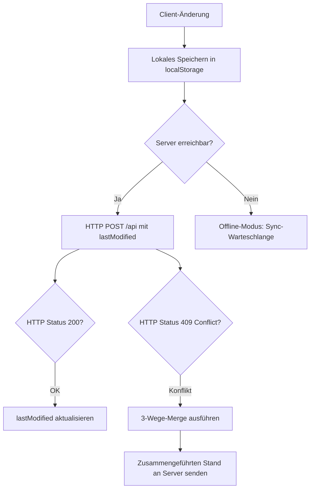

# RadPlan — Digitaler Dienstplan für die Klinik für Radiologie & Nuklearmedizin

> **RadPlan** ist eine vollständig im Browser laufende, hochspezialisierte Dienstplan-Anwendung für die **Klinik für Radiologie & Nuklearmedizin am Klinikum St. Georg Leipzig**. Sie verbindet ein dichtes, tabellarisches Monatsraster mit einem regelbasierten, mehrzyklischen Optimierungsalgorithmus (dem *RadPlan Neural Scheduler*), tiefen Mitarbeiter- und Jahresauswertungen, einem isolierten Planungsmodus und einer servergestützten Echtzeit-Synchronisation — verpackt in eine sorgfältig ausgearbeitete, barrierearme und touch-taugliche Oberfläche mit Hell-/Dunkelmodus, die bis in den letzten Pixel für iPhones (inklusive installierter PWA im Standalone-Modus) optimiert ist.
>
> Diese Dokumentation beschreibt den **vollständigen aktuellen Funktions- und Code-Stand** der Anwendung bis in jedes Detail: jede Ansicht, jedes Bedienelement, jede Regel, jeden Datenpfad, jede CSS-Datei, jede JS-Datei und jede Tastenkombination — verifiziert gegen den tatsächlichen Quellcode, nicht gegen eine ältere Beschreibung.

---

## Inhaltsverzeichnis

1. [Was RadPlan löst — die fachliche Domäne](#1-was-radplan-löst--die-fachliche-domäne)
2. [Technologie-Stack & Architekturprinzipien](#2-technologie-stack--architekturprinzipien)
3. [Fachliches Datenmodell & globaler Zustand](#3-fachliches-datenmodell--globaler-zustand)
4. [Stammdaten, Rollen, Qualifikationen & Sonderregeln](#4-stammdaten-rollen-qualifikationen--sonderregeln)
5. [Persistenz, LocalStorage & Server-Synchronisation](#5-persistenz-localstorage--server-synchronisation)
6. [Gesamtaufbau der Oberfläche](#6-gesamtaufbau-der-oberfläche)
7. [Das Dienstplan-Raster im Detail](#7-das-dienstplan-raster-im-detail)
8. [Zell-Interaktion: Editor, Schnellaktionen, Gestik & Tastatur](#8-zell-interaktion-editor-schnellaktionen-gestik--tastatur)
9. [Kontextmenü & Zell-Detail-Tooltip](#9-kontextmenü--zell-detail-tooltip)
10. [Das Undo/Redo-System](#10-das-undoredo-system)
11. [Der Planungsmodus (Entwurfs-Sandbox)](#11-der-planungsmodus-entwurfs-sandbox)
12. [Der RadPlan Neural Scheduler (Auto-Plan)](#12-der-radplan-neural-scheduler-auto-plan)
13. [Mitarbeitendenbereich (Team- & Personen-Dashboard)](#13-mitarbeitendenbereich-team--personen-dashboard)
14. [Der Auswertungs-Hub (Auswertungen)](#14-der-auswertungs-hub-auswertungen)
15. [Abteilungsübersicht](#15-abteilungsübersicht)
16. [Befehlspalette](#16-befehlspalette)
17. [Drucken & PDF-Export](#17-drucken--pdf-export)
18. [Import & Export von Daten](#18-import--export-von-daten)
19. [Darstellung, Theming, Animationen & Barrierefreiheit](#19-darstellung-theming-animationen--barrierefreiheit)
20. [Mobile-, Touch- & PWA-Erfahrung](#20-mobile--touch--pwa-erfahrung)
21. [Kalender- & Feiertagslogik](#21-kalender--feiertagslogik)
22. [Vollständige Tastaturkürzel-Referenz](#22-vollständige-tastaturkürzel-referenz)
23. [Vollständige Projektstruktur & Dateibeschreibungen](#23-vollständige-projektstruktur--dateibeschreibungen)
24. [Entwicklung & Deployment](#24-entwicklung--deployment)
25. [Glossar & Codetabellen](#25-glossar--codetabellen)

---

## 1. Was RadPlan löst — die fachliche Domäne

In einer klinischen radiologischen Abteilung müssen an jedem Tag des Jahres zwei kritische Dienste lückenlos und qualifiziert besetzt sein:

1. **Bereitschaftsdienst (BD / Code „D")** — Der Arzt vor Ort, der die Akutversorgung trägt, Notfall-CTs und -MRTs befundet, Kontrastmittelüberwachungen durchführt und klinische Anfragen steuert.
2. **Hintergrunddienst (HG)** — Die fachärztliche Rückfallebene im Hintergrund (Rufbereitschaft), die telefonisch beratend zur Seite steht, komplexe Befunde freigibt, Interventionsentscheidungen trifft und bei personellen Engpässen oder Katastrophenfällen einspringt.

Daneben werden die Ärztinnen und Ärzte der Abteilung an Werktagen auf verschiedene **Arbeitsplätze** (Modalitäten) verteilt: Großgeräte (MRT, CT, Sonographie – US, Angiographie – AN), Spezialbereiche (Mammographie – MA, Kinder-Ultraschall – KUS), der Außenstandort Wermsdorf (W) und die Teleradiologie (T).

Die Dienstplanung steht vor der Herausforderung, diese Dienste und Modalitäten unter Beachtung strenger Restriktionen zu verteilen:

* **Gesetzliche Vorgaben:** Einhaltung von Ruhezeiten (nach einem Bereitschaftsdienst am Folgetag zwingend dienstfrei).
* **Fachliche Qualifikation:** Wochenend-Bereitschaftsdienste und alle Hintergrunddienste dürfen ausschließlich von vollapprobierten Fachärztinnen und Fachärzten geleistet werden.
* **Soziale Kriterien & Fairness:** Gleichmäßige Verteilung der Dienste über das Jahr, Berücksichtigung von Wünschen und Urlauben, Vermeidung von aufeinanderfolgenden Dienstwochenenden sowie Einhaltung individueller vertraglicher Sondervereinbarungen (Dienstreduktion, Befreiungen, personenbezogene Konfliktregeln).

RadPlan digitalisiert diesen Prozess vollständig: von der präzisen **manuellen Erfassung** über tiefgehende **Auswertungen und Fairness-Kennzahlen** bis zur **vollautomatischen Berechnung** eines optimierten Dienstplans durch einen regelbasierten, mehrzyklischen Scheduling-Algorithmus.

---

## 2. Technologie-Stack & Architekturprinzipien

RadPlan ist konsequent als **Single-Page-Application (SPA) ohne Build-Schritt** konzipiert. Es gibt keinen Bundler, keinen Transpiler, kein `node_modules`-Verzeichnis mit Laufzeitabhängigkeiten — die Anwendung läuft exakt so im Browser, wie sie im Repository vorliegt.

### 2.1 Frontend-Laufzeit & Sprachen

* **HTML5 (`index.html`, ca. 58 KB):** Das statische Anwendungsgerüst. Enthält alle Skelette der Modal-Dialoge (Editor, Mitarbeitende, Auswertungen, Abteilung, Jahresplan, Import, Autoplan, Befehlspalette …), die feste Kopfzeile, die Planungsleiste, die Statistikleiste, den Tabellen-Container sowie die mobile Navigationsleiste. Ein Inline-`<script>` im `<head>` verhindert Theme-Flackern (siehe [19.1](#191-dynamische-themes-hell-dunkelmodus)).
* **ECMAScript-Module (ESM):** Der gesamte JavaScript-Code (`<script type="module" src="js/app.js">`) ist in klar getrennte, über `import`/`export` verbundene Module aufgeteilt (siehe die vollständige Dateiliste in [Kapitel 23](#23-vollständige-projektstruktur--dateibeschreibungen)). Es gibt keine globalen Variablen außerhalb dieser Modulgrenzen.
* **CSS3:** Das Styling ist auf 21 thematisch getrennte Dateien aufgeteilt (Kern-Variablen, Layout, Komponenten, drei Modal-Dateien nach Dialog getrennt, Ansichten, mobile Optimierung, Druck sowie ein Basis- plus acht Modul-Stylesheets für den Auswertungs-Hub). Durchgehender Einsatz von CSS Custom Properties (Variablen) für das Farbschema-Theming, von Flexbox/Grid für Layouts, von Container-Queries für adaptive Schriftgrößen in Tabellenzellen und von `@media (display-mode: standalone)` für PWA-spezifische Anpassungen.
  * Die früher monolithische `modals.css` (3.245 Zeilen) wurde reihenfolgeerhaltend in `modals-base.css` (Basis-Chrome + Editor), `modals-autoplan.css` (Auto-Plan-Dialog) und `modals-yearplan.css` (Jahresplaner-Dialog) aufgeteilt — die Kaskadenreihenfolge in `index.html` entspricht exakt der ursprünglichen Zeilenreihenfolge, es gibt also keine Verhaltensänderung.
  * Modal-Oberflächen sind bewusst theme-unabhängig immer hell gestaltet (siehe Kommentar in `modals-base.css`); ihre Hex-Farben sind daher größtenteils **kein** Aufräum-Fall für die theme-gebundenen `--gray-*`-Variablen. Wiederholtes reines Weiß (`#fff`/`#FFFFFF`) wurde auf das bereits vorhandene `--white` vereinheitlicht. Die zahlreichen `!important`-Deklarationen in den Modal-Dateien liegen fast ausschließlich in `body.is-mobile`-Overrides, die absichtlich die höhere Selektor-Spezifität der Desktop-Basisregeln kontern — ein Audit ergab keine sichere, risikofreie Entfernungsmöglichkeit ohne Layout-Regressionstests auf echten mobilen Geräten.

### 2.2 Externe Bibliotheken (per CDN eingebunden)

Alle externen Bibliotheken werden über `<script>`-Tags am Ende von `index.html` von öffentlichen CDNs geladen — es gibt keine lokal gebündelten Kopien. Die Kernfunktionen der App (Planung, Editor, Speichern) hängen nicht von ihnen ab; ist ein CDN nicht erreichbar, bleiben nur die jeweils abhängigen Zusatzfunktionen (Diagramme, Animationen, PDF) eingeschränkt:

* **Chart.js (v4.4.4):** Rendert alle Diagramme — Arbeitsplatzverteilungen und Aktivitätsverläufe im Mitarbeiterprofil, den kumulierten Fairness-Verlauf im Auswertungs-Hub, Balkendiagramme in der Prognose und den Kapazitäts-/Engpass-Verlauf bei Abwesenheiten.
* **GSAP (GreenSock Animation Platform, v3.12.2):** Sorgt für weiche Animationsübergänge.
* **jsPDF (v2.5.1) & jspdf-autotable (v3.8.2):** Erzeugen mehrseitige PDF-Dokumente im A4-Format direkt im Browser, ohne Server-Roundtrip.
* **IBM Plex Sans & IBM Plex Mono (Google Fonts):** Webfonts für optimale Lesbarkeit. Die Festbreitenschrift (Mono) wird gezielt für numerische Daten und Dienst-Codes genutzt, damit Zahlen beim Ändern nicht visuell „springen".

### 2.3 Edge-Backend & Persistenz

* **Cloudflare Pages Functions (`functions/api.js`):** Eine einzelne, serverlose Handler-Funktion `onRequest(context)`, die alle Anfragen an `/api` beantwortet.
* **Cloudflare KV (Key-Value-Namespace):** Der persistente Datenspeicher auf Cloudflare-Edge-Servern, gebunden unter dem Namen `RADPLAN_KV`. Der Datenbestand ist **nach Kalenderjahr partitioniert** statt in einem einzigen, unbegrenzt wachsenden JSON-Blob abgelegt: `RADPLAN_META` (`{ years, lastModified }`) verzeichnet die vorhandenen Jahre, jedes Jahr liegt separat unter `RADPLAN_YEAR_<jahr>` (`{ months, lastModified }`), Planungsentwürfe liegen gesammelt unter `RADPLAN_PLANS`. Der Wire-Vertrag gegenüber dem Client bleibt dabei unverändert (`{ main, plans, lastModified }`) — `functions/api.js` setzt die Jahres-Fragmente serverseitig transparent zum flachen `main`-Objekt zusammen bzw. zerlegt es beim Schreiben wieder. Ein noch vorhandener alter `"RADPLAN_DATA"`-Einzelblob (Vorgänger-Layout) wird beim ersten Zugriff automatisch und rückstandsfrei in das neue Layout migriert, ohne den alten Schlüssel zu löschen (dient als Fallback).
* **HTTP-Verhalten:** `GET` liefert den gespeicherten Stand zurück (oder ein leeres Grundgerüst `{main:{}, plans:{}, lastModified:0}`, falls noch nichts gespeichert wurde). `POST` schreibt neue Daten unter einer optimistischen Nebenläufigkeitskontrolle, die dank der Jahres-Partitionierung **pro Jahr** statt für den gesamten Bestand ausgewertet wird: bearbeiten zwei Personen gleichzeitig unterschiedliche Jahre, entsteht serverseitig gar kein Konflikt mehr (vorher führte jede gleichzeitige Änderung irgendwo im Datenbestand zu einem 409, siehe [5.2](#52-server-interaktion--3-wege-merge-mergethreeway)); alle anderen HTTP-Methoden werden mit `405` abgelehnt. CORS ist mit `*` vollständig offen, alle Antworten tragen `no-cache`-Header, und es findet keine Authentifizierung statt — die Anwendung setzt auf ein vertrauenswürdiges, internes Klinik-Netzwerk bzw. eine entsprechend abgesicherte Netzwerkumgebung.

---

## 3. Fachliches Datenmodell & globaler Zustand

### 3.1 Globale Datenstruktur `DATA`

Der gesamte Zustand aller Pläne ist in einem einzigen, hierarchischen JSON-Objekt namens `DATA` abgelegt (verwaltet in `state.js`). Seine Hauptschlüssel sind die Monate im Format `YYYY-M` (der Monat ist **0-basiert**, z. B. `"2026-5"` für Juni 2026).

```jsonc
{
  "2026-5": {
    "employees": ["Prof. Schäfer", "Dr. Lurz", "Dr. Becker", "Dr. Martin"],
    "assignments": {
      "Dr. Martin": {
        "3":  { "assignment": "CT",    "duty": "HG" },  // Tag 3: Arbeitsplatz CT, Hintergrunddienst
        "12": { "assignment": "MR/US", "duty": "D"  },  // Tag 12: Split-Arbeitsplatz, Bereitschaftsdienst
        "13": { "assignment": "F" }                      // Tag 13: Dienstfrei
      }
    },
    "rbn": {
      "3":  "Dr. Maybaum (NRAD)",
      "12": "Dr. Bailis (NRAD)"
    },
    "comments": {
      "Dr. Martin": { "12": "Vertretung für MRT" }
    }
  }
}
```

`model.js` bietet `normalizeMonthDataShape(md)`, das sicherstellt, dass jedes Monatsobjekt garantiert die vier Schlüssel `employees` (Array), `assignments`, `rbn` und `comments` (jeweils Objekte) besitzt — auch bei frisch angelegten Monaten oder nach einem Import.

### 3.2 Zellspezifische Datenbereinigung

Um Speicherplatz zu sparen und JSON-Strukturvergleiche (für Undo/Redo und den 3-Wege-Merge) sauber zu halten, werden Zellen bei jeder Änderung automatisch bereinigt (`cleanupAssignmentCell`):

* Enthält eine Zelle weder eine Zuweisung (`assignment`), einen Dienst (`duty`), Wünsche, Pins noch Kommentare, wird das entsprechende Tagesobjekt vollständig gelöscht.
* Hat ein Mitarbeiter an einem bestimmten Tag gar keine Einträge mehr, wird sein Tageseintrag aus `assignments` entfernt.

### 3.3 RBN-Zeile (Rufdienst Neuroradiologie)

Zusätzlich zur personenbezogenen Matrix existiert eine globale Planungszeile **„RD Neurorad"**, die in `md.rbn[day]` gespeichert wird und einen eigenen, achtköpfigen Personenpool nutzt:

* **Sichtbarkeit:** Die Zeile erscheint erst ab Juni 2025 (`RBN_ROW_START = { year: 2025, month: 5 }`, 0-basiert = Juni).
* **Auswahlpool (`RBN_OPTIONS`):** Prof. Schob (NRAD), Dr. Maybaum (NRAD), Dr. Bailis (NRAD), Dr. Schüngel (NRAD), Fr. Dalitz (RAD), Fr. Thaler (RAD), Dr. Martin (RAD), Hr. El Houba (RAD).
* **Dynamische Gültigkeit:** *Fr. Thaler (RAD)* steht nur bis einschließlich März 2026 zur Auswahl (`RBN_THALER_LAST_MONTH = { year: 2026, month: 2 }`, 0-basiert = März) und wird ab April automatisch aus der Dropdown-Liste ausgeblendet (`getRbnOptionsForDate`).

### 3.4 Personalabgänge (`EMPLOYEE_DEPARTURES`)

Um historische Pläne unverändert zu lassen, aber zukünftige Pläne von ausgeschiedenen Personen freizuhalten, wird befristetes Personal als strukturiertes Austrittsdatum modelliert:

```js
export const EMPLOYEE_DEPARTURES = {
  // month ist 0-basiert und markiert den ERSTEN Monat OHNE die Person.
  "Fr. Thaler": { year: 2026, month: 3, reason: "ausgeschieden" }, // aktiv bis inkl. März 2026
  "Hr. Torki":  { year: 2026, month: 6, reason: "gekündigt"    }, // aktiv bis inkl. Juni 2026
};
```

Die Hilfsfunktion `isEmployeeActiveInMonth(name, y, m)` prüft diese Bedingung live gegen jeden angefragten Monat. Beim Initialisieren oder Speichern eines Monats führt `reconcileEmployeesForMonth(md, y, m)` automatische Bereinigungen durch: ausgeschiedene Personen werden aus der `employees`-Liste eines Monats entfernt, sobald dieser Monat in ihrer Abwesenheitszeit liegt — vergangene Monate bleiben davon unberührt.

---

## 4. Stammdaten, Rollen, Qualifikationen & Sonderregeln

### 4.1 Mitarbeiter-Stammdaten (`EMP_META`)

In `constants.js` ist das Kernregister `EMP_META` hinterlegt. Jede Person wird dort als strukturiertes Objekt geführt mit den Feldern `fullName` (vollständiger Titel-/Namensstring), `position` (Kürzel, siehe unten), `posLabel` (ausgeschriebene Positionsbezeichnung), `type` (Facharztrichtung, z. B. „FA für Radiologie"), `area` (Schwerpunktbereich) und `deputy` (Standard-Vertretung).

Fehlt eine Person im Register (z. B. nach einem Datenimport mit unbekanntem Namen), liefert `getEmpMeta(name)` einen sicheren Fallback (`position: "—"`, leere Felder) statt eines Fehlers.

### 4.2 Positions-Kürzel

| Kürzel | Bedeutung |
| :--- | :--- |
| `CA` | Chefarzt |
| `LOA` | Leitender Oberarzt |
| `OA` / `OÄ` | Oberarzt / Oberärztin |
| `FA` / `FÄ` | Facharzt / Fachärztin |
| `AA` / `AÄ` | Assistenzarzt / Assistenzärztin |

Jedes Kürzel besitzt in `posColor()` eine eigene Badge-Farbe (z. B. CA = Violett, LOA = Blau, OA/OÄ = Türkis, FA = Grün), die im Raster, in Mitarbeiterkarten und in den Auswertungen konsistent wiederverwendet wird.

### 4.3 Rollenklassifikation für die Engine

Der Scheduler und das Dienstgitter leiten Berechtigungen dynamisch aus der Position ab:

* **`isFacharzt`:** `true` für alle Rollen außer AA/AÄ. Ermächtigt zur Übernahme von Hintergrunddiensten und Samstags-Bereitschaftsdiensten.
* **`isAssistenzarzt`:** `true` ausschließlich für AA/AÄ.
* **Fallback (`hasKnownRole`):** Personen ohne Profil im Register werden sicherheitshalber wie Assistenzärzte behandelt (die engeren Beschränkungen), um Fehlplanungen bei Berechtigungen zu vermeiden — begleitet von einer UI-Aufforderung zur Datenpflege.

### 4.4 Datengetriebene Sonderregeln (`SPECIAL_RULES`)

Sämtliche Ausnahmen und Spezialkombinationen sind zentral in einem einzigen Objekt `SPECIAL_RULES` in `constants.js` hinterlegt, das sowohl vom Scheduler als auch von der Konformitätsprüfung im Auswertungs-Hub konsumiert wird:

* **`dutyExempt: ["Prof. Schäfer"]`** — Komplette Befreiung von allen Bereitschafts- und Hintergrunddiensten. Das monatliche Dienstziel beträgt hart 0.
* **`reducedBdTarget: { "Dr. Polednia": 3, "Dr. Becker": 3, "Hr. Sebastian": 3 }`** — Reduziertes monatliches Dienstziel für den Bereitschaftsdienst (Standardziel ist ansonsten **4**).
* **`noBdWeekdays: { "Dr. Polednia": [0, 2, 4] }`** — Absolutes Verbot für Bereitschaftsdienste an Sonntagen (0), Dienstagen (2) und Donnerstagen (4).
* **`noHgFromAaWeekdays: { "Dr. Polednia": [0, 2, 4] }`** — Verbot zur Übernahme des Hintergrunddienstes an diesen Tagen, wenn der Bereitschaftsdienst-Halter desselben Tages ein Assistenzarzt ist (da Dr. Polednia am Folgetag für den Kinder-Ultraschall eingeplant ist und rechtliche Ruhezeiten greifen müssen).
* **`surplusBdPreference: ["Dr. Lurz"]`** — Priorität bei unvermeidbaren Überhangdiensten: Sind bereits alle Bereitschaftsdienste gleichmäßig und fair auf die Monatsziele verteilt und muss dennoch ein zusätzlicher Dienst vergeben werden, übernimmt bevorzugt Dr. Lurz diesen ersten Überhang-Dienst — sofern keine Bereitschaftsdienst-Wünsche anderer Personen für genau diesen Tag entgegenstehen.
* **`saturdayUltimaRatio: ["Dr. Becker"]`** — Samstags-Bereitschaftsdienst soll für diese Person nur im äußersten Ausnahmefall vergeben werden.
* **`saturdayFzaCompensation: ["Dr. Becker"]`** — Nach der Vergabe eines Samstags-Bereitschaftsdienstes muss am darauffolgenden regulären Werktag zwingend ein Freizeitausgleich (`FZA`) eingetragen werden.
* **`ctLeadershipPairs: [["Dr. Becker", "Dr. Martin"]]`** — Bilden das CT-Leitungsteam. Beide dürfen an Werktagen niemals gleichzeitig abwesend (Urlaub, FZA, Krankheit, Weiterbildung) oder dienstfrei sein; `getCtLeadershipPartner(name)` liefert die jeweilige Gegenperson.
* **`hgConflictRules`** — Strukturierte Konfliktkopplung für den Hintergrunddienst (Feldnamen exakt wie im Quellcode):
  ```js
  hgConflictRules: [
    { person: "Fr. Dalitz", weekdays: [0, 1], conflictBd: ["Hr. Torki", "Hr. Sebastian"] },
  ]
  ```
  Fr. Dalitz darf an Sonntagen (0) und Montagen (1) keinen Hintergrunddienst leisten, wenn an diesen Tagen Hr. Torki oder Hr. Sebastian den Bereitschaftsdienst halten (`getHgConflictBd`). Hintergrund: Die Mammographie-Schicht am Folgetag lässt keine Zeit für zeitintensive Assistenzarzt-Befundfreigaben.

Jede Regel ist über eine dedizierte, reine Prüf-Funktion (`getReducedBdTarget`, `isNoBdWeekday`, `isNoHgFromAaWeekday`, `isSaturdayUltimaRatio`, `getSurplusBdPreferenceRank`, `needsSaturdayFza`, `getCtLeadershipPartner`, `getHgConflictBd`) verfügbar — sowohl der Scheduler als auch die Live-Konflikterkennung im Raster und der Auswertungs-Hub greifen ausschließlich über diese Funktionen zu, nie direkt auf das Rohobjekt.

---

## 5. Persistenz, LocalStorage & Server-Synchronisation

RadPlan arbeitet nach einer **Offline-First-Strategie**: Daten werden lokal sofort gespeichert und asynchron mit der Cloud synchronisiert.



### 5.1 Lokale Speicherstrukturen (`localStorage`)

| Schlüssel | Inhalt |
| :--- | :--- |
| `radplan_v3` | Der Hauptdatenstamm (`DATA` als JSON-String, `STORAGE_KEY`) |
| `radplan_v3_plan_YYYY-M` | Temporärer Planungsentwurf für den jeweiligen Monat (Planungsmodus) |
| `radplan_v3_theme` | Gespeichertes Theme (`light` oder `dark`) |
| `radplan_v3_colorblind` | Umschalter für Barrierefreiheit (`"1"` = aktiv) |

### 5.2 Server-Interaktion & 3-Wege-Merge (`mergeThreeWay`)

Die Synchronisation arbeitet optimistisch. Bei jedem Speichervorgang sendet der Client den Zeitstempel seines letzten erfolgreichen Server-Abgleichs mit. Hat eine andere Planerin in der Zwischenzeit Daten gespeichert, meldet der Server ein **HTTP 409 (Conflict)** und liefert seinen neueren Datenstand aus (`latestData`). Da der Datenbestand serverseitig nach Kalenderjahr partitioniert ist (siehe [2.3](#23-edge-backend--persistenz)), prüft `functions/api.js` diese Bedingung **pro Jahr**: Ändert die andere Planerin nur ein anderes Jahr als der speichernde Client, entsteht serverseitig gar kein Konflikt und beide Speichervorgänge gelingen ohne Merge. Ein echtes 409 tritt nur noch auf, wenn dasselbe Jahr betroffen ist.

Der Client löst diesen Konflikt feldgenau auf, ausgehend von drei Ständen:

1. **Base-Stand:** Der Zustand beim letzten gemeinsamen Abgleich.
2. **Local-Stand:** Die ungespeicherten Änderungen des aktuellen Clients.
3. **Server-Stand:** Die Änderungen der anderen Planer auf dem Server.

Der Algorithmus wandert rekursiv durch das JSON:

* Wurde ein Feld lokal geändert, auf dem Server aber nicht → **lokale Änderung gewinnt**.
* Wurde ein Feld auf dem Server geändert, lokal aber nicht → **Server-Änderung gewinnt**.
* Wurde dasselbe Feld auf beiden Seiten unterschiedlich modifiziert → **Konflikt**. Die lokale manuelle Änderung überschreibt in diesem Fall den Server-Wert, um Datenverlust beim aktiven Planer zu verhindern. Der Merge-Vorgang feuert das Event `radplan-sync-update`, das UI-Statusleiste, Undo-Verlauf (Reset, siehe [10](#10-das-undoredo-system)) und ein sichtbares Toast informiert.

---

## 6. Gesamtaufbau der Oberfläche

Die Benutzeroberfläche gliedert sich in fünf Hauptbereiche:

```
+-------------------------------------------------------------------+
|  [Logo] RadPlan       ‹ Juni 2026 ▾ ›      [Undo] [Redo] [Mond]   | <-- Kopfzeile (Header)
+-------------------------------------------------------------------+
|  [PLANUNGSAKTIV]  Mitteilungen        [Auto-Plan] [Übernehmen]    | <-- Planungsleiste (nur aktiv)
+-------------------------------------------------------------------+
|  Stats: MR [12]  CT [8]  US [10]  D [4/30]  HG [5/30]  U [14]     | <-- Statistikleiste
+-------------------------------------------------------------------+
|  Mitarbeiter | 1 | 2 | 3 | 4 | 5 | 6 | 7 | 8 | 9 | 10 | ...        | <-- Hauptbereich (Tabelle/Raster)
|  ------------+---+---+---+---+---+---+---+---+---+----+----------|
|  Dr. Becker  |MR |CT | D | F |US |MR |   |   |   |    |           |
|  Dr. Martin  |CT |US |   |   | D | F |   |   |   |    |           |
+-------------------------------------------------------------------+
```

1. **Kopfzeile (`#app-header`):** Enthält das interaktive Markenlogo (animiertes SVG, siehe [19.5](#195-das-animierte-markenlogo)), die Monatsnavigation mit Schnellsprüngen, Undo-/Redo-Buttons für den Hauptmodus, Schnellwerkzeuge (Theme-Umschalter, Kontrastmodus, Suche/Befehlspalette, Dichte-Umschalter) und das Navigationsmenü für die Kernmodule (Planung, Mitarbeitende, Jahresplan, Auswertungen).
2. **Planungsleiste (`#plan-bar`):** Erscheint nur bei aktivem Planungsmodus. Bietet visuelle Rückmeldung und Steuerelemente zum Ausführen des Auto-Planers sowie zum Verwerfen oder Übernehmen des Entwurfs.
3. **Statistikleiste (`#stats-bar`):** Eine scrollbare Leiste mit farbigen Datenchips, die die Summe aller im Monat eingetragenen Arbeitsplätze, Dienste und Status in Echtzeit anzeigt.
4. **Hauptbereich (Tabelle):** Die interaktive Planungsmatrix. Zeigt Zeilen für Mitarbeitende und Spalten für Kalendertage.
5. **Mobile-Bedienleiste:** Unterhalb der `MOBILE_BREAKPOINT`-Schwelle (600px, siehe [20.1](#201-der-responsive-breakpoint-kaskade)) wird die Tabelle durch eine Tagesliste ersetzt und eine untere Navigationsleiste für den schnellen Zugriff auf Mitarbeitende, Planung und Menü eingeblendet.

---

## 7. Das Dienstplan-Raster im Detail

Das Monatsraster (`#plan-table`, gerendert in `render-grid.js`) stellt alle Informationen extrem verdichtet dar.

**Gezielte DOM-Updates statt Full-Rerender:** Eine einzelne Zellbearbeitung (Editor speichern, Schnellaktionen, Drag&Drop von Dienst-Badges) baut nicht die komplette Tabelle neu auf. `updateGridCell(emp, day)` ersetzt gezielt nur das betroffene `<td>`; `updateGridStatsAndHeader(touchedDays)` aktualisiert im Tabellenkopf und im Statistik-Fuß (Zeilen MRT/CT/D/HG/Anwesend) ebenfalls nur die Spalte(n) der tatsächlich geänderten Tage (`updateTheadDay`/`updateTfootDay`), statt Kopf- und Fußzeile über alle Tage hinweg neu zu erzeugen. Ein vollständiger Rebuild (`render()`) bleibt reserviert für Fälle, die die Spaltenstruktur selbst betreffen können (Monatswechsel, Import, Mitarbeiter hinzufügen/entfernen, mobile Kartenansicht).

### 7.1 Intelligenter Tabellenkopf (`renderThead`)

Die Spaltenköpfe zeigen gestapelte Informationen:

* **Kalenderwochen-Band (`KW`):** Wird am Wochenanfang gezeichnet und fasst die zugehörigen Wochentage visuell zusammen (ISO-Wochennummer über `isoWeekNumber`).
* **Tagesbezeichner:** Datum und Wochentag (Mo–So). Samstage, Sonntage und Feiertage sind farblich abgesetzt.
* **Feiertags-Indikator:** Fährt man über einen Feiertag, wird der offizielle Name eingeblendet (z. B. „Reformationstag").
* **Abdeckungs-Indikator:** Ein schmaler, dreistufiger Farbstreifen unter dem Wochentag:
  * *Grün:* Bereitschafts- (D) **und** Hintergrunddienst (HG) sind besetzt.
  * *Gelb:* Nur einer der beiden Dienste ist besetzt.
  * *Rot:* Beide Dienste sind unbesetzt. An Wochenenden und Feiertagen leuchtet dieser Indikator auffällig Orange-Rot, da hier eine Besetzung zwingend erforderlich ist.

### 7.2 Tabellenkörper (`renderTbody`)

* **Rollenbänder (Zonierung):** Das Raster trennt die Mitarbeitergruppen (Chefärzte, Oberärzte, Fachärzte, Assistenzärzte) durch horizontale Trennlinien und dezente Farbbänder, ohne die alphabetische Sortierung innerhalb der Gruppen aufzubrechen.
* **Namensspalte:** Enthält den Namen, ein farbiges Positions-Badge und ein Avatar-Symbol. Ein Klick öffnet das Mitarbeiterprofil (siehe [13.2](#132-der-personen-screen-detaillierte-einzelstatistik)), ein Rechtsklick das Kontextmenü für administrative Aktionen ([9](#9-kontextmenü--zell-detail-tooltip)).
* **Tageszellen:** Sind vollflächig in der Farbe der zugewiesenen Modalität eingefärbt (`cellColor`). Dienste (`D`, `HG`) und Abwesenheiten (`U`, `K`, `FZA` …) werden als Textbadges überlagert. Ein kleiner grauer Eckpunkt indiziert das Vorhandensein einer Tagesnotiz.

### 7.3 Live-Konflikterkennung im Raster

Wird eine Zelle bearbeitet, prüft die Funktion `computeGridConflicts` im Hintergrund sofort die Einhaltung aller K.-o.-Kriterien (Ruhezeiten, Dienst-Exklusivität, Qualifikationssperren, personenbezogene Sonderregeln aus `SPECIAL_RULES`). Bei Konflikten wird die Zelle im Raster mit einer roten Warnecke (**⚠**) markiert. Beim Überfahren mit der Maus zeigt der Detail-Tooltip ([9.2](#92-zell-detail-tooltip-celltooltipjs)) den Regelverstoß im Klartext an (z. B. *„Ruhezeit verletzt: Bereitschaftsdienst am Vortag erfordert dienstfreien Folgetag"*).

### 7.4 Container-Query Schriftgrößen-Skalierung

Um zu verhindern, dass Texte wie „MR/CT" oder Abkürzungen in engen Tabellenzellen abgeschnitten werden, nutzt RadPlan CSS-Container-Queries: Die Tageszellen verhalten sich als Style-Container, und die Schriftgröße der Zuweisungen passt sich stufenlos der tatsächlichen Breite und Höhe der Zelle an — unabhängig vom aktuell gewählten Dichte-Modus (Standard/Kompakt, `body.grid-density-compact`).

---

## 8. Zell-Interaktion: Editor, Schnellaktionen, Gestik & Tastatur

RadPlan bietet vier verschiedene Interaktionsmodelle, um den unterschiedlichen Eingabegewohnheiten der Anwender gerecht zu werden.

### 8.1 Der vierstufige Zuweisungs-Editor

Ein modales Fenster (`#modal-editor`) für detaillierte Zuweisungen:

1. **Einsatz:** Auswahl eines exklusiven Status (z. B. Urlaub) oder freie Kombination mehrerer Arbeitsplätze (z. B. „MR/CT") durch Anklicken der farbigen Chips.
2. **Dienst:** Zuweisung von Bereitschafts- (D) oder Hintergrunddienst (HG). Besetzte Dienste anderer Personen an diesem Tag werden als belegt markiert.
3. **Planung (nur im Planungsmodus):** Setzen von Dienstwünschen (`NO_DUTY` = Kein Dienst, `BD_WISH`, `HG_WISH`) und Fixieren der Zelle (Pin).
4. **Tagesnotiz:** Ein Textfeld für Kommentare (maximal 200 Zeichen).

Tastaturkürzel innerhalb des geöffneten Editors: siehe [22.3](#223-steuerung-im-editor-modal).

### 8.2 Desktop-Schnell-Popover (`showCellQuickPopover`)

Ein leichtgewichtiges Popover (`.cqp-*`-Klassen in `components.css`), das sich direkt an die fokussierte Zelle anheftet. Es ermöglicht das Setzen der gängigsten Modalitäten und Dienste mit einem einzigen Klick, ohne das große Editor-Modal zu öffnen. Positioniert sich automatisch so, dass es nie über den Viewport-Rand hinausragt.

### 8.3 Mobile-Radialmenü (`openRadialQuickMenu`)

Für Touch-Geräte optimiert: Ein **längeres Gedrückthalten** (Longpress) auf eine Tageszelle öffnet ein kreisförmiges Radialmenü. Durch Wischen in die Richtung eines Menüpunktes (z. B. nach oben für Urlaub, nach rechts für Bereitschaftsdienst) und anschließendes Loslassen wird die Zuweisung sofort eingetragen.

```
       [Urlaub]
          |
[Dienst]--+--[Frei]
          |
       [Editor]
```

### 8.4 Mehrfachauswahl & Drag-Selection

Um mehrere Tage in einem Zug zu planen:

* **Bereichs-Auswahl (Shift):** Zelle anklicken, Shift halten und Zielzelle anklicken wählt alle dazwischenliegenden Tage aus.
* **Einzel-Auswahl (Strg/Cmd):** Mehrere nicht zusammenhängende Zellen können gezielt selektiert werden.
* **Drag-Selection:** Klicken und Ziehen der Maus über mehrere Zellen spannt ein Auswahlfeld auf (`body.is-drag-selecting` unterdrückt währenddessen Textmarkierung).
* **Ctrl/Cmd+Klick auf eine Zelle** öffnet stattdessen direkt den RBN-Editor bzw. den Editor in einem speziellen Modus, statt eine Mehrfachauswahl zu beginnen.
* *Aktion:* Jede Zuweisung über den Editor oder die Tastenkürzel wird auf **alle** markierten Zellen gleichzeitig angewendet.

### 8.5 Tastatur-Navigation im Raster

Bei fokussierter Zelle (`handleGridKeydown` in `render-grid.js`, nur im Desktop-Modus aktiv) navigieren die Pfeiltasten zur jeweiligen Nachbarzelle (`focusAdjacentCell`), `D`/`H` togglen die jeweiligen Dienste direkt (`quickToggleDuty`), `Entf`/`Rückschritt` leert die Zelle und `Enter` öffnet den Editor. Details siehe [22.2](#222-raster-navigation-bei-fokussierter-zelle).

---

## 9. Kontextmenü & Zell-Detail-Tooltip

Zwei eigenständige, aber eng verwandte Bedienhilfen ergänzen die direkte Zell-Interaktion um Kontextinformationen bzw. schnelle administrative Aktionen.

### 9.1 Rechtsklick-Kontextmenü (`contextmenu.js`)

Eine generische, wiederverwendbare `ContextMenu`-Klasse (als Singleton `contextMenu` exportiert) mit Glassmorphism-Optik (`contextmenu.css`): Blur-/Sättigungs-Hintergrund, feste Positionierung an der Klickstelle, Unterstützung für Trennlinien, „gefährliche" (rot hervorgehobene) Einträge sowie Icon-, Label-, Untertitel- und Tastenkürzel-Slots pro Eintrag. Öffnet sich per Rechtsklick auf eine Namenszelle im Raster für administrative Aktionen und schließt automatisch bei Klick außerhalb, beim Scrollen oder bei Fenster-Resize.

### 9.2 Zell-Detail-Tooltip (`celltooltip.js`)

Ein Hover-Tooltip speziell für Desktop-/Maus-Nutzung (auf Geräten mit grobem Zeiger — Touch — bewusst deaktiviert, ebenso während ein Schnell-Popover geöffnet ist): Nach einer Verzögerung von 420 ms öffnet sich beim Überfahren einer Tageszelle ein Detailfenster (`.cdt-*`-Klassen in `enhancements.css`) mit:

* Name und Position der Person sowie der Zuweisung/dem Dienst des überfahrenen Tages,
* den letzten vier D-/HG-Diensteinträgen dieser Person (durchsucht den aktuellen und den Vormonat),
* der Erklärung eines eventuellen Regelkonflikts (aus dem `data-conflict`-Attribut der Zelle, siehe [7.3](#73-live-konflikterkennung-im-raster)),
* dem zuletzt protokollierten Änderungsverlauf dieser Zelle samt Zeitstempel (aus `history.js`, siehe [10.2](#102-changelog-für-den-zell-detail-tooltip)).

Der Tooltip positioniert sich automatisch innerhalb des sichtbaren Viewports neu und schließt bei Scrollen oder Fokusverlust.

---

## 10. Das Undo/Redo-System

RadPlan verwaltet **zwei vollständig getrennte** Verlaufs-Systeme, damit Änderungen im Hauptmodus niemals versehentlich mit Entwürfen aus dem Planungsmodus kollidieren.

### 10.1 Hauptmodus-Verlauf (`history.js`)

Anders als eine klassische Befehlsmuster-Implementierung protokolliert `history.js` **keine einzelnen Mutationsaufrufe**, sondern vergleicht vollständige `DATA`-Snapshots:

* Jeder Aufruf von `saveToStorage()` feuert synchron das Event `radplan-save-queued`.
* Der Listener debounct diese Events um 260 ms (um schnelle Mehrfach-Edits zu einem Undo-Schritt zusammenzufassen) und legt den Zustand *vor* der Änderung auf einem Stapel ab.
* Der Stapel ist auf `MAX_HISTORY = 80` Einträge begrenzt (älteste Einträge fallen heraus).
* Nach einer Server-Synchronisation, die den lokalen Datenbestand vollständig ersetzt (`radplan-sync-update`), wird der Verlauf zurückgesetzt (`resetNormalHistory`), da ein Undo auf einen inzwischen fremden Serverstand keinen Sinn ergäbe.

Exportierte API: `normalUndo`, `normalRedo`, `canNormalUndo`, `canNormalRedo`, `updateNormalHistoryUI`, `getLastChange`, `resetNormalHistory`, `initNormalHistory`.

### 10.2 ChangeLog für den Zell-Detail-Tooltip

Zusätzlich zum Undo-Stapel führt `history.js` eine separate `changeLog`-Map (Schlüssel `monthKey|emp|day` → `{ ts, from, to }`), die unabhängig von der Stapelgröße jede jemals vorgenommene Zelländerung mit Vorher-/Nachher-Wert und Zeitstempel referenzierbar hält. Sie speist ausschließlich den „letzte Änderung"-Abschnitt des Zell-Detail-Tooltips ([9.2](#92-zell-detail-tooltip-celltooltipjs)).

### 10.3 Separater Planungsmodus-Verlauf

Der Planungsmodus verfügt über einen eigenen Undo/Redo-Verlauf (`recordPlanHistory`/`undoPlan`/`redoPlan` in `app.js`), der komplett unabhängig vom Hauptverlauf agiert. Dadurch können komplexe Planungsänderungen (inklusive kompletter Auto-Plan-Läufe) gefahrlos schrittweise zurückgenommen und wiederhergestellt werden, ohne den Hauptplan-Verlauf zu berühren. `Strg/Cmd+Z` bzw. `Strg/Cmd+Shift+Z`/`Strg/Cmd+Y` routen automatisch zum jeweils aktiven Verlauf (Planungsmodus vs. Hauptmodus) und werden unterdrückt, während der Tastaturfokus in einem Eingabefeld liegt.

---

## 11. Der Planungsmodus (Entwurfs-Sandbox)

Der Planungsmodus bietet eine vollständig isolierte Arbeitsumgebung (Sandbox) für den Entwurf neuer Pläne.

### 11.1 Isolierte Session-Kopien

Beim Aktivieren des Planungsmodus wird eine tiefe Kopie des aktuellen Monatsplans im Speicher angelegt (`createPlanSession` in `model.js`). Alle manuellen Änderungen, Eintragungen von Dienstwünschen, Fixierungen (Pins) und Testläufe des Auto-Planers betreffen ausschließlich diesen Entwurf:

* Der Entwurf wird permanent im `localStorage` unter `radplan_v3_plan_YYYY-M` zwischengespeichert (`getStoredPlanDraft`, `persistPlanSessionRefs`), sodass ein versehentlich geschlossener Tab den Fortschritt nicht verliert.
* Erst durch Klicken auf **„Übernehmen"** wird der Entwurf in den echten Hauptplan überführt und synchronisiert (`ensurePlanSession`, `hasSessionChanges`/`hasAnyPlanChanges` prüfen vorab, ob überhaupt Änderungen vorliegen).
* Ein Klick auf **„Abbrechen"** verwirft den gesamten Entwurfsstand rückstandslos.

### 11.2 Separater Undo/Redo-Verlauf

Siehe [10.3](#103-separater-planungsmodus-verlauf).

---

## 12. Der RadPlan Neural Scheduler (Auto-Plan)

Der automatische Planer (`autoplan.js`) ist eine hochspezialisierte Optimierungs-Engine. Sie arbeitet mit einer Kombination aus deterministischen Restriktionen, probabilistischem Scoring und einer mehrzyklischen Metaheuristik, um die optimale Verteilung der Dienste zu berechnen.

### 12.1 Gewichtungs-Profile

Vor dem Berechnungsstart kann der Planer den Fokus der Optimierung festlegen:

* `standard` (Ausgewogen): Gleiche Balance zwischen Wunscherfüllung und mathematisch gerechter Verteilung.
* `fairness` (Fairness-optimiert): Priorisiert eine exakt gleichmäßige Verteilung aller Dienste und Wochenenden; persönliche Dienstwünsche treten in den Hintergrund.
* `wish` (Wunsch-optimiert): Versucht, so viele persönliche Dienstwünsche wie möglich zu erfüllen; dafür werden geringfügige Abweichungen in der Fairness in Kauf genommen.

### 12.2 Die mathematische Fitness-Funktion (NFI)

Die Qualität eines erzeugten Plans wird über den **Neural Fitness Index (NFI)** auf einer Skala von 0 bis 100 ausgedrückt:

$$\text{NFI} = 0.36 \cdot F_{\text{BD-Abdeckung}} + 0.24 \cdot F_{\text{HG-Abdeckung}} + 0.16 \cdot F_{\text{BD-Gerechtigkeit}} + 0.10 \cdot F_{\text{HG-Gerechtigkeit}} + 0.08 \cdot F_{\text{WE-Fairness}} + 0.06 \cdot F_{\text{Wünsche}}$$

* **BD-Abdeckung (36 %):** Bestraft jeden Tag, an dem der Bereitschaftsdienst unbesetzt bleibt. Unbesetzte Wochenenden wiegen doppelt schwer.
* **HG-Abdeckung (24 %):** Bestraft jeden Tag mit unbesetztem Hintergrunddienst.
* **BD-Gerechtigkeit (16 %):** Bewertet die Abweichung (Spread) der verplanten Bereitschaftsdienste zwischen den Fachärzten.
* **HG-Gerechtigkeit (10 %):** Bewertet die Abweichung der Hintergrunddienste von der idealen Lastverteilung.
* **Wochenend-Fairness (8 %):** Bewertet die Streuung der Wochenenddienste um den Kollegiums-Durchschnitt.
* **Wunscherfüllung (6 %):** Belohnt vergebene Dienste an Wunschtagen und bestraft Vergaben an Tagen mit einem eingetragenen „Kein Dienst".

Ein winziger Feinabzug (Deep-Move-Korrelation) verhindert zusätzlich eine künstliche Score-Inflation durch erzwungene Extrem-Swaps.

### 12.3 Detaillierter Ablauf der Optimierungs-Pipeline

```
[Start Auto-Plan]
       |
       v
[Historien-Analyse] (Soll/Ist seit 1. Januar sammeln)
       |
       v
[Greedy-Konstruktion] (Wochenend-BDs verteilen -> Werktags-BDs verteilen)
       |
       v
[HG-Kopplung (Bundling)] (Freitags-Support, WE-Kette, Feiertags-Vortag)
       |
       v
[HG-Rhythmisierung] (HG-Lücken füllen unter Anti-Clustering-Logik)
       |
       v
[Multi-Zyklus-Optimierung (max. 8 Zyklen, Abbruch bei Konvergenz)]
  |-- 1. BD-Swap-Pass (max. 20 Durchläufe, Gerechtigkeit glätten)
  |-- 2. HG-Wochenend-Kopplung & HG-Lücken auffüllen
  |-- 3. HG-Swap-Pass (max. 30 Durchläufe, Abstände optimieren)
  |-- 4. Deep-Optimize-Pass (max. 40 Durchläufe, rollenübergreifende Swaps)
  |-- 5. Coverage-Repair (Lücken zwangsbesetzen) — läuft am Ende jedes Zyklus
       |
       v
[Validierungs-Prüfung] (Dienst-Exklusivität, harte Constraints)
       |
       v
[Success-Visualisierung] (Lichtschein-Kontur-Tracing)
```

1. **Historien-Analyse:** Liest alle Dienste seit dem 1. Januar des aktuellen Kalenderjahres aus, um die kumulierte Belastung der Mitarbeiter als Grundlage der Fairnessbewertung zu erfassen. Historische Vorjahresdaten dienen dabei nur noch als minimaler „Tie-Breaker" bei absolut gleichwertigen Kandidaten im aktuellen Monat.
2. **Greedy-Konstruktion:** Zuweisung aller Bereitschaftsdienste. Wochenenden und Feiertage werden zuerst besetzt. Kandidaten mit der geringsten Jahresbelastung und passenden Wünschen werden bevorzugt. Manuell gesetzte Fix-Dienste haben absolute Priorität — der Algorithmus passt sich um diese Anker herum an.
3. **Hintergrund-Bundling (deterministische Kopplungen, greifen vor der freien Optimierung):**
   * *Freitags-Support:* Hat ein Assistenzarzt am Freitag Bereitschaftsdienst, übernimmt der Facharzt mit dem Samstags-Bereitschaftsdienst zwingend den Hintergrunddienst am Freitag.
   * *Wochenend-Kette:* Der Facharzt mit dem Samstags-Bereitschaftsdienst übernimmt automatisch den Hintergrunddienst am Sonntag (HG-D-HG-Kette).
   * *Feiertags-Vortag:* Ein Assistenzarzt im Bereitschaftsdienst vor einem Feiertag erhält Unterstützung durch den Facharzt des Feiertags-Bereitschaftsdienstes im Hintergrund.
4. **Hintergrund-Rhythmisierung:** Verteilung der verbleibenden Hintergrunddienste unter strengen Abstandsanforderungen (Anti-Clustering):
   * *Abstands-Malus:* Ein Hintergrunddienst innerhalb von 3 Tagen nach einem vorherigen wird hart bestraft.
   * *Direkt-Folge-Malus:* Back-to-back-Hintergrunddienste (außer bei zwingenden Kopplungen) werden noch massiver abgewertet.
   * *Dichte-Prüfung (Rolling Window):* Mehr als ein Hintergrunddienst pro Person in einem rollierenden 7-Tage-Fenster wird abgewertet.
5. **Multi-Zyklus-Optimierung (max. 8 Zyklen):** In bis zu 8 aufeinanderfolgenden Zyklen führt der Scheduler BD-Swaps (max. 20 Durchläufe/Zyklus), HG-Wochenend-Kopplung, HG-Lückenfüllung, HG-Swaps (max. 30 Durchläufe/Zyklus) und eine rollenübergreifende Deep-Optimize-Metaheuristik (max. 40 Durchläufe/Zyklus) durch und prüft nach jedem Swap systematisch, ob dies die Gesamt-Fitness (`computeGlobalObjective`) verbessert. Verbleibende Lücken werden am Ende jedes Zyklus durch *Coverage-Repair* zwangsweise an die am wenigsten belasteten Mitarbeiter geschlossen. Verbessert sich die globale Fitness in einem Zyklus um weniger als 0,01, gilt der Lauf als konvergiert und bricht vorzeitig ab (typischerweise deutlich vor dem 8. Zyklus).
6. **Validierung:** Abschlussprüfung auf Dienst-Exklusivität (maximal ein Dienst pro Kalendertag pro Person) und Einhaltung aller K.-o.-Kriterien.

### 12.4 Mathematische Kostenfaktoren (Objective Penalties)

Die zentrale Kostenfunktion (`computeBDObjective`/`computeHGObjective` u. a.) bewertet jeden Kandidatenplan; der Scheduler sucht iterativ nach der Lösung mit dem niedrigsten Gesamt-Score:

| Metrik / Verstoß | Straffaktor |
| :--- | :--- |
| Ungedeckter BD-Tag | + 25.000 |
| Ungedeckter HG-Tag | + 18.000 |
| Abweichung vom BD-Monatsziel | (Diff² × 25.000) + (\|Diff\| × 10.000) |
| HG-Fairness (Abweichung vom Ideal) | (Diff_zu_Ideal)² × 25.000 |
| HG-Typ-Balance (AA-HG vs. FA-HG) | (Diff_zu_Avg)² × 15.000 |
| Fr. Dalitz vs. Torki/Sebastian (So/Mo) | + 100.000 (K.-o.-Kriterium im Swap) |
| Illegale BD-Folge (D-D) | + 100.000 |
| HG vor eigenem BD (außer erlaubter Kopplung) | + 60.000 |
| Nicht gekoppelter Adjacent-HG | + 45.000 |
| Dichte-Verstoß (HG-Block im 7-Tage-Fenster) | + 12.000 |
| BD-Mindestabstand < 3 Tage | (3 − Distanz) × 15.000 |
| Zweiter Samstags-BD im Monat | + 80.000 |
| Becker-Samstag (Notlösung) | + 40.000 |
| D-F-D-F-Muster | + 1.200 |

### 12.5 Workload-Fairness-Kalkül (HG-Berechnung)

Die Lastverteilung der Hintergrunddienste erfolgt streng mathematisch auf Basis der aktuellen Bereitschaftsdienst-Belastung:

```
Ideal_HG_Anzahl = Monats_Durchschnitt_HG + (Durchschnitt_BD_der_FAs − Individuelle_BD_Anzahl) × 1.0
```

Ein Facharzt, der einen Bereitschaftsdienst weniger als der Durchschnitt leistet, muss exakt einen Hintergrunddienst mehr als der Durchschnitt übernehmen — und umgekehrt.

**Überhang-Präferenz (fünfter Dienst):** Sind alle Bereitschaftsdienste bereits gleichmäßig und fair an den Monatszielen verteilt und muss dennoch ein Dienst über dem Ziel hinaus vergeben werden, absorbiert Dr. Lurz diesen ersten Überhang-Dienst bevorzugt (`SPECIAL_RULES.surplusBdPreference`, wirkt sowohl im Greedy-Scoring als auch in der Kostenfunktion). Der Bonus (ca. 8.000 Pkt.) greift ausschließlich beim Schritt Ziel → Ziel+1, wird unterdrückt, sobald ein anderer Kandidat einen BD-Wunsch für denselben Tag besitzt, und ist klein gegenüber der quadratischen Zielabweichungs-Strafe — er erzwingt daher niemals einen unnötigen Überhang.

**Wochenend-Fairness (doppelte Absicherung):** Die Wochenend-Last wird nicht nur gegen das feste Ziel von 1.0 Äquivalenten gemessen (ein Wochenende mit mindestens einem D zählt als 1.0, ein Wochenende mit reinem HG als 0.5), sondern zusätzlich gegen die Streuung um den tatsächlichen Gruppendurchschnitt bestraft (`(weCount − weAvg)² × ~9.000` im BD-Objective bzw. `× ~4.500` im HG-Objective). So trägt auch in einem engen Monat niemand deutlich mehr Wochenend-Last als der Rest.

### 12.6 „Neural Constellation"-Visualisierung & Lichtschein-Tracing (`neuralgraph.js`)

Um die Rechenschritte des Schedulers grafisch erlebbar zu machen, rendert die Klasse `NeuralGraph` (ca. 1.400 Zeilen) eine vollflächige Canvas-Inszenierung während der ~22 Sekunden dauernden Berechnung:

* Die Tage des Monats kreisen als glänzende Netzknoten (Slot-Karten für D und HG) um einen zentralen, pulsierenden Energiekern (rotierender „molekularer Kern").
* Jede Zuweisung eines Dienstes schießt als farbcodiertes Energiepaket (D rot, HG blau) entlang der Synapsen von einem Netzknoten in den Kern; Tausch-Operationen, Fehler und der Erfolgs-Zustand lösen eigene Effekte aus (`pulseCell`, `triggerAssignment`, `triggerSwap`, `triggerError`, `triggerSuccess`, `setPhase`).
* Die Hintergrund-Aurora färbt sich je nach aktiver Phase ein (`init` / `greedy` / `hg` / `deep` / `success` / `error`).
* **Kürzel-Chips:** `getAbbreviation()` entfernt deutsche Titel (Dr./Prof./Hr./Fr./PD Dr. …) und Namenspräfixe (von/van/de/el …), um kompakte 3-Buchstaben-Kürzel für die Netzknoten zu erzeugen.
* **Telemetrie-HUD (Minimap, `attachMiniMap`):** Ein rotierender Wireframe-Globus, ein live mit den `#ap-ls-*`-DOM-Statuswerten synchronisiertes EKG-Signal sowie ein Flächendiagramm der CPU-Durchsatzaktivität.
* **Success-Phase & Lichtschein-Tracing:** Sobald die Optimierung erfolgreich abgeschlossen ist (`phase === 'success'`), wird die Kontur jeder Tageskarte, deren Bereitschafts- und Hintergrunddienst final feststehen, durch eine leuchtend grüne Konturlinie nachgezeichnet — zeitlich versetzt (staggered delay) ab Tag 1, wellenartig bis zum Monatsende, mit weicher Neonglow-Schattierung und sanftem Ausblenden nach 0,8 Sekunden.

### 12.7 Jahresplanung als segmentierte Monatskette (`computeAutoPlanRange`)

`computeAutoPlan()` ist bewusst auf Monatsgröße ausgelegt: seine Objective-Funktionen enthalten einen Tages-Coverage-Scan mit O(Tage)-Aufwand pro Bewertung (siehe [12.4](#124-mathematische-kostenfaktoren-objective-penalties)), der bei einem einzigen Solver-Lauf über z. B. ein ganzes Kalenderjahr (365 statt ~30 Tage) quadratisch teurer würde. `computeAutoPlanRange(startYear, startMonth, endYear, endMonth, options)` in `autoplan.js` löst eine mehrmonatige Planung stattdessen als **segmentierte Kette**: Der bestehende, unveränderte `computeAutoPlan()` wird einmal pro Monat aufgerufen. Die jahresweite Soll/Ist-Fairness trägt sich dabei automatisch fort, weil das Ergebnis jedes Monats vor der Planung des nächsten Monats in `DATA` geschrieben wird — `collectHistoricalDutyStats()` sieht die frisch geplanten Dienste des Vormonats also bereits als Ist-Belastung, exakt wie beim manuellen "Monat für Monat"-Planen.

* **Vorschau-Modus (Standard):** Ohne `options.apply` ist der Aufruf vollständig seiteneffektfrei — `DATA` wird intern per `structuredClone()` gesichert und nach der Berechnung wiederhergestellt (auch etwaige Monate, die durch monatsübergreifende Lesezugriffe wie die vorausschauende Urlaubsprüfung als Nebeneffekt neu angelegt wurden).
* **`options.apply = true`:** Die geplanten Monate bleiben dauerhaft in `DATA` stehen; der Aufrufer ist für `saveToStorage()` verantwortlich.
* **Zugriff über die Befehlspalette:** "Jahresplanung (restliche Monate automatisch)" (siehe [16](#16-befehlspalette)) plant über `runYearAutoPlan()` in `app.js` alle verbleibenden Monate des aktuell angezeigten Kalenderjahres durch und speichert direkt — ohne die übliche Monat-für-Monat-Vorschau des Planungsmodus. Bereits gesetzte Dienste bleiben als Fixpunkte erhalten.
* **Obergrenze:** Aus Versehentlich-Schutz sind maximal 24 Monate pro Aufruf zulässig.

---

## 13. Mitarbeitendenbereich (Team- & Personen-Dashboard)

Der Mitarbeitendenbereich (`#modal-emps`, gerendert in `render-employee-dashboard.js`, ca. 1.088 Zeilen) bietet Werkzeuge zur Analyse und Pflege des Personals.

### 13.1 Der Team-Screen

* **KPI-Zusammenfassung:** Zeigt die Anzahl der aktiven Mitarbeiter, die Verteilung der Dienstrollen (LOA, OA, FA, AA) und die Gesamtzahl der Bereitschafts- und Hintergrunddienste im laufenden Jahr.
* **Rollenfilter (`renderRoleFilters`):** Schnellsortier-Pillen zum Filtern nach Position.
* **Team-Analytics:** Ermöglicht die Auswertung der Arbeitszeiten und Dienste über dynamische Zeiträume: *Aktueller Monat*, *Aktuelles Quartal*, *Laufendes Jahr*, *Letzte 12 Monate* oder ein *frei wählbarer Datumsbereich (Custom, über `<input type="month">`)*, aggregiert intern über `getRangeMonths()`.
* **Dienst-Fairness (Team):** Ein eigener Analyseblock (Equity-Karten + Abweichungsbalken-Tabelle) bewertet die *Verteilungsgerechtigkeit* der belastenden Dienste über das Jahr, gespeist von `computeDutyFairness()` aus `model.js`. Er zeigt einen **Equity-Index** (Gini-basiert, 0–100; 100 = perfekt gleichmäßig) für Gesamt- und Wochenend-/Feiertagsdienste, den **Variationskoeffizienten** und die **Spannweite** (min–max). Eine **Fairness-Rangliste** stellt je Mitarbeiter Bereitschafts- (BD) und Hintergrunddienste (HG), Gesamt- sowie Wochenend-/Feiertagslast, das FTE-skalierte **Soll/Ist (BD)** und die **Abweichung vom fairen Anteil** dar — inklusive eines um die Null-Achse zentrierten Abweichungsbalkens (blau = unterdurchschnittlich, rot = überdurchschnittlich belastet) und einer Status-Pille (Über/Fair/Unter). Ein Klick auf eine Zeile öffnet das jeweilige Profil.
* **Mitgliederliste:** Filterbar nach Name, Qualifikation und Position, mit Live-Suche. Zeigt für jeden Mitarbeiter eine Karte mit Avatar-Initialen, „Heute"-Badge, Abdeckungs-Fortschrittsleiste, den zwei häufigsten Arbeitsplätzen als Chips und der Anzahl der aktiven Monate.
* **Kontext-Tooltips:** Alle KPI-Beschriftungen, Tabellenspalten, Filter-/Sortier-Bedienelemente und Fairness-Kennzahlen sind mit erklärenden Mouse-Over-Tooltips versehen (siehe [19.4](#194-kontext-hilfe--mouse-over-tooltips)).

### 13.2 Der Personen-Screen (Detaillierte Einzelstatistik)

Über fünf Tabs wird das Profil eines einzelnen Mitarbeiters aufgeschlüsselt (`renderEmployeeDetailDashboard`):

1. **Übersicht:** Monatliche Einsatzstatistik (aktive Werktage, Krankheitstage, Urlaubstage) mit direktem Trendvergleich (Pfeilsymbol) zum Vormonat. Enthält ein Donut-Diagramm der Verteilung auf die Modalitäten.
2. **Dienste & Feiertage:** Zeigt alle verplanten Dienste im Detail. Ein vorangestellter Block **Dienst-Fairness im Jahr** ordnet die Belastung der Person teamrelativ ein: Kacheln für Gesamtdienste, Wochenend-/Feiertagsdienste und reine Feiertagsdienste mit dem jeweiligen **Team-Rang** (#x/n), ein **Soll/Ist-Balken** für den Bereitschaftsdienst (FTE-skaliertes Jahresziel), zentrierte **Abweichungsbalken** gegenüber dem fairen Anteil sowie eine **Team-Positionsleiste** (min · Ø · max) inklusive Equity-Index. Der Bereich **Feiertagsdienste** listet namentlich alle gesetzlichen Feiertage des Jahres auf, an denen die Person Dienst geleistet hat.
3. **Kalender:** Ein interaktiver Monatskalender zur manuellen Zuweisung von Diensten sowie ein kompakter Jahreskalender (12-Monats-Übersicht aus Mini-Monatskarten), der die Einsatzverteilung farblich visualisiert.
4. **Analyse:** KPI-Kacheln plus zwei Chart.js-Diagramme (Balken für monatliche Aktivität, Kreis für Arbeitsplatzverteilung), deren Instanzen in einem `_detailCharts`-Cache gehalten und bei jedem Rerender sauber zerstört werden, um Speicherlecks zu vermeiden.
5. **Verwaltung:** Ermöglicht das Hinzufügen oder Entfernen der Person zum aktuellen Planungsmonat.

---

## 14. Der Auswertungs-Hub (Auswertungen)

Der **Auswertungs-Hub** (`#modal-analytics`, geöffnet über den Header-Button *Auswertungen*, das Mobil-Menü oder die Befehlspalette) ist die zentrale, frage- und domänenorientierte Analyseumgebung. Er konsolidiert sämtliche Kennzahlen in einem einzigen Modal mit drei Zonen:

```
+--------------------------------------------------------------+
|  Auswertungen        [Monat][Quartal][YTD][Jahr][12M][Frei]  | <- Kopf + Zeitraum-Leiste
+-------------+------------------------------------------------+
| Übersicht   |                                                |
| Abdeckung   |        Aktives Modul rendert hier              |
| Fairness    |        (Kennzahlen, Tabellen, Charts)          |
| Jahresgitter|                                                |
| Kurven      |                                                |
| Abwesenheit |                                                |
| Regelkonf.  |                                                |
| Prognose    |                                                |
| Berichte    |                                                |
+-------------+------------------------------------------------+
   ^ linke Navigation (Domänen; auf Mobile eine horizontal
     scrollende Reiterleiste, siehe 20.4)
```

### 14.1 Architektur: Engine, Shell & autarke Module

* **Engine (`js/analytics/engine.js`):** Die gemeinsame Berechnungs- und Zeitraum-Schicht. Sie stellt den einheitlichen Zeitraum-Selektor sowie alle wiederverwendbaren Kennzahl-Berechnungen bereit (`computeCoverage`, `computeAbsence`, `computeCompliance`, `computeForecast`, `computeWishFulfillment`, `computeYearGrid`) und re-exportiert die Fairness-Logik aus `model.js`. Sie ist außerdem die alleinige Quelle des **Tooltip-Glossars `TT`** und der **Wert-Interpretationsbibliothek `TTI`** (siehe [19.4](#194-kontext-hilfe--mouse-over-tooltips)).
* **Shell/Hub (`js/analytics/hub.js`):** Verwaltet die linke Navigation, die Zeitraum-Leiste und das Routing. Module sind autark (eigene Datei, eigenes CSS) und implementieren einen schlanken Vertrag: `{ id, label, icon, usesRange, render(root, ctx), dispose() }`. Beim Wechsel des aktiven Moduls wird der zugehörige Reiter automatisch in den sichtbaren Bereich der (auf Mobile horizontal scrollenden) Navigation gescrollt.
* **Zeitraum-Selektor:** Jede Domäne arbeitet auf einem global gewählten Zeitraum: **Monat**, **Quartal**, **Jahr bis heute (YTD)**, **Gesamtjahr**, **Rollierend 12 Monate** (auch über den Jahreswechsel) oder **Frei** (Start-/Endmonat per `<input type="month">`). Module ohne Zeitraumbezug (Jahresgitter, Kurven, Prognose) zeigen stattdessen einen statischen Jahresbezug.

### 14.2 Modul „Übersicht" (Dashboard-Einstieg, `dashboard.js`)

Verdichtet alle Domänen zu sechs Kennzahl-Kacheln mit Ampel-Logik (Abdeckung, Risiko-Index, Fairness-Equity, Regelkonformität, Abwesenheiten, Wunscherfüllung) und führt per Klick (Drill-down) direkt in das jeweilige Fachmodul. Eine **Handlungsbedarf-Liste** hebt die dringendsten Befunde hervor (offene Tage, WE-/Feiertagslücken, kritische Regelverstöße, ungleiche Verteilung, verletzte Wünsche).

### 14.3 Modul „Abdeckung & Risiko" (`mod-coverage.js`)

Tagesgenaue Besetzung von Bereitschafts- (D) und Hintergrunddienst (HG). Liefert die Abdeckungsquoten (`dPct`/`hgPct`), vollständig/teilbesetzt/offen klassifizierte Tage, separat ausgewiesene **Wochenend-/Feiertagslücken** und einen **Risiko-Index** (0–100, höher = sicherer), in dem WE-/Feiertagslücken doppelt gewichtet werden. Ein Risiko-Kalender visualisiert jeden Tag farblich (Legende: vollständig/teilbesetzt/offen/Wochenend-Feiertag).

### 14.4 Modul „Fairness" (`mod-fairness.js`)

Die FTE-gewichtete Verteilungsgerechtigkeit der Dienstlast. Zeigt den **Equity-Index** (Gini-Basis, 0–100), den **Variationskoeffizienten**, die **Spannweite** sowie eine Rangliste je Person mit BD, HG, Gesamt, WE/Feiertag, FTE-skaliertem **Soll/Ist (BD)**, **Abweichung vom fairen Anteil** (zentrierter Balken) und Status-Pille (Über/Fair/Unter). Ein Klick öffnet das jeweilige Profil.

### 14.5 Modul „Jahresgitter" (`mod-yeargrid.js`, Heatmap)

Matrix aus Mitarbeitenden × Monaten mit der Anzahl geleisteter Dienste je Zelle. Die Hintergrundfarbe codiert in fünf Stufen die Abweichung vom monatlichen Kollegiums-Durchschnitt (Dunkelblau = deutlich unter, Dunkelrot = deutlich über). Eine Ø-BD-Zeile weist den monatlichen Bezugswert aus; Fachärzte sind den Assistenzärzten vorangestellt.

### 14.6 Modul „Kurven" (`mod-curves.js`, Fairness-Verlauf)

Liniendiagramm (Chart.js) der kumulierten Abweichung jeder Person vom monatlichen Kollegiumsdurchschnitt über den Jahresverlauf, umschaltbar zwischen Bereitschafts- (BD) und Hintergrunddiensten (HG). Das ideale Ziel ist eine flache Linie nahe dem Nullpunkt. Eine begleitende Monatswert-Tabelle (Heatmap-Einfärbung) ergänzt die Kurven.

### 14.7 Modul „Abwesenheiten" (`mod-absence.js`)

Erfasste Fehltage (Urlaub, Krank/Kind-krank, FZA, Weiterbildung) je Person und der **Kapazitäts-/Engpass-Verlauf**: pro Werktag die Zahl gleichzeitig abwesender Personen samt Abwesenheitsquote, Spitzentag und Engpass-/Kollisionswarnungen (u. a. CT-Leitungspaare). Dienstfrei (`F`) zählt bewusst nicht als Abwesenheit.

### 14.8 Modul „Regelkonformität" (`mod-compliance.js`)

Prüft den Zeitraum über alle Monatsgrenzen hinweg auf Ruhezeit-Verstöße (dienstfreier Folgetag nach D), Dienst-Häufungen (< 3 Tage Abstand, exakt über UTC-Tagesindex), Qualifikations-Verstöße (HG/WE-D nur durch Fachärzte) und personenbezogene Sonderregeln aus `SPECIAL_RULES`. Ergebnis: ein **Regelkonformitäts-Score** (100 minus gewichtete Verstöße: kritisch −5, mittel −2, gering −1), eine Typ-Aufschlüsselung und eine Befundliste mit Schweregrad.

### 14.9 Modul „Prognose" (`mod-forecast.js`)

Lineare Hochrechnung der Dienste auf das Jahresende anhand der bislang mit Diensten gefüllten Monate (Faktor = 12 / Datenmonate). Stellt je Person Ist-Dienste, Prognose-Gesamt, das FTE-gewichtete **Jahresziel (BD)** und die erwartete Jahresabweichung dar. Ergänzt um die **Wunscherfüllungsrate** und die Zahl verletzter „Kein Dienst"-Wünsche.

**Saisonale Ausfallquote (`computeSeasonalAbsenceIndex` in `engine.js`):** Zusätzlich zur linearen Hochrechnung wertet das Modul die krankheitsbedingten Codes (K, Kind krank/KK) über **alle** in RadPlan erfassten Jahre hinweg kalendermonatsweise aus und stellt so saisonale Muster dar (z. B. eine erhöhte Grippewelle im Winter) — rein deskriptiv-historisch, ohne die Prognosezahlen selbst zu verändern. Ein zwölfteiliges Balkendiagramm zeigt je Kalendermonat die Krankheitsquote relativ zum historischen Jahresdurchschnitt (blasse, schraffierte Balken markieren Monate mit zu wenig Datengrundlage, mindestens 20 Personen-Werktage). Liegt einer der noch unbeplanten Restmonate des laufenden Jahres historisch mindestens 15 % über dem Durchschnitt, erscheint ein Warnhinweis mit Empfehlung einer zusätzlichen Rufbereitschaftsreserve für diese Monate.

### 14.10 Modul „Berichte" (`mod-reports.js`)

Generiert kompakte, druck-/exportfähige Auswertungen — u. a. einen Eigenbeleg je Person (Personenauswahl) sowie domänenübergreifende Zusammenfassungen (Monats-Dienstplan-PDF, Jahres-Fairness-CSV/Excel, Abwesenheitsübersicht-CSV, Abdeckungsbericht-CSV). Jede Berichtskarte erläutert ihren Inhalt und ihre Kennzahlen per Tooltip.

### 14.11 Mobile Darstellung des Auswertungs-Hubs

Der Auswertungs-Hub ist einer der am dichtesten mit Kennzahlen gefüllten Bereiche der App und wurde speziell für kleine Touch-Bildschirme (getestet gegen die iPhone-14-Pro-Max-Auflösung, 430 × 932 CSS-Pixel) gehärtet:

* **Echter Vollbild-Modus statt schwebender Karte:** `updateModalLayout()` (siehe [20.5](#205-modal-hoehen-fit-content-vs-fit-viewport)) toggelt normalerweise `modal-fit-content`/`modal-fit-viewport`, damit kurze Dialoge sich an ihren Inhalt anpassen. Für den Auswertungs-Hub wäre dieses Verhalten falsch — ein kurzer „Übersicht"-Tab würde den gesamten Hub zu einer kleinen schwebenden Karte schrumpfen lassen. Unterhalb von 720px Breite überschreiben zwei-Klassen-Selektoren (`.modal-analytics.modal-fit-content`/`.modal-analytics.modal-fit-viewport`) dieses Verhalten gezielt, sodass der Hub unabhängig vom aktiven Tab-Inhalt immer die volle Bildschirmhöhe (`var(--app-vh)`) einnimmt.
* **Randloses Overlay:** Das generische `.overlay`-System zentriert seinen Inhalt normalerweise innerhalb eines gepolsterten Rahmens (`var(--overlay-pad)`). Ein exakt bildschirmgroßes Kind überlappt diesen Rahmen dann asymmetrisch und lässt am unteren Rand einen sichtbaren Spalt zur darunterliegenden App frei. Für `#modal-analytics` wird das Padding sowie die Zentrierung unterhalb von 720px daher vollständig entfernt (`padding: 0 !important; align-items: stretch !important;`), sodass der Hub randlos exakt 0/0 bis zur Bildschirmkante reicht.
* **Kollisionsfreie Kopfzeile:** Titel und Schließen-Button bleiben über CSS `order` immer in derselben Zeile (unabhängig von der DOM-Reihenfolge); die Zeitraum-Leiste bricht als einzige in eine eigene volle Zeile um. Die Unterüberschrift wird auf sehr schmalen Bildschirmen (≤ 560px) auf eine Zeile mit Ellipsis gekürzt, statt mehrzeilig Platz zu beanspruchen.
* **Überlappungsfreie Modul-Navigation:** Die neun Domänen-Reiter sitzen in einer horizontal scrollenden Reihe. Jedes Reiter-Element ist explizit auf seine natürliche Inhaltsbreite fixiert (`flex: 0 0 auto`), damit kein Flexbox-Engine (insbesondere WebKit/Safari ist hierfür anfällig) die Beschriftungen unter das Minimum ihrer Textbreite zusammenstauchen und dadurch benachbarte Labels visuell überlappen lassen kann. Die Reihe nutzt `scroll-snap-type`, eine versteckte Scrollbar und einen weichen Rand-Fade (`mask-image`) als Hinweis auf weitere, noch unsichtbare Reiter; beim Wechsel des aktiven Moduls scrollt der neu aktive Reiter automatisch in den sichtbaren Bereich.

---

## 15. Abteilungsübersicht

Die Abteilungsübersicht (`#modal-dept`, gerendert in `render-dept.js`) fasst die Gesamtleistung der Klinik zusammen:

* **Tab Aktueller Monat (`renderDeptMonth`):** Liefert Kennzahlen zur Abdeckungsquote, den prozentualen Anteil besetzter Dienste an Wochenenden und Feiertagen, die Summe der geleisteten Stunden der gesamten Abteilung sowie eine Personentabelle mit Team-Summenzeile.
* **Tab Jahresübersicht (`renderDeptYear`):** Aggregiert diese Werte für das gesamte Kalenderjahr und vergleicht sie mit den Werten des Vorjahres zur Trendanalyse. Zusätzlich fasst ein Abschnitt **Dienst-Fairness** (`buildDeptFairnessHtml`, gespeist von `computeDutyFairness()`) den Equity-Index (gesamt und Wochenende/Feiertag) sowie die Spannweite der Wochenend-/Feiertagslast zusammen und stellt je Mitarbeiter BD, HG, Wochenend-/Feiertags- und reine Feiertagsdienste samt Soll/Ist-Abweichung (BD) tabellarisch dar.

---

## 16. Befehlspalette

Über die Tastenkombination **Strg+K** oder **Cmd+K** (macOS) sowie über das Lupensymbol im Header lässt sich die Befehlspalette (`#modal-command-palette`, `commandpalette.js`) öffnen:

* **Fuzzy-Suche:** Ermöglicht die schnelle Tastatureingabe zur Suche nach Funktionen (z. B. *„Jahresplan öffnen"*, *„Theme umschalten"*), Monaten (z. B. *„Juni 2026"*) und Mitarbeitenden (z. B. *„Dr. Becker"*).
* **Tastatursteuerung:** Pfeiltasten navigieren durch die Filterergebnisse, `Enter` führt den Befehl aus, `Esc` schließt die Palette.

---

## 17. Drucken & PDF-Export

RadPlan unterstützt zwei getrennte Ausgabeformate für den physischen Druck oder den digitalen Versand, beide über die Druckvorschau (`printpreview.js`, `#modal-print-preview`) gesteuert.

### 17.1 Gemeinsame Datenextraktion

Die aktuell im DOM angezeigte Tabelle `#plan-table` wird über `extractGrid()` in ein headless Grid-Modell überführt (unabhängig vom sichtbaren Rendering), aus dem beide Ausgabewege — Browser-Druck und PDF — gespeist werden. Der Anwender wählt vorab Seitenausrichtung (Hoch-/Querformat) und ob die RBN-Zeile mit ausgegeben werden soll; eine live skalierte Vorschau zeigt das Ergebnis vorab an.

### 17.2 Optimierter Browser-Druck

Über ein spezielles Druck-Stylesheet (`print.css`, nur `@media print` aktiv) wird das Layout beim Aufrufen des Browser-Druckdialogs (Strg+P) neu strukturiert: Alle störenden UI-Elemente (Header, Navigation, Buttons, mobile Nav) werden ausgeblendet, ein fester `@page`-Rahmen plus eine `--print-scale`-Custom-Property sorgt dafür, dass der komplette Monat auf eine Druckseite passt.

### 17.3 Nativer PDF-Export (jsPDF)

Die Anwendung erzeugt über jsPDF + jspdf-autotable direkt im Browser hochauflösende, mehrseitige PDF-Dokumente (`doPdfExport`):

* **Automatische Bänderung:** Da ein voller Monat im Querformat nicht lesbar auf eine DIN-A4-Seite passt, wird der Plan automatisch in zwei Tagesbänder (Tag 1–15 und Tag 16–Monatsende) zerlegt und vertikal gestapelt, sodass jedes Band nur rund 16 Spalten enthält.
* **Automatische Schriftgrößen-Anpassung:** Eine kombinierte binäre/lineare Suche ermittelt die größtmögliche Schriftgröße, die gleichzeitig eine horizontale Textbreiten-Beschränkung und die vertikale „passt auf eine Seite"-Beschränkung einhält.
* **Eigene Druckpalette:** Zellfarben werden unabhängig vom aktuell aktiven Theme aus einer fest definierten, für Druck optimierten Farbpalette rekonstruiert (`CODE_MAP` plus Wochenend-/Feiertags-/Konflikt-Klassen); Bereitschaftsdienst-Zellen erhalten einen roten, Hintergrunddienst-Zellen einen blauen Rahmen (`didDrawCell`-Hook).
* **Markenbranding:** Das App-Logo (`img/icon.svg`) wird für den PDF-Export rasterisiert und eingebettet.

---

## 18. Import & Export von Daten

* **Export:** Der gesamte Datenbestand der Anwendung kann jederzeit als strukturierte JSON-Datei exportiert werden. Dies dient der manuellen Datensicherung oder dem Übertragen auf ein anderes Gerät.
* **Import:** Über einen Importdialog können JSON-Dateien per Drag & Drop hineingezogen oder als Text eingefügt werden. Vor dem Einspielen prüft eine Validierungsroutine die JSON-Struktur auf Integrität (u. a. `normalizeMonthDataShape`), um das Einschleusen beschädigter Datenstände zu verhindern.

---

## 19. Darstellung, Theming, Animationen & Barrierefreiheit

### 19.1 Dynamische Themes (Hell-/Dunkelmodus)

Die Anwendung verfügt über ein detailliert ausgearbeitetes CSS-Theming-System:

* Die Steuerung erfolgt über das Attribut `data-theme="dark"` bzw. `"light"` am `<html>`-Element.
* **Flicker-Schutz:** Ein inline eingebetteter JavaScript-Block im `<head>` von `index.html` liest — noch *vor* dem Rendering des restlichen Dokuments und vor jedem Stylesheet-Paint — das gespeicherte Theme aus `localStorage['radplan_v3_theme']` aus (Fallback auf `matchMedia('(prefers-color-scheme: dark)')`, falls noch nichts gespeichert wurde) und setzt `data-theme` sofort synchron. Ebenso wird `data-cb="1"` gesetzt, falls der Farbenblind-Modus zuvor aktiviert wurde. Nach `DOMContentLoaded` wird zusätzlich das Favicon Theme- und Cache-bewusst neu geschrieben (`img/icon.svg?v=<timestamp>&theme=<theme>`). Der gesamte Block ist in `try/catch` gekapselt und fällt bei jedem Fehler (z. B. gesperrtem `localStorage`) sicher auf das Dunkel-Theme zurück.
* **Theme-Wechsel mit kreisförmiger Enthüllung:** Der Theme-Umschalter nutzt die native View Transitions API (`viewtransition.js`, `withThemeViewTransition`): Ein `document.documentElement.animate()`-Aufruf auf dem `::view-transition-new(root)`-Pseudo-Element zeichnet eine kreisförmige Aufdeckung ausgehend von der Klickposition (Radius bis zur am weitesten entfernten Bildschirmecke). Ist die API nicht verfügbar oder ist `prefers-reduced-motion` gesetzt, erfolgt ein einfacher, unmittelbarer Wechsel ohne Animation.

### 19.2 Farbenblind-Modus (Barrierefreiheit)

Aktiviert einen optimierten CSS-Farbsatz über das Attribut `data-cb="1"`. Die Standardfarben für Arbeitsplätze werden durch kontrastreiche Farbpaletten ersetzt, die auch bei Rot-Grün-Schwäche oder anderen Sehbehinderungen eine fehlerfreie Unterscheidung der Modalitäten garantieren.

### 19.3 ARIA-Spezifikation (Accessible Rich Internet Applications)

Die Anwendung erfüllt wichtige Barrierefreiheitsstandards:

* Alle modalen Dialoge nutzen `role="dialog"`, `aria-modal="true"` und leiten den Tastaturfokus beim Öffnen automatisch in das Modal (Focus Trapping, generischer Handler in `render-modals.js`).
* Tabellen und Listen sind mit den korrekten Rollen (`role="grid"`, `role="row"`, `role="gridcell"`) versehen.
* Für Screenreader sind informative `aria-label`- und `aria-live`-Bereiche für dynamische Statusänderungen hinterlegt (z. B. `#aria-announcer`).

### 19.4 Kontext-Hilfe & Mouse-Over-Tooltips

Sämtliche Fachbegriffe, Kennzahlen, Spaltenköpfe, KPI-Kacheln, Legenden und Bedienelemente im **Auswertungs-Hub** und im **Mitarbeitendenbereich** sind mit erklärenden Mouse-Over-Tooltips hinterlegt, damit auch ohne Vorwissen sofort verständlich ist, was ein Wert ausdrückt.

* **Globales Tooltip-System (`js/tooltip.js`):** Jedes Element mit einem `data-tooltip`-Attribut zeigt beim Überfahren (Maus) oder Fokussieren (Tastatur) eine erklärende Sprechblase. Diese wird an `<body>` gehängt und intelligent positioniert (oberhalb/unterhalb je nach Platz, horizontal im Viewport gehalten, Pfeil auf die Ankermitte ausgerichtet) und dadurch in scrollbaren Modal-Containern **niemals abgeschnitten**.
* **Verhalten:** Einblendung nach kurzer Verzögerung (≈340 ms), sauberes Ausblenden bei Verlassen, Scrollen, Resize oder `Escape`. Auf Touch-Geräten (grober Zeiger) bewusst unterdrückt, um Tap-Interaktionen nicht zu stören. `prefers-reduced-motion` wird respektiert.
* **Zentrales Glossar (`TT` in `analytics/engine.js`):** Eine einzige kuratierte Quelle für die kompakten, fachlich präzisen Erklärtexte aller Domänenbegriffe (Bereitschafts-/Hintergrunddienst, FTE, Equity-Index, Soll/Ist, Risiko-Index, Compliance-Score u. v. m.). Module verwenden ausschließlich diese Definitionen — das garantiert konsistente Formulierungen und Pflege an einer Stelle.
* **Wert-Interpretation (`TTI` in `analytics/engine.js`):** Über die reine Begriffsdefinition hinaus erklären die Tooltips an den **angezeigten Werten** das *konkrete Ergebnis*: ein Equity-Index von 82/100 → „gut: überwiegend ausgewogene Verteilung mit leichten Unterschieden"; eine Fair-Δ von +3 → „leistet 3 Dienste mehr als den fairen Anteil – überdurchschnittlich belastet"; ähnlich für Risiko-Index, Abdeckungsquote, Compliance-Score, Prognose-Abweichung, Wunscherfüllungsrate oder Abwesenheits-Spitzentag, jeweils mit qualitativem Band (sehr gut / gut / mittel / schwach / kritisch).

### 19.5 Das animierte Markenlogo

`icons.js` exportiert neben einem zentralen Icon-Register (`ICON_PATHS`, rund 30 Icons: Sonne, Mond, Undo, Redo, Spalten, Dichte, Suche, Befehl, Kalender, Stift, Nutzer, Download, Upload, Drucker, Aktualisieren, Auge, Kontrast, Schließen, Häkchen, Warnung, Info, Chevrons, Sparkles, Zahnrad, Pin, Stern u. a. — abrufbar über `icon(name, opts)`/`setIcon(el, name, opts)`) auch `ANIMATED_BRAND_ICON_SVG`: eine große, in sich geschlossene animierte Logo-SVG mit umkreisenden Ringen und pulsierendem Kern, eigenen CSS-`@keyframes`, Hell-/Dunkel-Varianten (über `prefers-color-scheme` und `[data-theme]`) und einem `prefers-reduced-motion`-Kill-Switch. Wird über `injectBrandIcon()` in `#brand-icon-container` im Header eingesetzt.

---

## 20. Mobile-, Touch- & PWA-Erfahrung

RadPlan passt sein Bedienkonzept in mehreren, kaskadierenden Stufen an die Bildschirmgröße an und ist zusätzlich als **installierbare Progressive Web App (PWA)** für iOS und Android konzipiert.

### 20.1 Der Responsive-Breakpoint-Kaskade

Die Anwendung nutzt keinen einzelnen Umschaltpunkt, sondern eine gestaffelte Kette von CSS-`max-width`-Breakpoints, die schrittweise Dichte und Layout reduzieren, bevor bei der eigentlichen JavaScript-Schwelle (`MOBILE_BREAKPOINT = 600` in `constants.js`) vollständig auf das mobile Kartenlayout umgeschaltet wird (`body.is-mobile`, gesteuert in `render-grid.js` über `refreshResponsiveLayout()`):

| Breakpoint | Wo | Wirkung |
| :--- | :--- | :--- |
| `1200px` | `layout.css` | Blendet Marken-Subtitel aus, verkleinert Monatslabel, versteckt Planungsleisten-Hinweistext |
| `768px` | `layout.css` | Verkleinert Header-/Namens-/Zell-/Zeilen-Größenvariablen, zeigt nur noch das Marken-Icon (kein Text), zentriert Header, versteckt Button-Beschriftungen, staucht Statistik- und Planungsleiste zu horizontal scrollenden Toolbars |
| `768px` | `mobile-optimization.css` | Modale (Editor/Import/Profil) werden zu vollbreiten Bottom-Sheets mit Slide-Up-Animation, oben abgerundeten Ecken und Safe-Area-bewusstem unteren Padding |
| `720px` / `560px` / `380px` | `analytics.css` | Kollabiert das Kennzahl-/Diagramm-Raster des Auswertungs-Hubs stufenweise auf weniger Spalten und verkleinert Innenabstände/Schriftgrößen |
| `700px` | `mobile-optimization.css` | Der Jahresplaner wird zur vollen `--app-vh`-Höhe mit Safe-Area-bewusstem oberen/unteren Padding |
| **`600px`** | `layout.css` + JS (`MOBILE_BREAKPOINT`) | **Umschaltpunkt zur mobilen Kartenansicht:** `body.is-mobile` wird gesetzt, die Haupttabelle wird ausgeblendet, die vertikale Tageskartenliste sowie die untere `.mobile-nav` erscheinen |
| `600px` | `mobile-optimization.css` | Kontrast-Härtung: erzwingt feste, dunkle Tintenfarben auf reinen Telefon-Oberflächen (Mobile-Nav, Tageskarten, Sheets) unabhängig vom aktiven Theme |
| `480px` + `orientation: portrait` + `pointer: coarse` | `mobile-optimization.css` | Explizit auf Geräteklassen wie das iPhone 14 Pro Max zugeschnitten: eigene Größenvariablen sowie Safe-Area-Padding für Header und Grid-Wrapper im Standalone-Modus |

### 20.2 Mobile Kartenliste & Navigation

* **Tages-Kartenliste:** Anstelle der breiten Tabelle zeigt die mobile Ansicht eine vertikale Liste von Tageskarten. Die Karte des aktuellen Tages wird automatisch in der Mitte des Bildschirms zentriert.
* **Mobile Bottom-Sheets:** Der Zuweisungs-Editor, das Hauptmenü und weitere Dialoge öffnen sich auf Mobilgeräten nicht als zentrierte Boxen, sondern gleiten als wischbare Sheets vom unteren Bildschirmrand nach oben.
* **Untere Navigationsleiste (`.mobile-nav`):** Fixiert am unteren Bildschirmrand mit den Sprungzielen Mitarbeitende, Planung und Menü; respektiert die Geräte-Sicherheitsabstände (siehe [20.3](#203-safe-area-sicherheitszonen)) über `padding-bottom: var(--safe-bottom)`.

### 20.3 Safe-Area-Sicherheitszonen

Vier CSS-Variablen (`--safe-top`, `--safe-left`, `--safe-right`, `--safe-bottom` in `core.css`) spiegeln `env(safe-area-inset-*)` — die von iOS gemeldeten Aussparungen für Notch/Dynamic Island (oben) und den Home-Indicator-Balken (unten). Header, Grid-Wrapper, Overlays, die mobile Navigation und alle Bottom-Sheets berücksichtigen diese Werte konsequent über `max(<Basiswert>, var(--safe-*))`, damit kein Bedienelement unter der Aussparung eines modernen iPhones verschwindet.

### 20.4 iOS-Standalone-PWA: Präzise Viewport-Erkennung

Wird RadPlan über „Zum Home-Bildschirm hinzufügen" installiert und im **Standalone-Modus** (ohne Safari-Oberfläche) geöffnet, gelten für die Viewport-Höhe eigene, in `render-grid.js` sorgfältig gehärtete Regeln — WebKit meldet in diesem Modus insbesondere beim Kaltstart und nach Bildschirmdrehung unzuverlässige Werte:

* **`--app-vh` (Basiswert `100dvh` in `core.css`):** In normalen Browser-Tabs korrekt, weil `dvh` das Ein-/Ausblenden der Adressleiste berücksichtigt. Im installierten Standalone-Modus gibt es diese Adressleiste jedoch gar nicht — und WebKit hat dort einen bekannten Fehler: `dvh` wird beim Kaltstart nicht korrekt berechnet und stabilisiert sich erst nach einer echten Geometrieänderung (z. B. einer Gerätedrehung), die sich nicht programmatisch auslösen lässt. Deshalb erzwingt `@media (display-mode: standalone) { :root { --app-vh: 100vh; } }` in `core.css` für den Standalone-Fall stattdessen den unmittelbar korrekten Wert `100vh` — dieser ist ohne Adressleiste von Anfang an exakt richtig. Eine zusätzliche `body.is-standalone`-Regel (Klasse von `render-grid.js` gesetzt) sichert dasselbe Ergebnis auch auf älteren Engines ab, die `display-mode` nicht per Media-Query melden.
* **Keine Verwechslung von Home-Indicator und Tastatur:** `getKeyboardInset()` vergleicht `window.innerHeight` mit `visualViewport.height + visualViewport.offsetTop`. Da die iOS-Home-Indicator-Sicherheitszone im Standalone-Modus gelegentlich fälschlich wie eine kleine Tastaturlücke aussieht, wird jede gemeldete Lücke unter 100px grundsätzlich **nicht** als Tastatur gewertet (`KEYBOARD_MIN_INSET = 100`) — sonst würde die fixierte mobile Navigation dauerhaft über den unteren Bildschirmrand angehoben und ließe einen sichtbaren, ungenutzten Streifen frei.
* **CSS hat Vorrang vor JavaScript-Messwerten:** `syncViewportCssVars()` setzt `--app-vh` nur dann auf einen von JavaScript berechneten Pixelwert, wenn tatsächlich eine Bildschirmtastatur eingeblendet ist oder die Engine `dvh`/`vh` gar nicht unterstützt. In jedem anderen Fall wird die Eigenschaft explizit entfernt (`removeProperty`), sodass die zuverlässige CSS-Definition greift, statt eines möglicherweise veralteten JavaScript-Messwerts.
* **Mehrfache Nachsynchronisierung:** Da WebKit seine Viewport-Metriken nach einer Drehung teils verzögert und ohne auslösendes `resize`-Ereignis korrigiert, synchronisiert sich der Zustand zusätzlich zu `resize`/`visualViewport`-Events auch nach `orientationchange` (mit Nachprüfungen nach 250 ms und 600 ms), bei `pageshow`, bei `visibilitychange`, bei `visualViewport`-`scroll` sowie kurz nach dem App-Start (`requestAnimationFrame` und ein 350-ms-Timeout).

Ergebnis: Die App füllt in der installierten iPhone-PWA konsequent den gesamten Bildschirm bis zur unteren Kante aus — ohne den früher sichtbaren dunklen (Dark Mode) bzw. hellen (Light Mode) „Riegel" oberhalb des Home-Indicators.

### 20.5 Modal-Höhen: `fit-content` vs. `fit-viewport`

`updateModalLayout()` (`render-grid.js`) berechnet für jedes geöffnete Modal die verfügbare Höhe (`--modal-max-height`) und misst anschließend per `requestAnimationFrame`, ob der tatsächliche Inhalt (`modal.scrollHeight`) hineinpasst: Passt er hinein, erhält das Modal die Klasse `modal-fit-content` (schrumpft auf seinen Inhalt, wirkt wie eine kompakte schwebende Karte); passt er nicht hinein, erhält es `modal-fit-viewport` (nutzt die volle verfügbare Höhe mit internem Scrollen). Für dedizierte Vollbild-Ansichten wie den Auswertungs-Hub wird dieses generische Verhalten gezielt mit spezifischeren CSS-Selektoren überschrieben (siehe [14.11](#1411-mobile-darstellung-des-auswertungs-hubs)).

### 20.6 Tastatur-Resistenz

Das Layout überwacht Änderungen des `visualViewport`, um das Verschieben von Eingabefeldern oder das Verdecken aktiver Bereiche durch die eingeblendete Bildschirmtastatur zu verhindern — die tatsächliche Tastaturhöhe wird in der CSS-Variable `--kb-inset` verfügbar gemacht und u. a. von der mobilen Navigationsleiste berücksichtigt.

---

## 21. Kalender- & Feiertagslogik

Die Anwendung ermittelt alle arbeitsfreien Tage dynamisch ohne externe API-Abfragen (`constants.js`):

* **Bewegliche Feiertage (Gaußsche Osterformel, `easterDate`):** Berechnet das Datum des Ostersonntags für ein beliebiges Jahr. Davon ausgehend werden Karfreitag (−2 Tage), Ostermontag (+1 Tag), Christi Himmelfahrt (+39 Tage) und Pfingstmontag (+50 Tage) ermittelt.
* **Sächsische Besonderheiten (`getSaxonyHolidays`, mit `getSaxonyHolidaysCached` gecacht):** RadPlan berücksichtigt die regionalen Feiertage des Standorts Leipzig, wie den *Reformationstag* (31. Oktober) und den *Buß- und Bettag* (variabel berechnet als der Mittwoch vor dem 23. November).
* **Ruhetags-Automatik:** Nach einem Bereitschaftsdienst am letzten Tag des Monats prüft das System den ersten Tag des Folgemonats, um den gesetzlich vorgeschriebenen Ruhetag auch über Monatsgrenzen hinweg korrekt einzutragen.
* Weitere Kalenderhelfer: `weekday`, `isWeekend`, `isFriday`, `isWorkday`, `isHoliday`, `isTodayCol`, `isoWeekNumber`, `nextCalendarDay`/`prevCalendarDay`, `daysInMonth`, `addDays`, `dateToDK`.

---

## 22. Vollständige Tastaturkürzel-Referenz

### 22.1 Globale Steuerung

| Tastenkombination | Aktion |
| :--- | :--- |
| `Alt` + `←` | Zum vorherigen Monat wechseln |
| `Alt` + `→` | Zum nächsten Monat wechseln |
| `Strg` + `K` / `Cmd` + `K` | Befehlspalette öffnen |
| `Strg` + `S` / `Cmd` + `S` | Daten exportieren (im Planungsmodus: Entwurf zwischenspeichern) |
| `Strg` + `P` / `Cmd` + `P` | Druckvorschau und PDF-Export-Dialog öffnen |
| `Strg` + `Z` / `Cmd` + `Z` | Letzte Aktion rückgängig machen (Undo, routet automatisch in Planungs- oder Hauptmodus-Verlauf) |
| `Strg` + `Y` / `Cmd` + `Y` | Letzte Aktion wiederholen (Redo) |
| `Strg` + `Shift` + `Z` | Letzte Aktion wiederholen (Alternative für macOS) |
| `Esc` | Aktives Modal, Popover oder Flyout schließen, oder Mehrfachauswahl aufheben |

Alle Undo/Redo- und Speichern-Kürzel werden unterdrückt, solange sich der Tastaturfokus in einem Eingabefeld (Input/Textarea/Select) befindet, um Konflikte mit nativer Texteditier-Tastenbelegung zu vermeiden.

### 22.2 Raster-Navigation (bei fokussierter Zelle, nur Desktop)

| Taste | Aktion |
| :--- | :--- |
| `←` `↑` `→` `↓` | Zur Nachbarzelle navigieren |
| `1` | Arbeitsplatz MRT (`MR`) zuweisen |
| `2` | Arbeitsplatz CT (`CT`) zuweisen |
| `3` | Arbeitsplatz Sonographie (`US`) zuweisen |
| `4` | Arbeitsplatz Angiographie (`AN`) zuweisen |
| `5` | Arbeitsplatz Mammographie (`MA`) zuweisen |
| `6` | Arbeitsplatz Kinder-Ultraschall (`KUS`) zuweisen |
| `7` | Arbeitsplatz Wermsdorf (`W`) zuweisen |
| `8` | Arbeitsplatz Teleradiologie (`T`) zuweisen |
| `D` | Bereitschaftsdienst (`D`) umschalten (An/Aus) |
| `H` | Hintergrunddienst (`HG`) umschalten (An/Aus) |
| `Entf` / `Rückschritt` | Inhalt der Zelle löschen (Zelle leeren) |
| `Enter` | Zuweisungs-Editor für die fokussierte Zelle öffnen |

### 22.3 Steuerung im Editor-Modal

| Taste | Aktion |
| :--- | :--- |
| `1`–`8` | Entsprechenden Arbeitsplatz aktivieren/deaktivieren (nicht bei der RBN-Zeile) |
| `D` | Bereitschaftsdienst aktivieren/deaktivieren (nicht bei der RBN-Zeile) |
| `H` | Hintergrunddienst aktivieren/deaktivieren (nicht bei der RBN-Zeile) |
| `S` / `Enter` | Änderungen speichern und Editor schließen |
| `Esc` | Editor ohne Speichern schließen |

### 22.4 Befehlspalette

| Taste | Aktion |
| :--- | :--- |
| `↓` / `↑` | Auswahl in den Suchergebnissen bewegen |
| `Enter` | Ausgewählten Befehl ausführen |
| `Esc` | Befehlspalette schließen |

---

## 23. Vollständige Projektstruktur & Dateibeschreibungen

```
radplan/
├── index.html                       # SPA-Einstiegsseite; DOM-Grundgerüst aller Bereiche + Theme-Flicker-Schutz
├── manifest.json                    # PWA-Konfiguration (Name, Icons, Start-URL, Anzeigemodus, Farben)
├── package.json                     # Projektspezifikation (ESM-Modultyp, "test"-Skript)
├── Algorithmusregeln.txt            # Fachliche Dienstplanregeln (Klinikvorgaben) in Prosaform
├── algorithm_rules.md               # Kanonische technische Spezifikation des Scheduler-Algorithmus (v3.2)
├── radplan.json                     # Beispiel-/Testdatenstand für Entwicklungszwecke (~1,3 MB)
├── functions/
│   └── api.js                      # Cloudflare Pages Function: GET/POST auf Cloudflare-KV, optimistische Nebenläufigkeit
├── img/
│   ├── icon.svg                    # Statisches App-Icon im SVG-Format
│   └── icon_animated.svg           # Animiertes RadPlan-Markenlogo (Lade- und Header-Animation)
├── js/
│   ├── app.js                      # Orchestriert Anwendungs-Lifecycle, globale Event-Listener und Tastatursteuerung
│   ├── constants.js                # Stammdaten, SPECIAL_RULES, Codes/Farben, Kalender-/Feiertagsmathematik
│   ├── state.js                    # Verwaltet DATA, LocalStorage-Zugriffe und Server-Synchronisation (3-Wege-Merge)
│   ├── model.js                    # Datenabfragen (Queries), Fairness-Berechnung, Planungs-Session-Lebenszyklus
│   ├── history.js                  # Snapshot-basiertes Undo/Redo (Hauptmodus) + ChangeLog für den Zell-Tooltip
│   ├── autoplan.js                 # Der Neural Scheduler (Constraint-Engine, Swaps, Kostenfunktionen, NFI)
│   ├── neuralgraph.js              # "Neural Constellation"-Canvas-Visualisierung (Kern, Partikel, Minimap, Tracing)
│   ├── render-grid.js              # Haupt-Monatsraster, Viewport-/Modal-Höhenlogik, Quick-Popover, Radialmenü
│   ├── render-modals.js            # Steuert alle modalen Dialoge (Editor, NFI-Details, Berichte, Toasts, Focus-Trap)
│   ├── render-employee-dashboard.js # Team- und Personen-Screens des Mitarbeitendenbereichs (5 Profil-Tabs)
│   ├── render-dept.js              # Abteilungsstatistiken für Monats- und Jahresansicht
│   ├── printpreview.js             # Druckvorschau, Browser-Druck und nativer PDF-Export (jsPDF)
│   ├── commandpalette.js           # Befehlspalette (Fuzzy-Suche, Tastaturbedienung)
│   ├── contextmenu.js              # Generische, wiederverwendbare Rechtsklick-Kontextmenü-Klasse
│   ├── celltooltip.js              # Detail-Tooltip beim Überfahren einer Rasterzelle (Person, Historie, Konflikt)
│   ├── tooltip.js                  # Globales, schwebendes Hilfe-Tooltip-System (data-tooltip) für Modale
│   ├── viewtransition.js           # View-Transitions-Wrapper: Monatswechsel-Richtung, kreisförmiger Theme-Wechsel
│   ├── icons.js                    # Zentrales SVG-Icon-Register + animiertes Markenlogo
│   ├── utils.js                    # HTML-Escaping-Hilfsfunktion (`esc`)
│   └── analytics/                  # Der Auswertungs-Hub (frage-/domänenorientierte Analysen)
│       ├── engine.js               # Gemeinsame Berechnungs-/Zeitraum-Schicht + Tooltip-Glossar (TT) + Interpreter (TTI)
│       ├── hub.js                  # Shell: Navigation, Zeitraum-Leiste, Modul-Routing
│       ├── dashboard.js            # Modul „Übersicht" (Kennzahl-Kacheln, Drill-down, Handlungsbedarf)
│       ├── mod-coverage.js         # Modul „Abdeckung & Risiko" (Besetzung D/HG, Lücken, Risiko-Index)
│       ├── mod-fairness.js         # Modul „Fairness" (Equity-Index, Variationskoeffizient, Rangliste)
│       ├── mod-yeargrid.js         # Modul „Jahresgitter" (Heatmap Person × Monat)
│       ├── mod-curves.js           # Modul „Kurven" (kumulierter Fairness-Verlauf)
│       ├── mod-absence.js          # Modul „Abwesenheiten" (Fehltage, Kapazitäts-/Engpass-Verlauf)
│       ├── mod-compliance.js       # Modul „Regelkonformität" (Ruhezeiten, Häufung, Qualifikation, Score)
│       ├── mod-forecast.js         # Modul „Prognose" (Jahresend-Hochrechnung, Wunscherfüllung)
│       └── mod-reports.js          # Modul „Berichte" (druck-/exportfähige Auswertungen, Eigenbeleg)
├── css/
│   ├── core.css                    # CSS-Custom-Properties (Farben, Typografie, Safe-Area-/Viewport-Variablen), globale Basis
│   ├── layout.css                  # Header, Navigationsleisten, Grid-Systeme, Hauptcontainer, Breakpoint-Kaskade
│   ├── components.css               # Buttons, Formulare, Karten, Tabellen, Avatare, Befehlspalette, Zell-Quick-Popover
│   ├── chips.css                   # Themenbewusste Farbcodierung der Arbeitsplatz-/Status-„Chips"
│   ├── modals-base.css             # Basis-Modal-Chrome (.overlay/.modal, Focus-Traps) + Editor-Dialog (#modal-editor)
│   ├── modals-autoplan.css         # Auto-Plan-Modal (#modal-autoplan) inkl. NFI-Score-Infobox
│   ├── modals-yearplan.css         # Jahresplaner-Modal, Editor-Kommentarbereich, mobile Jahresplan-Anpassungen
│   ├── views.css                   # Profil-Tabs, Kalenderansichten, Abteilungsübersicht, Mitarbeitenden-Dashboard
│   ├── contextmenu.css             # Design des Rechtsklick-Kontextmenüs
│   ├── mobile-optimization.css     # Responsive Anpassungen, iOS-Safe-Area, Bottom-Sheets, mobile Kontrast-Härtung
│   ├── enhancements.css            # Stile für den Zell-Detail-Tooltip (celltooltip.js) und die Druckvorschau
│   ├── print.css                   # CSS-Formatierung für den physischen Ausdruck (@media print)
│   ├── analytics.css               # Grundlayout des Auswertungs-Hubs (Shell, Navigation, Kacheln, mobile Vollbild-Logik)
│   ├── analytics-coverage.css      # Stil des Moduls „Abdeckung & Risiko"
│   ├── analytics-fairness.css      # Stil des Moduls „Fairness"
│   ├── analytics-yeargrid.css      # Stil des Moduls „Jahresgitter"
│   ├── analytics-curves.css        # Stil des Moduls „Kurven"
│   ├── analytics-absence.css       # Stil des Moduls „Abwesenheiten"
│   ├── analytics-compliance.css    # Stil des Moduls „Regelkonformität"
│   ├── analytics-forecast.css      # Stil des Moduls „Prognose"
│   └── analytics-reports.css       # Stil des Moduls „Berichte"
└── (kein test/-Verzeichnis vorhanden — siehe Kapitel 24)
```

---

## 24. Entwicklung & Deployment

### 24.1 Lokale Entwicklung

Da RadPlan keine Build-Pipeline benötigt, kann das Projekt über jeden statischen Webserver lokal bereitgestellt werden.

*Hinweis:* Aufgrund von Sicherheitsrichtlinien für ES-Module (CORS) muss die App über das HTTP-Protokoll (`http://`) geladen werden; das direkte Öffnen der `index.html` über den Dateipfad (`file://`) im Browser wird von den meisten Browsern blockiert.

```bash
# Beispiel mit Node.js (serve-Paket)
npx serve .

# Beispiel mit Python
python3 -m http.server 8000
```

### 24.2 Automatisierte Tests

`package.json` definiert ein `npm test`-Skript (`node --test test/**/*.test.js`), das den nativen Testrunner von Node.js ohne externe Test-Frameworks nutzt. **Aktuell existiert im Repository jedoch kein `test/`-Verzeichnis und keine einzige Testdatei** — `npm test` läuft fehlerfrei durch, meldet aber `0` gefundene, ausgeführte Tests. Das Skript ist als Grundgerüst für eine zukünftige Testsuite vorbereitet, deckt den aktuellen Code-Stand aber nicht ab. Qualitätssicherung erfolgt derzeit durch manuelle Prüfung und durch die harten, im Scheduler und in der Regelkonformitätsprüfung eingebauten Constraint-Checks selbst.

### 24.3 Deployment

* **Hosting:** Das Projekt ist für das Deployment auf **Cloudflare Pages** vorbereitet.
* **Serverless-Funktionen:** Der Ordner `functions/` wird von Cloudflare automatisch als Pages Function bereitgestellt.
* **Datenbank-Binding:** In den Cloudflare-Projekteinstellungen muss ein KV-Namespace-Binding mit dem Namen `RADPLAN_KV` auf eine Cloudflare-KV-Datenbank eingerichtet werden.

---

## 25. Glossar & Codetabellen

### 25.1 Dienst-Abkürzungen

| Code | Bedeutung |
| :--- | :--- |
| **BD / D** | Bereitschaftsdienst (Präsenzdienst vor Ort für Notfälle) |
| **HG** | Hintergrunddienst (fachärztliche Rufbereitschaft von zu Hause) |
| **RBN / RD Neurorad** | Bereitschaftsdienst der Neuroradiologie (eigener Personenpool, separate Planungszeile) |
| **NFI** | Neural Fitness Index — mathematischer Qualitätswert eines Dienstplans von 0 bis 100 |
| **Pin** | Fixierte Zelle. Gesperrt gegen automatische Änderungen durch den Auto-Planer |
| **FTE** | Full-Time Equivalent — vertraglicher Beschäftigungsgrad (z. B. `1.0` = Vollzeit) |

### 25.2 Modalitäts-Codes (Arbeitsplätze, `WORKPLACES`)

| Code | Bedeutung |
| :--- | :--- |
| **MR** | MRT (Magnetresonanztomographie / Kernspintomographie) |
| **CT** | Computertomographie |
| **US** | Sonographie (Ultraschall) |
| **AN** | Angiographie (Katheteruntersuchungen) |
| **MA** | Mammographie (Brustdiagnostik) |
| **KUS** | Kinder-US (pädiatrische Ultraschalldiagnostik) |
| **W** | Wermsdorf (Einsatz am Außenstandort) |
| **T** | Teleradiologie (Befundung aus der Ferne) |

### 25.3 Status-Codes (Abwesenheiten, `STATUSES`)

| Code | Bedeutung |
| :--- | :--- |
| **F** | Frei (Freizeit / gesetzlicher Ausgleichstag nach Bereitschaftsdienst) |
| **U** | Urlaub (Erholungsurlaub) |
| **ZU** | Zusatzurlaub (z. B. für geleistete Nachtdienste) |
| **SU** | Sonderurlaub |
| **FZA** | Freizeitausgleich (Überstundenabbau) |
| **K** | Krank (Arbeitsunfähigkeit wegen Krankheit) |
| **KK** | Kind Krank (Freistellung wegen Erkrankung des Kindes) |
| **§15c** | Freistellung nach §15c des Tarifvertrags (Fortbildung/Forschung) |
| **WB** | Weiterbildung (berufliche Fortbildung / Kongressteilnahme) |

`ABSENCE_CODES` fasst alle neun Status-Codes als „Abwesenheit" zusammen; `VACATION_CODES` (U, ZU, SU, §15c) markiert reine Urlaubsformen; `VACATION_LIKE_CODES` erweitert diese Menge um FZA und WB und wird für die Regel „kein Bereitschaftsdienst am Tag vor einem urlaubsähnlichen Folgetag" verwendet.

### 25.4 Positions-Kürzel

| Code | Bedeutung |
| :--- | :--- |
| **CA** | Chefarzt |
| **LOA** | Leitender Oberarzt |
| **OA / OÄ** | Oberarzt / Oberärztin |
| **FA / FÄ** | Facharzt / Fachärztin |
| **AA / AÄ** | Assistenzarzt / Assistenzärztin |

### 25.5 Wunsch-Typen (`WISH_TYPES`)

| Code | Bedeutung |
| :--- | :--- |
| **NO_DUTY** | „Kein Dienst" — harter Ausschluss für den Scheduler |
| **BD_WISH** | Wunsch nach Bereitschaftsdienst an diesem Tag |
| **HG_WISH** | Wunsch nach Hintergrunddienst an diesem Tag |

---

<div align="center">

**RadPlan** — entwickelt für die **Klinik für Radiologie & Nuklearmedizin, Klinikum St. Georg Leipzig**.
Faire Verteilung, transparente Regeln, optimale Pläne auf Knopfdruck.

</div>
